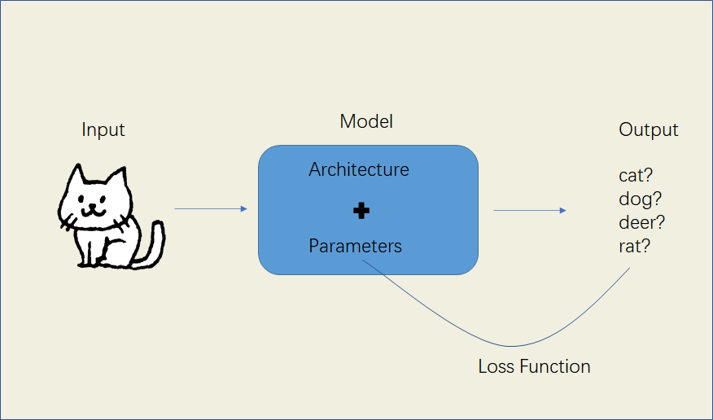
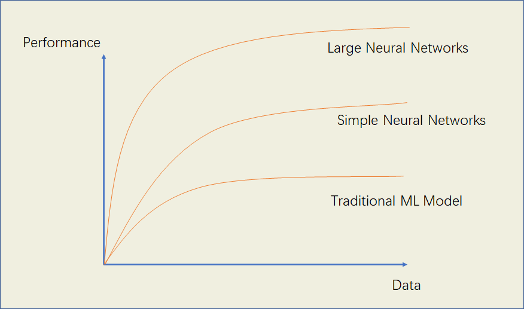
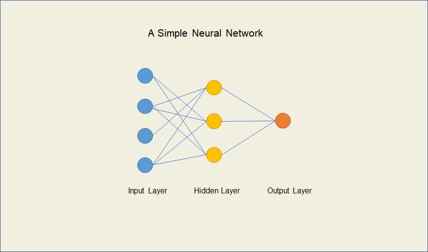

# 深度 Deep Learning

#### 作者：罗力铭
#### 邮箱：limingluo3@outlook.com

***点击左下角图标显示或隐藏目录。***

深度学习是一类基于神经网络的机器学习方法，用处十分广泛，学习能力也十分强大，对于有监督学习、半监督学习、无监督学习都有比较高效的解决方法。

与机器学习相似，深度学习分析要解决的问题，输入合适的数据，经过恰当的算法模型（包括选用的模型架构以及具体参数）的处理，输出需要的结果。

与传统的机器学习算法相比，深度学习有着更复杂的算法结构，需要更大的数据量和算力，但也带来了更好的算法表现。

- 拥有更多的数据量，就意味着拥有更多的信息，通常可以训练出更为准确的深度学习模型。比如仅用10张小狗和小猫的图片，很难训练出一个模型来辨别一张图片是小狗还是小猫，而如果拥有成千上万张小狗小猫图片作为数据集，即使使用的架构不是很好，也能训练出一个相对较优秀的图像识别模型，通过大量数据的投喂，深度学习算法相对传统的机器学习算法一般能够产出更出色的模型。

- 拥有更多的算力，就意味着拥有更高的效率，虽然深度学习模型通常能够有着更为出色的表现，但也需要大量的算力，不然训练的时间是难以估量的，近年来随着各个厂商硬件设备（CPU、GPU等）的研发与量产，算力变得越来越强大和越来越便宜，使得深度学习算法的快速实现和落地变得容易，极大地推动了相关算法的研究和工业落地。

神经网络是由多个神经元连接在一起的分层结构的计算模型，也叫做人工神经网络（Artificial Neural Networks），用于解决各种各样的非线性的机器学习问题。

其中每个神经元代表一个运算单元，通常是由一个线性函数+一个激活函数组成的，比如神经元可以是一个完整的逻辑回归模型。

神经网络是一个大家庭，具体包括了前馈神经网络（FF）、径向基函数神经网络（RBF）、卷积神经网络（CNN）、循环神经网络（RNN）、长短期记忆网络（LSTM）、自编码器（AE）、生成对抗网络（GAN）等，每种神经网络在不同的数据领域发挥着作用，产出高效的结果。