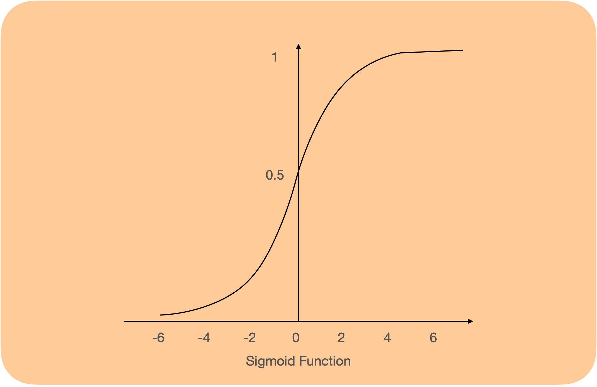
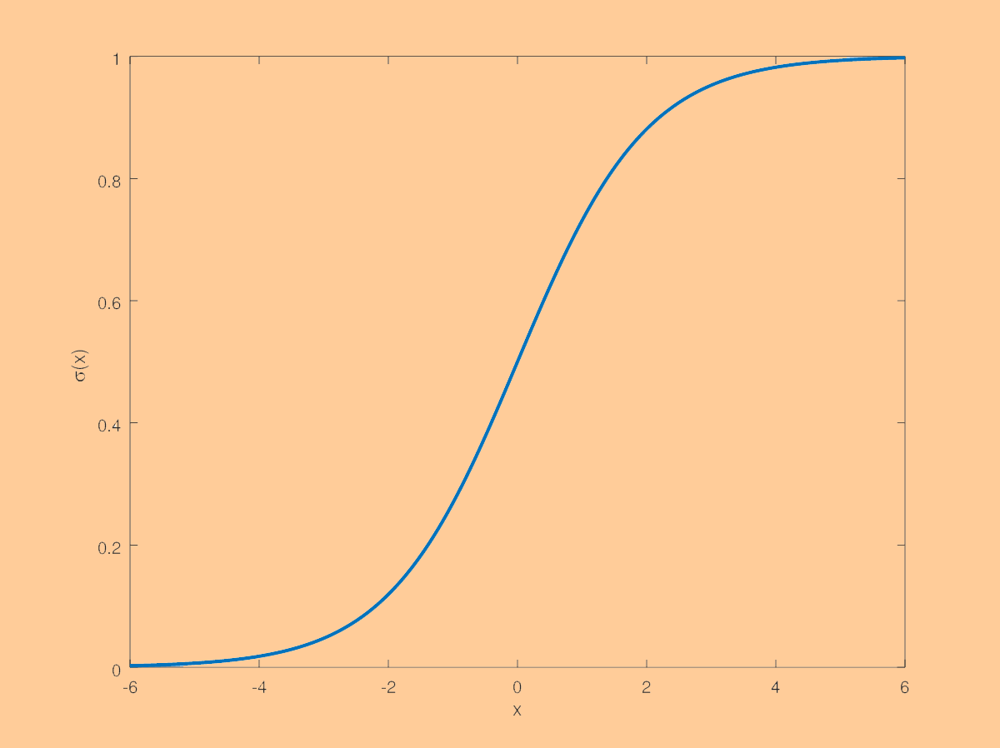
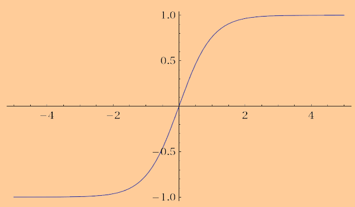
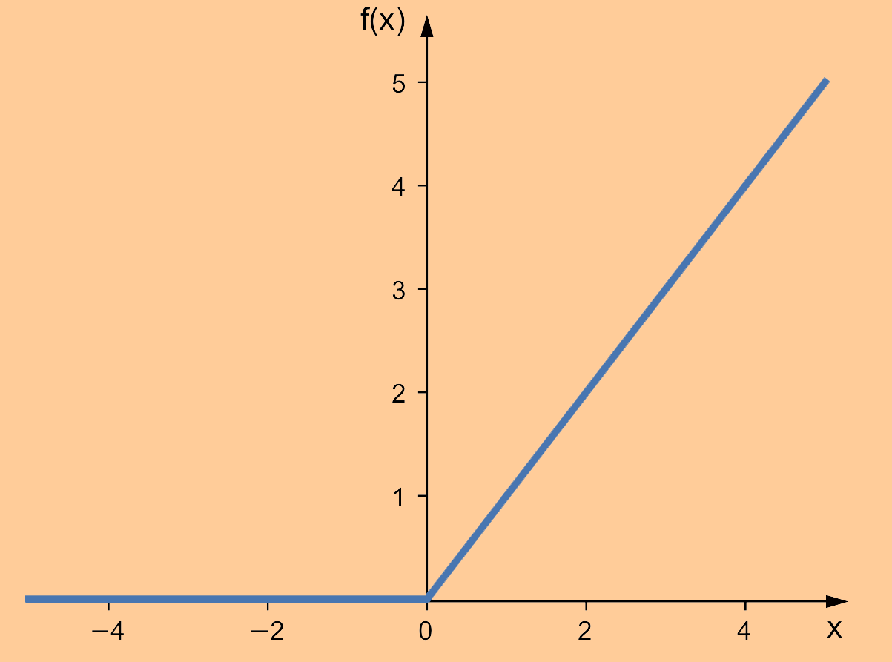

# 前馈神经网络 Feed-forward Neural Networks

## 描述

最原始也是最基础的神经网络，本质上就是多层感知机 Multi-layer Perceptron，多个神经元之间进行**全连接**，只是需要根据解决问题的不同选择合适的激活函数。

在上图的前馈神经网络中，除了输入层外，每一个神经元都有一个激活函数，在感知机中我们采用了符号函数，而在神经网络中，我们可以根据问题的需求采取不同的激活函数，每个神经元的激活函数都可以不同，常用的有Sigmoid函数、Sign函数、Softmax函数、ReLu函数。

在输入层（Input Layer）和输出层（Output Layer）之间的神经元属于隐藏层（Hidden Layer）。我们把上图中的神经网络叫做三层神经网络（Three layer neural network），因为习惯上输出层是不计入网络层数的。

在隐藏层中，神经元接受上一层的所有神经元输入的变量，加权后再经过激活函数的处理得到一个输出，然后再与同一层神经元的输出一起输入到下一层神经元，最后传递到输出层得到最终的结果。

- 为什么叫做隐藏层？

  隐藏层的层数以及每层的单位数是人为设计的，其中的具体参数也是在训练过程中得到，在数据集中的输入和输出都不会体现，所以叫做隐藏层。

- 为什么需要隐藏层？
  
    隐藏层从数据中抽象出更深层次的特征，可以学习到原本在数据中没能直接体现的特征，
    
    比如识别一张猫的图片，输出的只是图片的RGB颜色信息，而通过中间隐藏层的学习，神经网络能够学习到其中的深层次表达，越到后面的隐藏层，学到的内容越精细。比如第一个隐藏层中有神经元可能学到了猫的大概轮廓是什么样，第二层的神经元开始知道耳朵、鼻子、眼睛的轮廓，最后结合这些特征能够判断图片是否是猫。
    
    比如预测房价的问题，输入的特征是房屋的面积、卧室数量、邮编、邻居的财富总值，线性回归中我们直接找各个特征和房价之间的关系，而在神经网络中，我们可以学习到更深层次的信息，比如结合邮编和邻居财富总值我们知道当地小学的教学质量，这些更深层次的特征能对输出产生更大的影响。
    
- 怎么确定需要多少隐藏层，每个隐藏层需要多少神经元？
  
    一般需要根据经验进行不断尝试和调整
    

要进行神经网络的训练，需要基于给定的输入和输出以及神经网络的结构，计算出每一个隐藏层中的所有权重，为什么找出权重之间的关系，我们先看看神经网络的正向过程是怎么样的。

## 模型

以判断一张图片是不是猫的问题为例

### 输入特征

图片由像素点构成，每个像素点用R、G、B三个数值来表现其颜色，所以可以用图片上每一个像素点的R、G、B数值作为特征，则输入的特征数量为 像素长度 X 像素宽度 X 3，如下图的图片为4X4像素，则输入一共有4X4X3 = 48个特征，具体为$[212, 122, 23, ..., 24, 67, 98,..., 33, 46, 111, ...]$

给定一个有m个样本、d个特征的数据集$X=\{x^{(1)},x^{(2)},...,x^{(m)}\}$

$x^{(i)}=\{x_0^{(i)},x_1^{(i)},x_2^{(i)},...,x_d^{(i)}\}$，表示每一个样本

则$X$是个$(d,m)$的矩阵

$X=\left[\begin{array}{ccc}
\vdots & \vdots & \vdots & \vdots \\
x^{(1)} & x^{(2)} & \cdots & x^{(m)} \\
\vdots & \vdots & \vdots & \vdots
\end{array}\right] $

### 输出结果

输出$\hat{y}=\{0, 1\}$，分别代表是猫、不是猫两种输出

### 模型架构

我们使用下图的前馈神经网络结构。

第$l$层的整体权重为$w^{[l]}$，矩阵大小根据输入的特征数量以及隐藏层的单位个数进行初始化

因为需要输出0-1之间的值作为概率，所以激活函数使用Sigmoid函数$\sigma(z)=\frac{1}{1+e^{-z}}$，这个模型看起来就像是很多个逻辑回归模型叠加起来。

当输入越大时，输出就越接近1，相反就越接近0。

在每个神经元中，都进行了一次类似于逻辑回归的运算（建议参考《机器学习》笔记中逻辑回归的部分）

-16444654319641.jpg)

$z=\sigma(w^Tx+b)$

$a=\sigma(z)$

通过层层递进，最终计算出的$a$就是预测的结果$\hat{y}$

## 正向传播

对于每个样本，正向计算过程如下

每层中矩阵$W$的形状取决于上一层中$a$（或$x$）的形状以及下一层中神经元的个数，数值可以随机初始化，然后通过反向传播优化并得到最终的值。

## 反向传播

根据最大似然估计，定义代价函数 

$J(\hat{y},y)=\frac {1}{m}\sum_{i=1}^m-[y^{(i)}\log\hat{y}^{(i)}+(1-y^{(i)})\log(1-\hat{y}^{(i)})]$

则损失函数为：$L(\hat{y},y)=-[y^{(i)}\log\hat{y}+(1-y)\log(1-\hat{y})]$

***注：***代价函数是指整个训练集上的平均损失，损失函数是指训练集中单个样本的损失。

我们要找到理想的权重$W^{[1]},W^{[2]},W^{[3]}$和偏置$b^{[1]},b^{[2]},b^{[3]}$，需要用梯度下降法不断更新权重（建议参考《机器学习》笔记中梯度下降的部分），于是我们需要找到损失函数关于权重和参数的导数，它们之间是有关联的，层层递进，求导的时候从后往前运算会简单很多。

对于单个样本，根据上面的损失函数$L(\hat{y},y)$以及$a^{[3]} = \hat{y}$，有：

$\begin{aligned}
\frac{\partial L(y, \hat{y})}{\partial a^{[3]}} &=-\left[\frac{y}{a^{[3]}}+\frac{-(1-y)}{1-a^{[3]}}\right] \\
&=\frac{1-y}{1-a^{[3]}}-\frac{y}{a^{[3]}} \\
&=\frac{a^{[3]}(1-y)-\left(1-a^{[3]}\right) y}{a^{[3]}\left(1-a^{[3]}\right)} \\
&=\frac{a^{[3]}-y}{a^{[3]}\left(1-a^{[3]}\right)}
\end{aligned}$

根据$a^{[3]}=\sigma(z^{[3]})=\frac{1}{1+e^{-z^{[3]}}}$，有：

$\begin{aligned}
\frac{\partial a^{[3]}}{\partial z^{[3]}} &=-\frac{e^{-z^{[3]}} \times(-1)}{\left(1+e^{-z^{[3]}}\right)^{2}} \\
&=\frac{1+e^{-z^{[3]}}-1}{\left(1+e^{-z^{[3]}}\right)^{2}} \\
&=\frac{1}{\left(1+e^{-z^{[3]}}\right)}-\frac{1}{\left(1+e^{-z^{[3]}}\right)^{2}} \\
&=a^{[3]}-a^{[3]^{2}}\\
&=a^{[3]}(1-a^{[3]})
\end{aligned}$

则：

$\begin{aligned}
\frac{\partial L(y, \hat{y})}{\partial z^{[3]}} &=\frac{\partial L(y, \hat{y})}{\partial a^{[3]}} \cdot \frac{\partial a^{[3]}}{\partial z^{[3]}} \\
&=\frac{a^{[3]}-y}{a^{[3]}\left(1-a^{[3]}\right)} \cdot a^{[3]}\left(1-a^{[3]}\right) \\
&=a^{[3]}-y
\end{aligned}$

根据$z^{[3]}=W^{[3]}a^{[2]}+b^{[3]}$，有：$\frac{\partial z^{[3]}}{\partial w^{[3]}}=a^{[2]}$，$\frac{\partial z^{[3]}}{\partial b^{[3]}}=1$，$\frac{\partial z^{[3]}}{\partial a^{[2]}}=W^{[3]}$

**则：**

 $\begin{aligned}
\frac{\partial L(y, \hat{y})}{\partial W^{[3]}} &=\frac{\partial L(y, \hat{y})}{\partial z^{[3]}} \cdot \frac{\partial z^{[3]}}{\partial W^{[3]}} \\
&=(a^{[3]}-y){a^{[2]}}^T
\end{aligned}$

$\begin{aligned}
\frac{\partial L(y, \hat{y})}{\partial b^{[3]}} &=\frac{\partial L(y, \hat{y})}{\partial z^{[3]}} \cdot \frac{\partial z^{[3]}}{\partial b^{[3]}} \\
&=a^{[3]}-y
\end{aligned}$

$\begin{aligned}
\frac{\partial L(y, \hat{y})}{\partial a^{[2]}} &=\frac{\partial L(y, \hat{y})}{\partial z^{[3]}} \cdot \frac{\partial z^{[3]}}{\partial a^{[2]}} \\
&=(a^{[3]}-y)W^{[3]}
\end{aligned}$

根据$a^{[2]}=\sigma(z^{[2]})=\frac{1}{1+e^{-z^{[2]}}}$，有：

$\begin{aligned}
\frac{\partial a^{[2]}}{\partial z^{[2]}}
&=a^{[2]}(1-a^{[2]})
\end{aligned}$

则：$\begin{aligned}
\frac{\partial L(y, \hat{y})}{\partial z^{[2]}} &=\end{aligned}(a^{[3]}-y)W^{[3]} \cdot a^{[2]}(1-a^{[2]})$

根据$z^{[2]}=W^{[2]}a^{[1]}+b^{[2]}$，有：$\frac{\partial z^{[2]}}{\partial W^{[2]}}=a^{[1]}$，$\frac{\partial z^{[2]}}{\partial b^{[2]}}=1$，$\frac{\partial z^{[2]}}{\partial a^{[1]}}=W^{[2]}$

则：

$\begin{aligned}
\frac{\partial L(y, \hat{y})}{\partial W^{[2]}} &=\frac{\partial L(y, \hat{y})}{\partial z^{[2]}} \cdot \frac{\partial z^{[2]}}{\partial W^{[2]}}\\&=\frac{\partial L(y, \hat{y})}{\partial z^{[2]}} \cdot a^{[1]}\\
&=(a^{[3]}-y)W^{[3]} \cdot a^{[2]}(1-a^{[2]}) \cdot a^{[1]}
\end{aligned}$

$\begin{aligned}
\frac{\partial L(y, \hat{y})}{\partial b^{[2]}} &=\frac{\partial L(y, \hat{y})}{\partial z^{[2]}} \cdot \frac{\partial z^{[2]}}{\partial b^{[2]}}\\
&=\frac{\partial L(y, \hat{y})}{\partial z^{[2]}} \\&=(a^{[3]}-y)W^{[3]} \cdot a^{[2]}(1-a^{[2]})
\end{aligned}$

以此类推，可以得到$\frac{\partial L(y, \hat{y})}{\partial W^{[1]}} $和$\frac{\partial L(y, \hat{y})}{\partial b^{[1]}} $

现在得到了损失函数$L(y,\hat{y})$关于各层中$W$和$b$的导数，就可以通过梯度下降$W=W-\alpha \frac{\partial L(y,\hat{y})}{\partial W}W$以及$b=b-\alpha \frac{\partial L(y,\hat{y})}{\partial b}$迭代更新，最终得到最理想的参数，其中$\alpha$是学习速率。

## 参数初始化

在逻辑回归算法（相当于单个神经元）中，初始化参数$W$和$b$时我们可以全部都赋予0的值，最终也能训练出一个较好的参数，但在神经网络中缺不能草率地将所有参数全部初始化为0。

因为这样的话，同一层的每个神经元的初始权重都为0，在反向传播的时候，因为导数的值都一样，所以每个权重更新变化的值都一样，同一层中权重一直是相等的，那么我们想让每个神经元表现出不同数据特征的目的也没达到，等同于只使用一个神经元。

一般来说，在神经网络中会把各层的$W$随机初始化为很小的值，$b$初始化为0。

- 为什么要把$W$初始化为很小的值？

  如果$W$的初始值很大的化，$z=W^Tx+b$也会很大，对于一些激活函数，如

  在Sigmoid函数$a=\sigma(z)$中，自变量$z$很大，导数在这个位置就会很小，梯度下降的速率会变得很慢，因而需要更多次的迭代才能训练出理想的参数。

- Python中比较常用的初始化：`np.random.randn((row,column))*0.01`

## 激活函数

### 激活函数是什么？

作为神经网络中不可缺少的一部分，激活函数被应用在隐藏层和输出层中。隐藏层中的激活函数影响了神经网络学习的速度和效果，输出层中的激活函数据决定了模型输出的数据是什么样子。

在上面的图像二分类问题中，我们需要的输出是一个0-1之间的概率，所以$Sigmoid$成为输出层中一个理想又自然的激活函数，在隐藏层中我们也选择了$Sigmoid$函数，但实际上对于这个问题还有更好的选择。

### 为什么我们需要激活函数？

我们使用神经网络的出发点就是多添加参数使得模型能够解决复杂问题，而激活函数需要是非线性函数，使用它们的话可以增加模型的复杂性，不使用激活函数的话，不管神经网络有多少层，每层有多少神经元，最终其实就**等价于一个线性回归模型**。在神经网络中，选取适合的激活函数对于模型最终表现的影响是巨大的，针对不同的问题需要使用不同的激活函数，在同一个模型中对于不同的部分也会使用多种不同的激活函数。

### 激活函数的条件

激活函数一般需要是非线性的，满足可求导性和单调性

一般来说，神经网络的所有隐藏层中都会使用同一种激活函数，输出层需要根据输出数据的特征来选择合适的输出函数。

### 主流激活函数

1. Sigmoid函数 $\sigma(z)=\frac {1} {1+e^{-z}}$

    

    输出范围为(0,1)

    优点：简单，适合输出用概率表示的分类问题

    缺点：当z太大或太小时，函数的导数接近0，梯度下降的更新过程会很慢

    对于二分类问题的输出层，Sigmoid函数是一个不错的选择，但不适合作为隐藏层中的激活函数，$tanh$和$Relu$是更好的选择

2. Tanh函数 $tanh(z)=\frac{e^z-e^{-z}}{e^z+e^{-z}}$

    

    输出范围是(-1, 1)

    优点：适用于分类问题，特别是需要对负类进行惩罚时

    缺点：当z太大或太小时，函数的导数接近0，梯度下降的更新过程会很慢

3. ReLU（Rectified Linear Unit）函数  $ReLU(z)=max(z, 0)$

    

    最常用的激活函数，范围是[0, infinity]

    优点：z太大时，输出值也变大，梯度更新相对快

    缺点：输入的负值会输出为0，降低了负输入值对模型的影响力

4. Softmax函数

    $Softmax(z) = \frac{{e^z}^i}{\sum{{e^z}^i}}$ 

    一般用在输出层的激活函数，预测多分类问题，输出一个和为1的概率分布

			### 如何选择激活函数

激活函数的选取需要基于问题的特征和输出，进行多种不同的组合搭配来得出最优的选择。基于经验，下面是一些常用激活函数的选择参考。

- 对于隐藏层
  - 当使用前馈神经网络时，一般使用ReLU函数
  - 当使用卷积神经网络时，一般使用ReLU函数
  - 当使用循环神经网络时，一般使用Tanh或Sigmoid函数
- 对于输出层
  - 当遇到二分类问题时，一般使用Sigmoid函数
  - 当遇到多分类问题时，一般使用Softmax函数
  - 当遇到多标签问题时，一般使用Sigmoid函数
  - 当遇到回归问题时，一般直接使用线性函数

补充：

- 二分类（Binary Classification）：假设两个分类相互独立，在两个分类中将样本判断为其中一个，是二选一的问题，比如判断一个人是否患有新冠肺炎，输出为“患有”和“不患有“
- 多分类（Multi-class Classification）：假设多个分类相互独立，在多个分类中将样本判断其中一个，是多选一的问题，比如判断一张图片上的动物是什么（可能是老虎、狮子、猎豹、豺狼中的一种）
- 多标签分类（Multi-label Classification）：假设某些分类不相互独立，每个样本可以预测为一个或多个类别，是多选多的问题，比如给Steam上的一款游戏进行分类，可能同时会贴上“多人游戏”、“RPG”、“支持手柄”、“Windows平台“的标签
