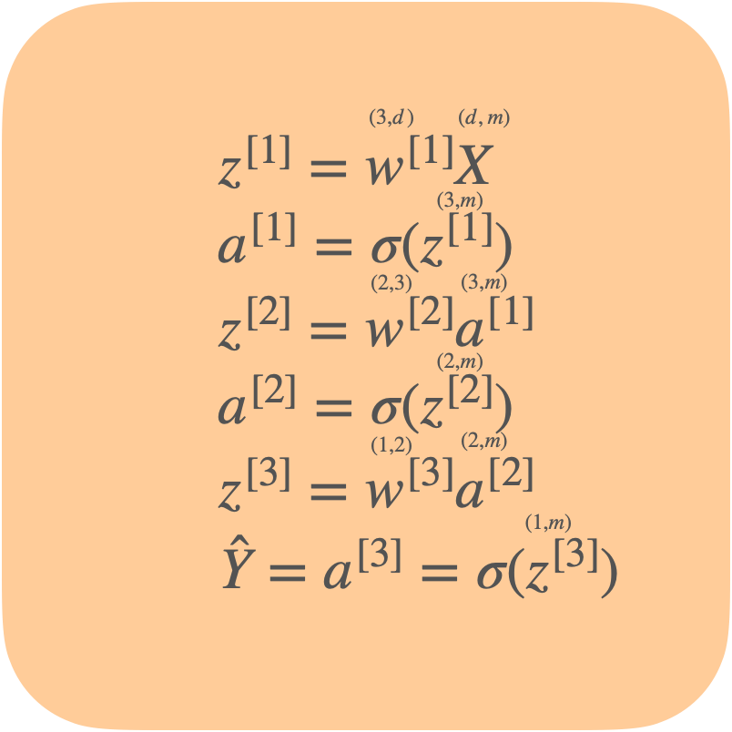

# 前馈神经网络 Feed-forward Neural Networks

## 描述

最原始也是最基础的神经网络，本质上就是多层感知机 Multi-layer Perceptron，多个神经元之间进行**全连接**，只是需要根据解决问题的不同选择合适的激活函数。

在上图的前馈神经网络中，除了输入层外，每一个神经元都有一个激活函数，在感知机中我们采用了符号函数，而在神经网络中，我们可以根据问题的需求采取不同的激活函数，每个神经元的激活函数都可以不同，常用的有Sigmoid函数、Sign函数、Softmax函数、ReLu函数。

在输入层（Input Layer）和输出层（Output Layer）之间的神经元属于隐藏层（Hidden Layer）。

在隐藏层中，神经元接受上一层的所有神经元输入的变量，加权后再经过激活函数的处理得到一个输出，然后再与同一层神经元的输出一起输入到下一层神经元，最后传递到输出层得到最终的结果。

- 为什么需要隐藏层？
  
    隐藏层从数据中抽象出更深层次的特征，可以学习到原本在数据中没能直接体现的特征，
    
    比如识别一张猫的图片，输出的只是图片的RGB颜色信息，而通过中间隐藏层的学习，神经网络能够学习到其中的深层次表达，越到后面的隐藏层，学到的内容越精细。比如第一个隐藏层中有神经元可能学到了猫的大概轮廓是什么样，第二层的神经元开始知道耳朵、鼻子、眼睛的轮廓，最后结合这些特征能够判断图片是否是猫。
    
    比如预测房价的问题，输入的特征是房屋的面积、卧室数量、邮编、邻居的财富总值，线性回归中我们直接找各个特征和房价之间的关系，而在神经网络中，我们可以学习到更深层次的信息，比如结合邮编和邻居财富总值我们知道当地小学的教学质量，这些更深层次的特征能对输出产生更大的影响
    
- 怎么确定需要多少隐藏层，每个隐藏层需要多少神经元？
  
    一般需要根据经验进行不断尝试和调整
    

要进行神经网络的训练，需要基于给定的输入和输出以及神经网络的结构，计算出每一个隐藏层中的所有权重，为什么找出权重之间的关系，我们先看看神经网络的正向过程是怎么样的。

## 正向传播

以判断一张图片是不是猫的问题为例

### 输入特征

图片由像素点构成，每个像素点用R、G、B三个数值来表现其颜色，所以可以用图片上每一个像素点的R、G、B数值作为特征，则输入的特征数量为 像素长度 X 像素宽度 X 3，如下图的图片为4X4像素，则输入一共有4X4X3 = 48个特征，具体为$[212, 122, 23, ..., 24, 67, 98,..., 33, 46, 111, ...]$

给定一个有m个样本、d个特征的数据集$X=\{x^{(1)},x^{(2)},...,x^{(m)}\}$

$x^{(i)}=\{x_0^{(i)},x_1^{(i)},x_2^{(i)},...,x_d^{(i)}\}$，表示每一个样本

则$X$是个$(d,m)$的矩阵

$X=\left[\begin{array}{ccc}
\vdots & \vdots & \vdots & \vdots \\
x^{(1)} & x^{(2)} & \cdots & x^{(m)} \\
\vdots & \vdots & \vdots & \vdots
\end{array}\right] $

### 输出结果

输出$\hat{y}=\{0, 1\}$，分别代表是猫、不是猫两种输出

### 模型架构

我们使用下图的前馈神经网络结构。

第$l$层的整体权重为$w^{[l]}$，矩阵大小根据输入的特征数量以及隐藏层的单位个数进行初始化

因为需要输出0-1之间的值作为概率，所以激活函数使用Sigmoid函数$\sigma(z)=\frac{1}{1+e^{-z}}$

当$z$越大时，输出的$a$就越接近1，相反就越接近0

### 正向传播

根据最大似然估计，定义代价函数 

$J(\hat{y},y)=\frac {1}{m}\sum_{i=1}^m-[y^{(i)}\log\hat{y}^{(i)}+(1-y^{(i)})\log(1-\hat{y}^{(i)})]$

我们要找到理想的权重$w^{[1]},w^{[2]},w^{[3]}$，可以考虑用梯度下降法不断更新权重

于是我们需要对不同的权重进行求导，而它们之间是有关联的，层层递进，$\hat{y}$与$w^{[3]}$有直接联系，所以求导的时候从后往前运算会简单很多。

$\begin{aligned}
\frac{\partial J}{\partial {w^{[3]}}}&=
\frac{1}{m} \sum_{i=1}^{m} \frac{\partial}{\partial w^{[3]}}\left[-y^{(i)} \log \left(\sigma\left(w^{[3]} a^{[2]}\right)\right)-\left(1-y^{(i)}\right) \log \left(1-\sigma\left(w^{[3]} a^{[2]}\right)\right)\right]\\
&=\frac{1}{m} \sum_{i=1}^{m}-y^{(i)} \frac{1}{a^{[3]}} a^{[3]}\left(1-a^{[3]}\right) a^{[2]^{\top}}-\left(1-y^{(i)}\right) \frac{1}{1-a^{[3]}}(-1)\left(1-a^{[3]}\right) a^{[3]} a^{[2]^\top}\\
&=\frac{1}{m} \sum_{i=1}^{m} (a^{[3]}-y^{(i)})a^{[2]^\top}
\end{aligned}$因为$\frac {\partial z^{[3]}}{\partial w^{[3]}}=a^{[2]^T}$，所以$\frac {\partial J}{\partial z^{[3]}}=a^{[2]^T}$

## 激活函数 Activation Function

 

- 为什么我们需要激活函数？
  
    我们使用神经网络的出发点就是多添加参数使得模型能够解决复杂问题，而激活函数需要是非线性函数，使用它们的话可以增加模型的复杂性，不使用激活函数的话，不管神经网络有多少层，每层有多少神经元，最终其实就等价于一个线性回归模型。
    
- 激活函数的条件
  
    激活函数需要是非线性的，满足可求导性和单调性
    

根据经验，有一些函数适合作为激活函数：

1. Sigmoid函数 $\sigma(z)=\frac {1} {1+e^{-z}}$
   
    输出范围为(0,1)
    
    优点：简单，适合输出用概率表示的分类问题
    
    缺点：当z太大或太小时，函数的导数接近0，梯度下降的更新过程会很慢
    
2. Tanh函数 $tanh(z)=\frac{e^z-e^{-z}}{e^z+e^{-z}}$
   
    输出范围是(-1, 1)
    
    优点：适用于分类问题，特别是需要对负类进行惩罚时
    
    缺点：当z太大或太小时，函数的导数接近0，梯度下降的更新过程会很慢
    
3. ReLU函数  $ReLU(z)=max(z, 0)$
   
    最常用的激活函数，范围是[0, infinity]
    
    优点：z太大时，输出值也变大，梯度更新相对快
    
    缺点：输入的负值会输出为0，降低了负输入值对模型的影响力

