# 神经网络优化

对应的Jupyter Notebook文件，在 [Improving Neural Networks](https://github.com/limingluo/limingluo.github.io/blob/main/deeplearning/notebooks/Improving-Neural-Networks.ipynb)    [下载到本地](https://limingluo.github.io/deeplearning/notebooks/Improving-Neural-Networks.ipynb)

## 参数

### 参数与超参数

1. 参数 parameter

​	参数是模型内部的配置变量，是可以根据数据学习出的变量，比如神经网络中的权重、偏差等，在进行预测的时候需要用到参数的值。

2. 超参数 hyperparameter

​	模型超参数是模型外部的配置，是不能根据数据学习出的，比如神经网络中的学习速率、迭代次数、隐藏层层数、隐藏神经元个数等，设置不同的超参数会产生不同的模型，得到不同的模型表现。

### 参数/超参数初始化

#### 参数——权重和偏置

1. 0初始化

```python
# layer_dims的形状：(输入层特征数, 第一层神经元数..., 输出层神经元数)
def initialize_parameters_zeros(layers_dims):
    parameters = {} # 参数字典，保存所有参数
    L = len(layers_dims)  # 神经网络层数
    
    for l in range(1, L):
        parameters["W"+str(l)] = np.zeros((layers_dims[l], layers_dims[l-1]))
        parameters["b"+str(l)] = np.zeros((layers_dims[l], 1))
    return parameters
```

在逻辑回归算法（相当于单个神经元）中，初始化参数$W$和$b$时我们可以全部都赋予0的值，最终也能训练出一个较好的参数，但在神经网络中缺不能草率地将所有参数全部初始化为0。

因为这样的话，同一层的每个神经元的初始权重都为0，在反向传播的时候，因为导数的值都一样，所以每个权重更新变化的值都一样，同一层中权重一直是相等的，那么我们想让每个神经元表现出不同数据特征的目的也没达到，这种现象叫symmetry。

实际上，只要把权重初始化为同一个值，就会出现symmetry，在神经网络中是不行的。

下图演示了如果将参数全初始化为0，损失随迭代次数的变化情况（隐藏层使用ReLu激活函数，输出层使用Sigmoid激活函数）：

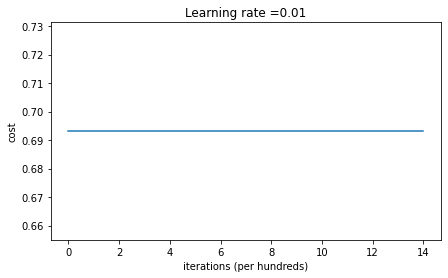

可以看到，把参数初始化为0的话，损失一直不随着迭代次数的增加而变化。

2. 随机初始化

随机把$W$初始化为一个标准高斯分布的值，$b$初始化为0

```python
# layer_dims的形状：(输入层特征数, 第一层神经元数..., 输出层神经元数)
def initialize_parameters_random(layers_dims):
    parameters = {} # 参数字典，保存所有参数
    L = len(layers_dims)  # 神经网络层数
    ranges = 1 # 初始化W的倍数，表示W在(0, 0.01)间
    for l in range(1, L):
        parameters["W"+str(l)] = np.random.randn(layers_dims[l], layers_dims[l-1])*ranges 
        parameters["b"+str(l)] = np.random.rzeros((layers_dims[l], 1))
    return parameters
```

将$W$全初始化为随机为标准正态分布的值（-1-1），损失随迭代次数的变化情况（隐藏层使用ReLu激活函数，输出层使用Sigmoid激活函数）：

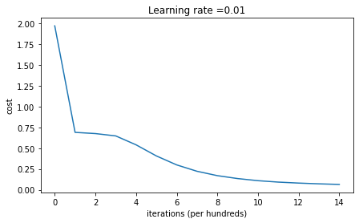

将$W$全初始化为随机为较大值（-10-10），损失随迭代次数的变化情况（隐藏层使用ReLu激活函数，输出层使用Sigmoid激活函数）：

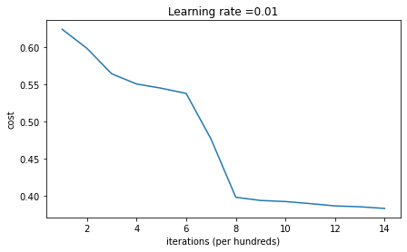

可以看到，把$W$初始化到一个较小的值时，损失的下降速率会更快，但也不能过于的小。

- 为什么$W$初始化不能太大？

  如果$W$的初始值很大，$z=W^Tx+b$也会很大，对于一些激活函数，比如

  在Sigmoid函数$a=\sigma(z)$中，自变量$z$很大，输出也很大，导数在这个位置会很小，更新参数时不仅初始值就打，梯度下降的速率会变得很慢（这个现象叫梯度弥散），因而需要更多次的迭代才能训练出理想的参数。

- 为什么$W$初始化不能太小？

  如果$W$的初始值很小，那么经过多层神经网络传播后输出的值就会很小，从一个极小的值开始更新参数也会需要很多的迭代次数。

3.  Xaviar初始化

$W$符合一个均值为0，标准差为$\sqrt{\frac{1}{\mathrm{n}_{\mathrm{l-1}}}}$的高斯分布，其中$n_{l-1}$为上一层中的神经元个数。

$\mathrm{W} \sim \mathrm{N}\left(0, \sqrt{\frac{1}{\mathrm{n}_{\mathrm{l-1}}}}\right)$

```python
# layer_dims的形状：(输入层特征数, 第一层神经元数..., 输出层神经元数)
def initialize_parameters_Xaviar(layers_dims):
    parameters = {} # 参数字典，保存所有参数
    L = len(layers_dims)  # 神经网络层数
    ranges = 1 # 初始化W的倍数，表示W在(0, 0.01)间
    for l in range(1, L):
        parameters["W"+str(l)] = np.random.randn(layers_dims[l], layers_dims[l-1]) * np.sqrt(1./layers_dims[l-1])
        parameters["b"+str(l)] = np.zeros((layers_dims[l], 1))
    return parameters
```

将$W$进行Xaviar初始化，损失随迭代次数的变化情况（隐藏层使用ReLu激活函数，输出层使用Sigmoid激活函数）：

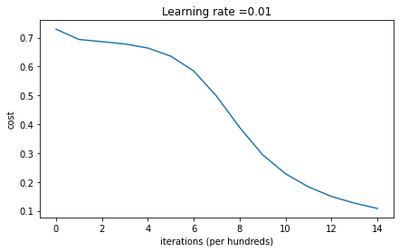

Xaviar初始化方法适合tanh和sigmoid等激活函数。

4. He初始化

$W$符合一个均值为0，标准差为$\sqrt{\frac{1}{\mathrm{n}_{\mathrm{l-1}}}}$的高斯分布，其中$n_{l-1}$为上一层中的神经元个数。

$\mathrm{W} \sim \mathrm{N}\left(0, \sqrt{\frac{2}{\mathrm{n}_{\mathrm{l-1}}}}\right)$

```python
# layer_dims的形状：(输入层特征数, 第一层神经元数..., 输出层神经元数)
def initialize_parameters_he(layers_dims):
    parameters = {} # 参数字典，保存所有参数
    L = len(layers_dims)  # 神经网络层数
    ranges = 1 # 初始化W的倍数，表示W在(0, 0.01)间
    for l in range(1, L):
        parameters["W"+str(l)] = np.random.randn(layers_dims[l], layers_dims[l-1]) * np.sqrt(2./layers_dims[l-1])
        parameters["b"+str(l)] = np.zeros((layers_dims[l], 1))
    return parameters
```

将$W$进行He初始化，损失随迭代次数的变化情况（隐藏层使用ReLu激活函数，输出层使用Sigmoid激活函数）：

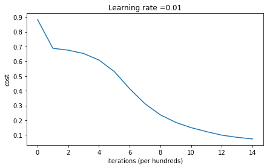

He初始化方法适合ReLu和Leaky-ReLu等激活函数。

#### 超参数

​	超参数的选择一般是基于不断试错，尝试多种不同的超参数组合，然后训练出不同的模型后比较表现，积累经验，选出最优的组合

## 激活函数

### 激活函数是什么？

作为神经网络中不可缺少的一部分，激活函数被应用在隐藏层和输出层中。隐藏层中的激活函数影响了神经网络学习的速度和效果，输出层中的激活函数据决定了模型输出的数据是什么样子。

在上面的图像二分类问题中，我们需要的输出是一个0-1之间的概率，所以$Sigmoid$成为输出层中一个理想又自然的激活函数，在隐藏层中我们也选择了$Sigmoid$函数，但实际上对于这个问题还有更好的选择。

### 为什么我们需要激活函数？

我们使用神经网络的出发点就是多添加参数使得模型能够解决复杂问题，而激活函数需要是非线性函数，使用它们的话可以增加模型的复杂性，不使用激活函数的话，不管神经网络有多少层，每层有多少神经元，最终其实就**等价于一个线性回归模型**。在神经网络中，选取适合的激活函数对于模型最终表现的影响是巨大的，针对不同的问题需要使用不同的激活函数，在同一个模型中对于不同的部分也会使用多种不同的激活函数。

### 激活函数的条件

激活函数一般需要是非线性的，满足可求导性和单调性

一般来说，神经网络的所有隐藏层中都会使用同一种激活函数，输出层需要根据输出数据的特征来选择合适的输出函数。

### 主流激活函数

1. Sigmoid函数 $\sigma(z)=\frac {1} {1+e^{-z}}$

   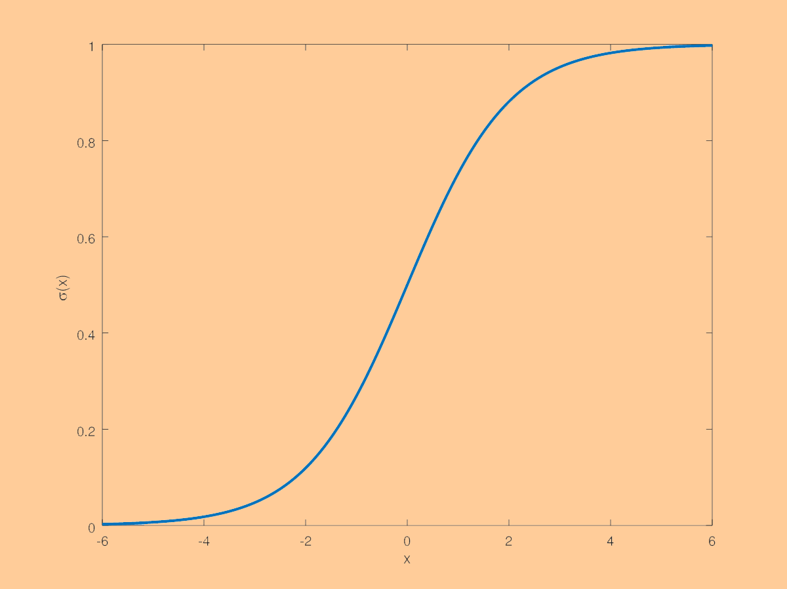

   输出范围为(0,1)

   优点：简单，适合输出用概率表示的分类问题

   缺点：当z太大或太小时，函数的导数接近0，梯度下降的更新过程会很慢

   对于二分类问题的输出层，Sigmoid函数是一个不错的选择，但不适合作为隐藏层中的激活函数，$tanh$和$Relu$是更好的选择

2. Tanh函数 $tanh(z)=\frac{e^z-e^{-z}}{e^z+e^{-z}}$

   

   输出范围是(-1, 1)

   优点：适用于分类问题，特别是需要对负类进行惩罚时

   缺点：当z太大或太小时，函数的导数接近0，梯度下降的更新过程会很慢

3. ReLU（Rectified Linear Unit）函数  $ReLU(z)=max(z, 0)$

   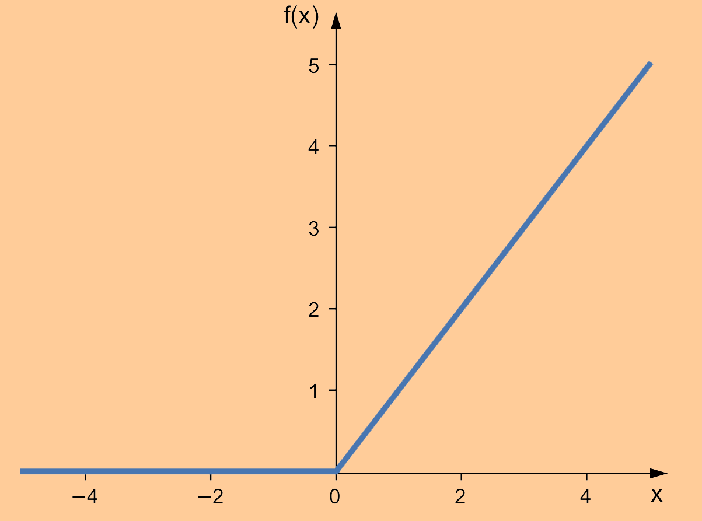

   最常用的激活函数，范围是[0, infinity]

   优点：z太大时，输出值也变大，梯度更新相对快

   缺点：输入的负值会输出为0，降低了负输入值对模型的影响力

4. Softmax函数

   $Softmax(z) = \frac{{e^z}^i}{\sum{{e^z}^i}}$ 

   一般用在输出层的激活函数，预测多分类问题，输出一个和为1的概率分布

### 如何选择激活函数

激活函数的选取需要基于问题的特征和输出，进行多种不同的组合搭配来得出最优的选择。基于经验，下面是一些常用激活函数的选择参考。

- 对于隐藏层
  - 当使用前馈神经网络时，一般使用ReLU函数
  - 当使用卷积神经网络时，一般使用ReLU函数
  - 当使用循环神经网络时，一般使用Tanh或Sigmoid函数
- 对于输出层
  - 当遇到二分类问题时，一般使用Sigmoid函数
  - 当遇到多分类问题时，一般使用Softmax函数
  - 当遇到多标签问题时，一般使用Sigmoid函数
  - 当遇到回归问题时，一般直接使用线性函数

补充：

- 二分类（Binary Classification）：假设两个分类相互独立，在两个分类中将样本判断为其中一个，是二选一的问题，比如判断一个人是否患有新冠肺炎，输出为“患有”和“不患有“
- 多分类（Multi-class Classification）：假设多个分类相互独立，在多个分类中将样本判断其中一个，是多选一的问题，比如判断一张图片上的动物是什么（可能是老虎、狮子、猎豹、豺狼中的一种）
- 多标签分类（Multi-label Classification）：假设某些分类不相互独立，每个样本可以预测为一个或多个类别，是多选多的问题，比如给Steam上的一款游戏进行分类，可能同时会贴上“多人游戏”、“RPG”、“支持手柄”、“Windows平台“的标签

## 数据集划分

在传统的机器学习模型中，一般采用80/20的方式划分训练集和测试集，或者60/20/20的方式划分训练集/验证集/测试集。

在深度学习模型中，因为需要投喂大量的数据，甚至能到百万、千万的数据量，这时候的验证集和测试集就不需要占比太多，比如95/2.25/2.5的占比方式就可以。

## 正则化

在《机器学习》笔记中提到

- 当偏差较大时，说明模型**欠拟合**，考虑增加模型的复杂度，比如使用更复杂的算法，增加神经网络的层数和神经元等
- 当方差较大时，说明模型**过拟合**，考虑增加更多数据进行训练，或者使用正则化方法等。

而因为神经网络一般具有很复杂的结构，训练出的模型很容易会过拟合，除了增加更多训练数据外，正则化是一种十分有效的方法。

### L1/L2正则化

在一般的机器学习算法，比如逻辑回归、线性回归中，我们使用L1正则化、L2正则化来减缓过拟合现象，在神经网络中我们也能使用这种正则化。

神经网络模型的代价函数为：

$J\left(w^{[1]}, b^{[1]}, \ldots, w^{[l]}, b^{[l]}\right)=\frac{1}{m}\sum_{i=1}^m L(\hat{y}^{(i)},y^{(i)})$

加入L2正则项后变为：

$J\left(w^{[1]}, b^{[1]}, \ldots, w^{[l]}, b^{[l]}\right)=\frac{1}{m}\sum_{i=1}^m L(\hat{y}^{(i)},y^{(i)})+\frac{\lambda}{2m}\sum_{l=1}^L||w^{[l]}||^2_F$

其中$||w^{[l]}||^2_F=\sum_{i=1}^{n^{[l-1]}}\sum_{j=1}^{n^{[l]}}(w_{ij}^{[l]})^2$

在使用梯度下降更新参数的时候也需要减掉这个正则项。

### Dropout正则化

#### 基本思想

在神经元输出到下一层时，随机地让下一层的一些神经元工作，一部分不工作，在每一次训练时随机使用残缺的神经网络，这样的方法能在一定程度上抵抗过拟合现象。

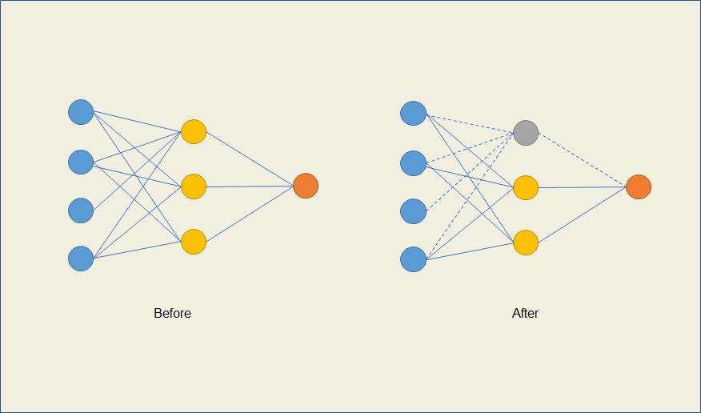

比如上图中，在一次训练时我们随机drop out掉隐藏层中的第一个神经元，这样与它就不会继续向下传播。

具体表现就是，原来在输入下一层的时候，在进行$z^{[l+1]}=W^{[l+1]}a^{[l]}+b^{[l+1]}$计算之前，先将上一层的输出$a^{[l]}$与一个服从伯努利分布的变量$r^{[l]}$相乘，给定一个概率（比如0.9、0.5等 ），得到一个新的$\bar a^{[l]}$，这样这层中的每个神经元就会有一定的概率不会向下传播。 

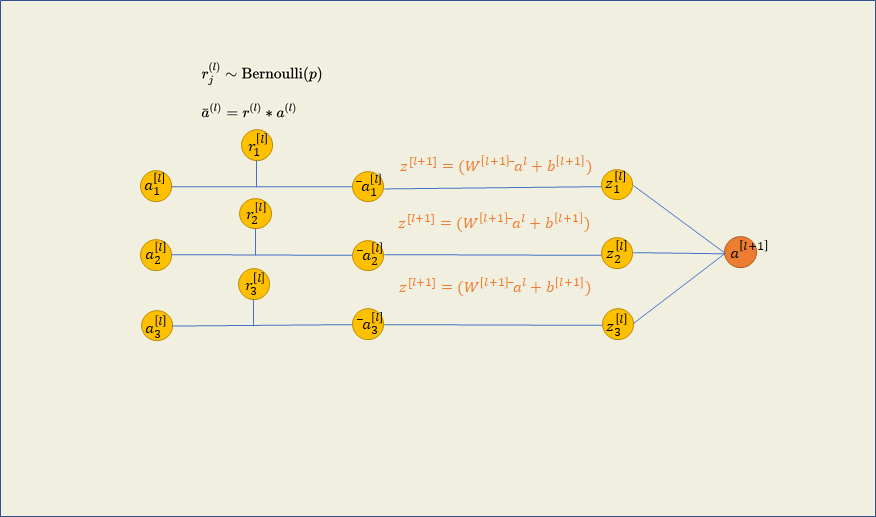

#### 形象例子：

如果输入的是40X40像素的图片作为数据，那么一共有40X40X3=4800个输入特征。

构建一个神经网络，在输入层传播到第一个隐藏层的过程中使用Dropout，设定保留概率为0.8。

那么在每一次训练时，这4800个特征每一个都有可能被暂时隐藏，最后可能只剩下3800个特征，也就相当于每次更新，神经网络都只接受了一张残缺的图片，有一些像素块是被遮挡住的。

#### 实现——Inverted Dropout

假设神经网络中有3层隐藏层，我们仅对隐藏层使用Dropout

```python
A0 = '...' # 第一层隐藏层的输入，从前向传播中获得
A1 = '...' # 第二层隐藏层的输入，从前向传播中获得
A2 = '...' # 第三层隐藏层的输入，从前向传播中获得
prob = 0.8 # 设置保留神经元的概率，有20%的神经元会被隐藏
for i in range(1, L + 1): 
    # L为隐藏层个数，我们对每一层隐藏层都使用Dropout
    'd' + str(i) = np.random.rand(A + str(i).shape[0],A + str(i).shape[1]) < prob
    # 创建向量d1, d2, d3，它们的形状分别等于A1, A2, A3，且里面每个元素值为0或1，取决于创建的0-1之间的随机数是否小于0.8
    A + str(i) = np.multiply(A + str(i), d + str(i))
    # 将每一层的A与d相乘得到新的A，A中的一些元素的值乘以0得到0，其它的元素乘以1大小不变，达成了随机隐藏20%神经元的目的
```

注意，在对测试集进行测试的时候，不要继续使用Dropout方法，而应该用原全连接层的所有参数进行前向传播。

#### 为什么行得通？

**不让神经网络过度依靠任何一个特征**

​	在通过面积、所在城市、卧室数量、附近是否有学校四个特征预测房价的回归任务中，使用神经网络，在输入层到第一层隐藏层中可能会一直给面积这一特征赋予很高的权重，导致最终的模型过度依赖面积这一因素而不太考虑其他因素。

​	在输入层使用Dropout后，随机隐藏输入的特征（神经元），某些时候就会隐藏到面积这一特征，这时神经网络只能依靠其他三个特征，就不得不给它们赋予更高的权重，最后的模型得到的权重得到分散，三个特征都有考虑，用在新的各种各样的数据上的表现就会更好。

### Data Augmentation 数据增强 

神经网络的训练需要大量的数据，但在现实里搜集数据是一件耗时耗力甚至耗资金的事，因此通过一些方法让已有的数据发挥更大的作用，能够给神经网络带来很大的提升，数据增强就是这么一种方法。

在计算机视觉相关的问题中，我们可以对已有的图片进行各种改动来获取更多的数据。比如在识别猫还是狗的二分类问题中，我们可以将图片进行翻转、缩放、裁剪等操作，得到”新“的图片，虽然人一眼能看出这是同一种图片，但对于计算机来说，输入的像素特征已经完全被打乱，这是一种很有效的增加数据的方法。

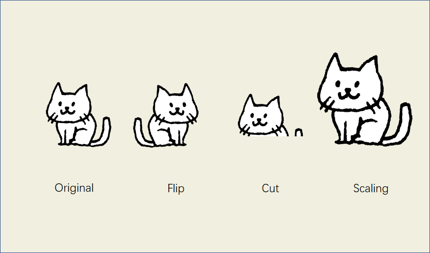

#### 实现

```python
import cv2 # 使用open-cv库来实现图片的变形
# 读取图片
img = cv2.imread('/cat.jpg') 
# 将图片垂直翻转
img_flip_along_x = cv2.flip(img, 0) 
# 将图片水平翻转
img_flip_along_x = cv2.flip(img, 1) 
# 将图片顺时针180度翻转
img_flip_along_xy = cv2.flip(img, -1)

# 将图片裁剪 高度上保留100-300像素，宽度上保留150-350像素
img_cut=img[100:300,150:350] # 

# 将图片缩放为200x200的大小
img_200x200 = cv2.resize(img, (200, 200)) 
```

### Early stopping 早停法

#### 原理

过拟合的表现是神经网络在训练集上表现很好，但在验证集或测试集上的表现不好。实际上，在训练的过程中，随着迭代次数的增加，尽管模型在训练集上的损失在逐步降低，但其在验证集/测试集上的损失可能是反复增减的，在某一次迭代时就已经达到最小损失了，因此跑完全部的迭代次数可能会使得模型在新数据上的表现变差。

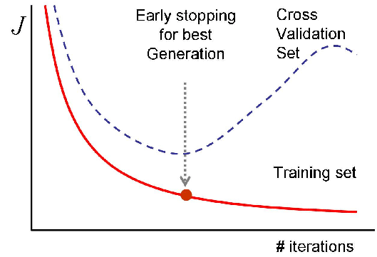

source: https://www.researchgate.net/figure/Cross-validation-Early-stopping-Principe-2000_fig4_228469923

早停法的原理就是在训练的过程中计算模型在验证集上的表现，只要模型在验证集上的表现开始下降的时候就停止训练。

#### 为什么行得通？

在训练的过程中，随着迭代次数的增加，权重会更新到越来越大的值，这样的权重会在训练集上表现得越来越好，但遇到未见过的数据时就会表现差，因此在中间点就停止训练的话可以得到中等大小的权重值，更能拟合未见过的数据。


## 归一化 Normalisation

### 为什么要使用归一化

1. 提高模型求解的精度

   对于一些机器学习/深度学习任务来说，输入数据的特征的范围相差较大，比如预测房价的回归任务中，输入特征有房屋面积和到市中心距离，面积的数值区间为几十到几百（平方米），而到市中心距离的数值区间为几百到几万（米）。因为输入特征范围的巨大差距使得与其相对应的权重参数会有很大的差距，最终训练得到的结果表明到市中心距离对于房价的影响要大得多，而实际上并不是这样，结果就造成了模型的表现不好。

   将输入特征归一化后，就能比较有效地避免这个问题，因为特征的取值都相差不大，不会出现一个或几个特征“独大”的情况。

2. 加快模型训练的收敛速度

​	因为输入特征范围的巨大差距使得与其相对应的权重和偏置参数也会有很大的差距。

​	代价$J$与权重$w$和偏置$b$的关系图就会呈现下图的样子：

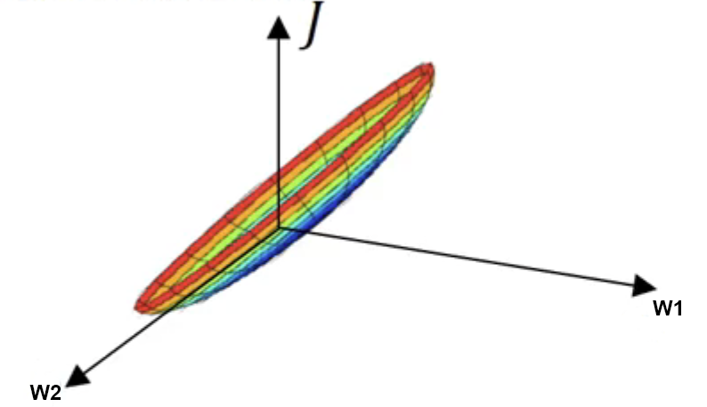

​	俯视图如下图：

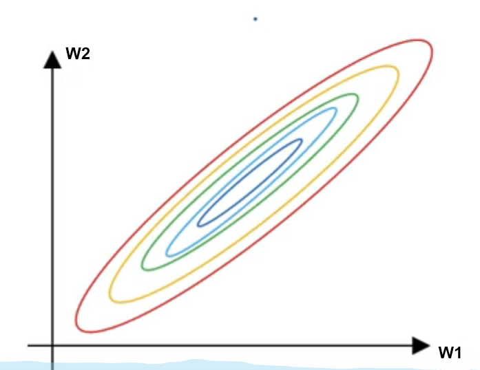

​	在对参数进行更新时，梯度下降算法会沿着参数的梯度（导数）方向进行更新，也就是垂直于当前点的方向进行移动，直到最终到达，其更新过程如下图：

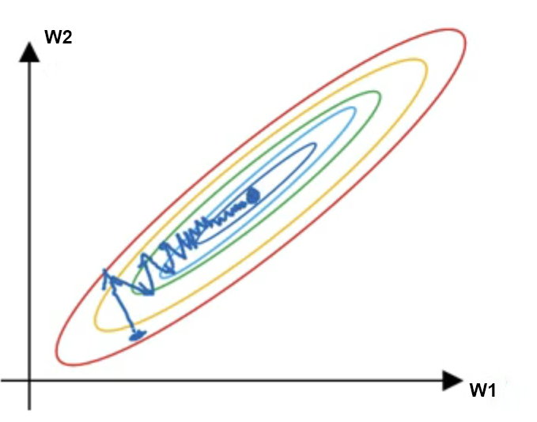

可以观察到，因为路线非常陡峭，所以需要很多很多步才能抵达代价最小点。


归一化就是将输入的特征控制在同的一个区间内，比如进行缩放让它们的值都在0-1范围内，处理之后代价$J$与权重$w$和偏置$b$的关系图就会呈现下图的样子：

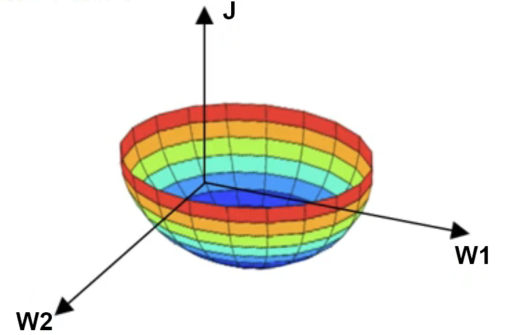

俯视图以及更新路线：

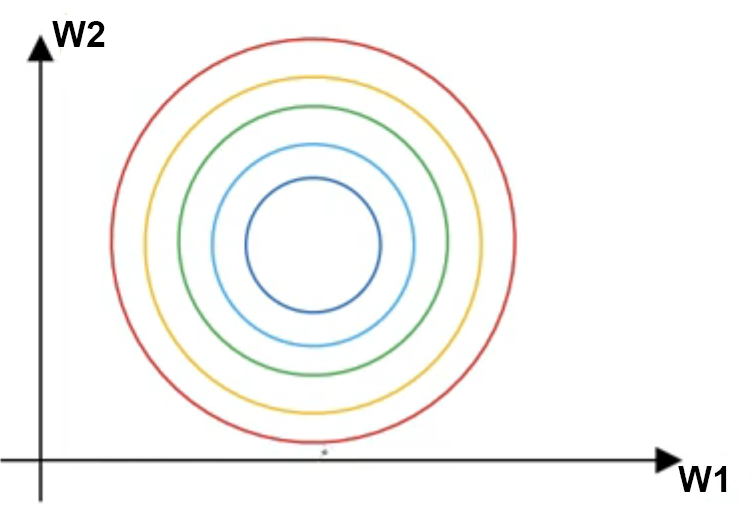

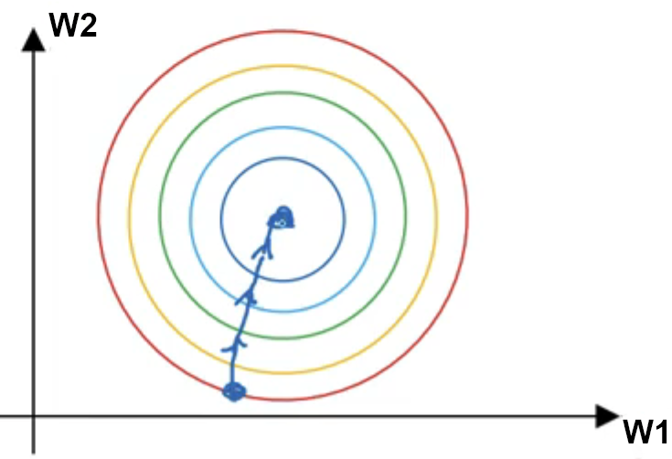

source: Deep Learning Coursera by Andrew Ng

可以观察到，进行归一化后更新的速率大幅提升，模型更容易收敛，减少了训练时间。

### 归一化的方法

#### z-score normalisation

​	也叫做标准化（standardisation），将特征值缩放到均值为0，方差为1的分布上，适合特征分布里没有特别离谱的界外值（outlier）时使用。

​	$x^\prime = \frac{x-\mu}{\sigma}\\ \mu = \frac{1}{m}\sum_{i=1}^m x_i\\\sigma=\sqrt{\frac{1}{m}\sum_{i=1}^m x_i^2}$

​	其中$x$为特征值，$\mu$为特征的平均值，$\sigma$为特征的标准差

#### min-max normalisation

​	有时候归一化会默认指这个min-max归一化，将特征值缩放到0和1之间。

​	$x^\prime=\frac{x-x_{min}}{x_{max}-x_{min}}$

​	其中$x$为特征值，$x_{max}$为特征的最大值，$x_{min}$为特征的最小值

#### Mean normalisation

$x^\prime=\frac{x-\mu}{x_{max}-x_{min}}\\\mu = \frac{1}{m}\sum_{i=1}^m x_i$

其中$x$为特征值，$\mu$为特征的平均值，$x_{max}$为特征的最大值，$x_{min}$为特征的最小值

#### 中心化	

$x^\prime = x  -\mu\\\mu =\frac{1}{m}\sum_{i=1}^m x $

### 代码实例

#### 导入数据

```python
# 从sklearn中导入《加州房价》数据集
from sklearn.datasets import fetch_california_housing
# 导入pyplot用于图像绘制
from matplotlib import pyplot as plt
# 导入numpy用于科学计算
import numpy as np

# 取数据集中的前100个样本，形状为(特征, 样本)
data = housing.data[0:100].T
# 查看第一个特征（房屋年龄）的形状
data[1].shape # (100, )
# 查看第二个特征（房间平均数量）的形状
data[2].shape # (100, )
```

#### 归一化前图示

```python
# x轴——从1-100个样本
index = np.arange(len(data[0]))
# 每条柱状的宽度
width = 0.25
# 画出两个特征的柱状图
plt.bar(index - width/2, data[1], width, label='Age')
plt.bar(index, data[2], width, label='Average No. of rooms')
plt.legend()
```

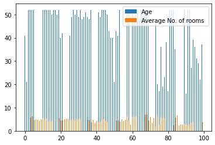

#### 1. z-score 实现

```python
# 手动实现
# 输入特征数据，返回归一化后的数据
def z_score(x): 
    # 计算特征的平均值
    mu = np.sum(x)/len(x) 
    # 计算特征的标准差
    sigma = np.sqrt(np.sum(np.power(x, 2))/len(x)) 
    # 计算归一化后的数据
    x = (x - mu) / sigma
    # 返回归一化后的数据
    return x
```

**z-score归一化后图示**

```python
# 房屋年龄特征归一化
standard_scaler_data1 = z_score(data[1]) 
# 平均房间数量特征归一化
standard_scaler_data2 = z_score(data[2]) 
# # 画出归一化后两个特征的柱状图
f, (ax1, ax2) = plt.subplots(1, 2, figsize=(10,5))
ax1.bar(index - width/2, data[1], width)
ax1.bar(index, data[2], width)
ax2.bar(index - width/2, standard_scaler_data1, width)
ax2.bar(index, standard_scaler_data2, width)
ax1.set_title('Before')
ax2.set_title('After')
plt.show()
```

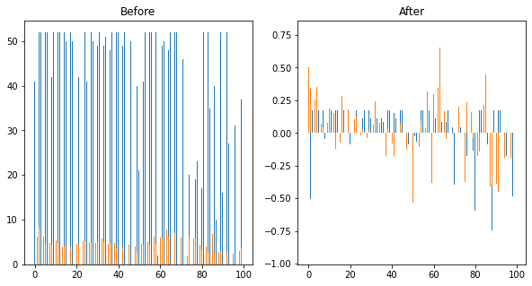

可以观察到，进行z-score归一化后，两个特征的数据范围都在-1-1之间。

**使用sklearn库实现z-score**

```python
# 导入sklearn库
from sklearn import preprocessing

# 用sklearn将房屋年龄特征归一化
sk_k_standard_scaler_data1 = preprocessing.StandardScaler().fit_transform(data[1].reshape(-1, 1))
# 用sklearn将平均房间数量特征归一化
sk_standard_scaler_data2 = preprocessing.StandardScaler().fit_transform(data[2].reshape(-1,1))

# 画图
f, (ax1, ax2) = plt.subplots(1, 2, figsize=(10,5))
ax1.bar(index - width/2, data[1], width)
ax1.bar(index, data[2], width)
ax2.bar(index - width/2, standard_scaler_data1[:,0], width)
ax2.bar(index, standard_scaler_data2[:,0], width)
ax1.set_title('Before')
ax2.set_title('After')
plt.show()
```

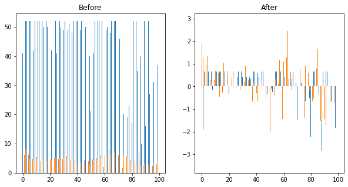可以看到，手动实现和调用库实现的结果时一样的。

#### 2. min-max实现

```python
# 手动实现
# min-max函数，输入特征值，返回归一化后的特征
def min_max(x):
    # 计算特征中的最小值
    x_min = min(x) 
    # 计算特征中的最大值
    x_max = max(x) 
    # 计算归一化后的值
    x = (x - x_min)/(x_max - x_min) 
    # 返回归一化后的值
    return x
```

**min-max归一化后图示**

```python
# 房屋年龄特征归一化
min_max_scaler_data1 = min_max(data[1]) 
# 平均房间数量特征归一化
min_max_scaler_data2 = min_max(data[2]) 

# 画图
f, (ax1, ax2) = plt.subplots(1, 2, figsize=(10,5))
ax1.bar(index - width/2, data[1], width)
ax1.bar(index, data[2], width)
ax2.bar(index - width/2, min_max_scaler_data1, width)
ax2.bar(index, min_max_scaler_data2, width)
ax1.set_title('Before')
ax2.set_title('After')
plt.show()
```

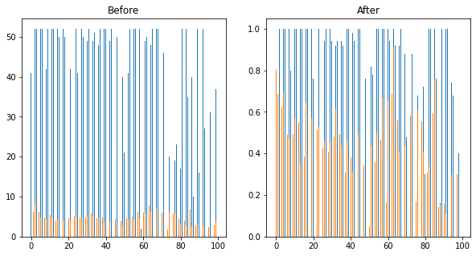

可以观察到，进行min-max归一化后，两个特征的数据范围都在0-1之间。

**使用sklearn库实现min-max**

```python
# 导入sklearn库
from sklearn import preprocessing

# 用sklearn将房屋年龄特征归一化
sk_min_max_scaler_data1 = preprocessing.MinMaxScaler().fit_transform(data[1].reshape(-1, 1))
# 用sklearn将平均房间数量特征归一化
sk_min_max_scaler_data2 = preprocessing.MinMaxScaler().fit_transform(data[2].reshape(-1, 1))

# 画图
f, (ax1, ax2) = plt.subplots(1, 2, figsize=(10,5))
ax1.bar(index - width/2, data[1], width)
ax1.bar(index, data[2], width)
ax2.bar(index - width/2, sk_min_max_scaler_data1[:,0], width)
ax2.bar(index, sk_min_max_scaler_data2[:,0], width)
ax1.set_title('Before')
ax2.set_title('After')
plt.show()
```


可以看到，手动实现和调用库实现的结果时一样的。

#### 3. Mean normalisation与中心化实现

```python
# 手动实现
# Mean normalisation函数，输入特征值，返回归一化后的特征
def mean_norm(x):
    # 计算特征中的最小值
    x_min = min(x) 
    # 计算特征中的最大值
    x_max = max(x)
    # 计算特征的平均值
    mu = np.sum(x)/len(x)
    # 计算归一化后的特征
    x = (x - mu)/(x_max - x_min)
    # 返回归一化后的特征
    return x

# 中心化函数，输入特征值，返回归一化后的特征
def centralisation(x):
    # 计算特征的平均值
    mu = np.sum(x)/len(x)
    # 计算归一化后的特征
    x = x - mu
    # 返回归一化后的特征
    return x
```

**mean归一化后图示**

```python
# 房屋年龄特征归一化
mean_scaler_data1 = mean_norm(data[1])
# 平均房间数量特征归一化
mean_scaler_data2 = mean_norm(data[2])

# 画图
f, (ax1, ax2) = plt.subplots(1, 2, figsize=(10,5))
ax1.bar(index - width/2, data[1], width)
ax1.bar(index, data[2], width)
ax2.bar(index - width/2, mean_scaler_data1, width)
ax2.bar(index, mean_scaler_data2, width)
ax1.set_title('Before')
ax2.set_title('After')
plt.show()
```

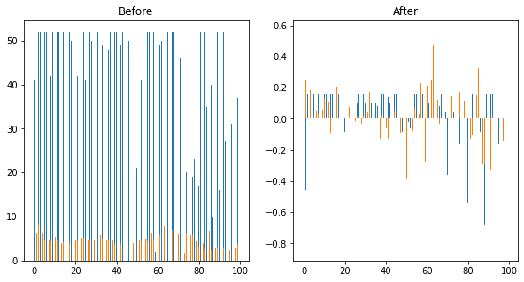

**中心化化后图示**

```python
# 房屋年龄特征归一化
cen_scaler_data1 = centralisation(data[1])
# 平均房间数量特征归一化
cen_scaler_data2 = centralisation(data[2])

# 画图
f, (ax1, ax2) = plt.subplots(1, 2, figsize=(10,5))
ax1.bar(index - width/2, data[1], width)
ax1.bar(index, data[2], width)
ax2.bar(index - width/2, cen_scaler_data1, width)
ax2.bar(index, cen_scaler_data2, width)
ax1.set_title('Before')
ax2.set_title('After')
plt.show()
```


## 梯度消失/爆炸

### 概念

1. 梯度消失：在神经网络中，前面隐藏层的学习速率低于后面隐藏层的学习速率，这种现象叫梯度消失。
2. 梯度爆炸：在神经网络中，前面隐藏层的学习速率高于后面隐藏层的学习速率，这种现象叫梯度爆炸。

### 原因

在深度学习中，一般来说越复杂的结构，使用的神经网络层数越多，最后训练出的模型越好，我们可以通过反向传播机制和激活函数的使用来学习到数据各种各样的复杂特征，但也正式因为这两个因素，会在训练的过程中造成梯度消失/爆炸。


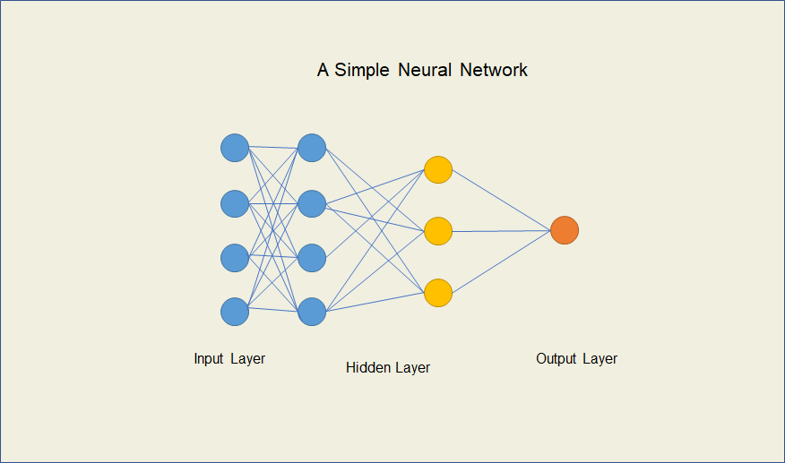

在神经网络更新参数时，需要通过$W^{[l]} = W^{[l]}- learning\_rate * \frac{\partial J}{\partial W^{[l]}}$进行梯度下降

而根据链式法则：

$\frac{\partial J}{\partial W^{[l]}} = \frac{\partial J}{\partial A^{[l+1]}} ·{\frac{\partial A^{[l+1]}}{\partial Z^{[l+1]}}}·{\frac{\partial Z^{[l+1]}}{\partial A^{[l]}}}·{\frac{\partial A^{[l]}}{\partial Z^{[l]}}}·{\frac{\partial Z^{[l]}}{\partial W^{[l]}}}$

其中：

${\frac{\partial A^{[l+1]}}{\partial Z^{[l+1]}}}=f^\prime(Z^{[l+1]})$

${\frac{\partial Z^{[l+1]}}{\partial A^{[l]}}}=W^{[l+1]}$

${\frac{\partial A^{[l]}}{\partial Z^{[l]}}}=f^\prime(Z^{[l]})$

也就是说，权重的梯度是和权重的值以及激活函数的求导相关的。继续往前反向传播的时候，各层的$W$以及激活函数的导数$f^\prime$就相乘堆叠起来越来越多，神经网络的层数越多前面的梯度就会堆叠就越多$W$和$f^\prime$。

所以：

1. 当初始化的权重$W$过大时，经过反向传播的累积，前面的网络层梯度就会越大，参数更新就会越快，太大时就造成了梯度爆炸；反之当权重$W$初始过小时就造成了梯度消失。
2. 当对激活函数求导的结果大于1时，经过反向传播的累积，前面的网络层梯度也会越大，会造成梯度爆炸；反之造成梯度消失。像$Sigmoid$激活函数，其导数的最大值为$\frac 1 4$，很容易造成梯度消失，这也是在隐藏层不推荐使用$Sigmoid$的原因之一。

### 解决方法

1. 使用效果更好的激活函数，如ReLu, Leaky-ReLu等
2. 使用标准高斯分布初始化权重
3. 使用正则化方法，控制权重的大小，限制梯度爆炸现象
4. Batch Normalisation
5. LSTM结构

## Mini-batch

### 什么是mini-batch？

### 为什么用mini-batch？

深度学习中，每次训练都要经过前向传播、反向传播、更新参数的过程，而其中每次都需要使用到训练集中所有的样本进行计算。比如在
