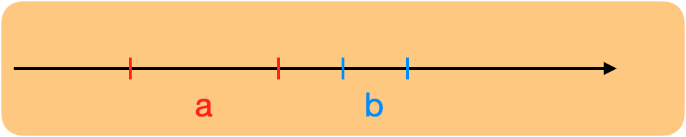
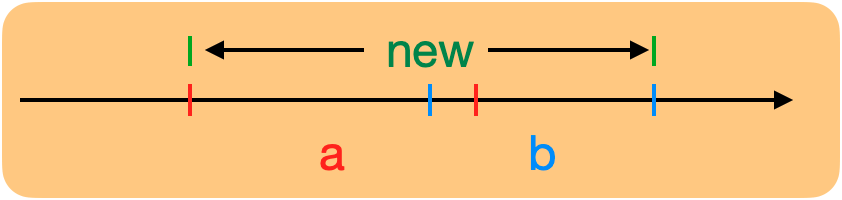
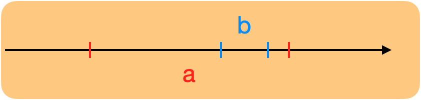
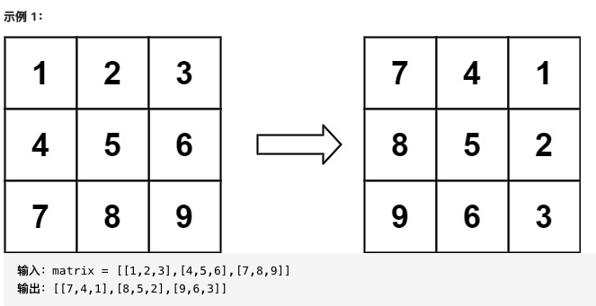
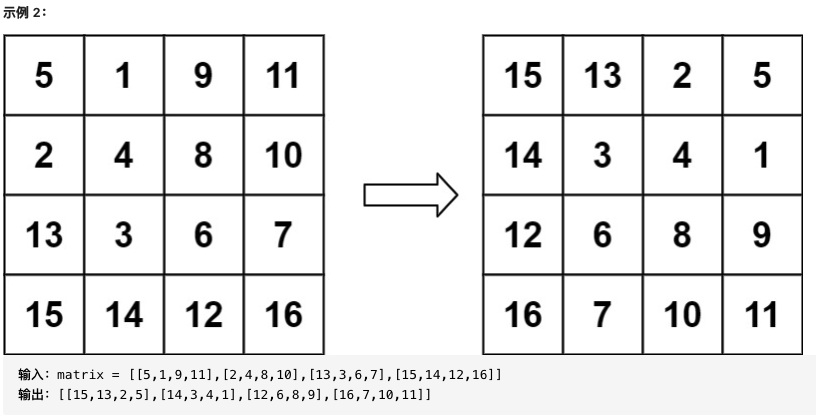
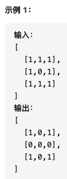
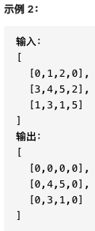
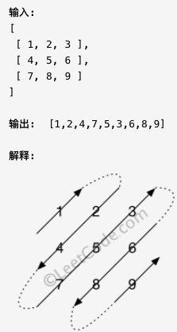

#
# LeetCode 724 寻找数组的中心下标 Find Pivot Index

[力扣](https://leetcode-cn.com/problems/find-pivot-index/)

***描述***

给你一个整数数组 `nums` ，请计算数组的 **中心下标** 。

数组 **中心下标** 是数组的一个下标，其左侧所有元素相加的和等于右侧所有元素相加的和。

***问题***

- 如果不存在中心下标返回什么？比如$nums=[1,2,3]$

  0

- 中心下标可以出现在最左边或者最右边吗？比如$nums=[4,-2,2]$

  可以

- 如果数组中有多个中心下标怎么办？比如$nums=[1,3,2,0,4]$

  返回最靠近左边的哪一个

***示例***

输入：$nums = [1, 7, 3, 6, 5, 6]$ 输出：3 解释： 中心下标是 3 。 左侧数之和 $sum = nums[0] + nums[1] + nums[2] = 1 + 7 + 3 = 11$ ， 右侧数之和 $sum = nums[4] + nums[5] = 5 + 6 = 11$ ，二者相等。

***解答***

1. 暴力法

   关键点是判断元素的左边和是否等于右边和。

   从左到右遍历$nums$，将第$i$个元素左边的元素存在$left$列表中，右边的元素存在$right$列表中，比较两个列表的元素和是否相等，若相等，则返回i，若遍历完了还不相等，返回$-1$

   其实不新建两个列表也可以，分表再用循环求一个$lsum$和$rsum$就行

   ```python
   class Solution:
       def pivotIndex(self, nums: List[int]) -> int:
           left = []
           right = nums.copy()
           right.pop(0)
           for i in range(len(nums)):
               if sum(left) == sum(right):
                   return i
               left.append(nums[i])
               if right:
                   right.pop(0)
           return -1
   ```

   时间复杂度为$O(n^2)$，因为遍历了两层，第一层遍历整个列表，第二层分别计算两个列表的元素和也需要遍历整个列表。$6012ms$

   空间复杂度$O(n)$，因为新建了两个列表。$15.9MB$

   能不能只遍历$left$列表来减少时间消耗？

2. 暴力法优化

   提前计算$nums$的元素和$total$，第一层遍历整个$nums$，第二层中可以只计算$left$列表的和，则只需要满足$sum(left)*2+nums(i)= total$即可

   ```python
   class Solution:
       def pivotIndex(self, nums: List[int]) -> int:
           left = []
           total = sum(nums)
           for i in range(len(nums)):
               if sum(left) * 2 + nums[i] == total:
                   return i
               left.append(nums[i])
           return -1
   ```

   时间复杂度为$O(n^2)$，因为遍历了两层，第一层遍历整个列表，第二层计算$left$列表的元素和也需要遍历整个列表。$1712ms$

   空间复杂度为$O(n)$，因为新建了一个列表。$15.8MB$

   时间复杂度试试降到$O(n)$，只遍历一层

3. 前缀和法 Presum

   上面优化的算法中，既然我们在第二层只需要计算$i$左边的元素和，那就不用新建一个列表每次求和了，而是定义一个前缀和$presum$，这样判断条件就$presum * 2 + nums[i] == total$每次$i$不满足条件后就将$presum$就加上$nums[i]$

   ```python
   class Solution:
       def pivotIndex(self, nums: List[int]) -> int:
           total = sum(nums)
           presum = 0
           for i in range(len(nums)):
               if presum * 2 + nums[i] == total:
                   return i
               presum += nums[i]
           return -1
   ```

   时间复杂度为$O(n)$，因为只遍历了一次列表。 $36ms$

   空间复杂度为$O(1)$，因为没有新的结构生成。 $15.7MB$

# LeetCode704 二分查找 Binary Search

[力扣](https://leetcode-cn.com/problems/binary-search/)

***描述***

给定一个 n 个元素有序的（升序）整型数组 nums 和一个目标值 target  ，写一个函数搜索 nums 中的 target，如果目标值存在返回下标，否则返回 -1。

***问题***

- 数组中是否会存在重复元素？

  不会

- 数组会为空吗？——如果为空要考虑这种情况，直接返回-1

  不会

***示例***

输入: $nums = [-1,0,3,5,9,12], target = 9$ 输出: $4$ 解释: $9$ 出现在 $nums$ 中并且下标为 $4$

输入: $nums = [-1,0,3,5,9,12], target = 2$ 输出: $-1$ 解释: $2$ 不存在 nums 中因此返回 $-1$

***解答***

1. 暴力法

   遍历整个数组，一一比较元素与target是否一致

   ```python
   class Solution:
       def search(self, nums: List[int], target: int) -> int:
           for i in range(len(nums)):
               if target == nums[i]:
                   return i
           return -1
   ```

   时间复杂度为$O(n)$，遍历了一次数组

   空间复杂度为$O(1)$，只创建了$i$

   用二分查找来减小时间消耗

2. 二分查找

   从数组最中心开始找，比较中心值和target大小，比target大就把范围缩小到左边，反之到右边

   重复比较中心值和target，直到范围缩小到target本身

   时间复杂度$O(logn)$

   空间复杂度$O(1)$

   ```python
   class Solution:
       def search(self, nums: List[int], target: int) -> int:
           low = 0 # 初始化左边下标为0
           high = len(nums) - 1 # 初始化右边下标为数组最右边元素的下标
           while low <= high: # 当左下标不大于右下标时执行判断
   						# 计算中心下标，注意不写成 (low + high) // 2是因为避免溢出，不过Python会自动转换长整数 
               mid = low + (high-low)//2 
   						# 中心值等于目标时直接返回中心下标
               if target == nums[mid]: 
                   return mid
   						# 目标小于中心值时说明目标在左半部分，将右下标左移到中心下标左边
               elif target < nums[mid]:
                   high = mid - 1
   						# 目标大于中心值时说明目标在右半部分，将左下标右移到中心下标右边
               elif target < nums[mid]:
                   low = mid + 1
           return -1 # 如果循环结束找不到目标，返回-1
   ```

# LeetCode 035 搜索插入位置 Search Insert Position

[力扣](https://leetcode-cn.com/problems/search-insert-position/)

***描述***

给定一个排序数组和一个目标值，在数组中找到目标值，并返回其索引。如果目标值不存在于数组中，返回它将会被按顺序插入的位置。

***问题***

- 排序数组是升序排列还是降序排列的？

  升序

- 数组中会不会有重复元素？

  不会

- 数组会不会为空？

  不会

***示例***

输入: $[1,3,5,6], 5$ 输出: $2$

输入: $[1,3,5,6], 2$ 输出: $1$

***解答***

1. 暴力法

   先考虑$target$的值在数组中的情况，遍历数组，如果$target$存在，返回对应元素的索引

   再考虑$target$为最小值或最大值的情况，返回$0$或者$len(nums)$

   有考虑target排序在中间的情况，遍历数组，target大于第$i$个元素并小于第$i+1$个元素

   ```python
   class Solution:
       def searchInsert(self, nums: List[int], target: int) -> int:
           for i in range(len(nums)):
               if nums[i] == target:
                   return i
           if target < nums[0]:
               return 0
           if target > nums[(len(nums)-1)]:
               return len(nums)
           for i in range(len(nums)-1):
               if target >= nums[i] and target < nums[i+1]:
                   return i+1
   ```

   时间复杂度为$O(n)$，最多只遍历了一层数组。$20ms$

   空间复杂度为$O(1)$，没有新的结构生成。$15.3MB$

2. 暴力法优化

   遍历数组，只要元素值大于或等于$target$，就可以返回此时的下标

   遍历结束后，所有元素小于$target$，返回最后一个下标+1，即为数组长度

   ```python
   class Solution:
       def searchInsert(self, nums: List[int], target: int) -> int:
           for i in range(len(nums)):
               if nums[i] >= target:
                   return i
           return i+1
   ```

   时间复杂度为$O(n)$，最多只遍历了一层数组。$32ms$

   空间复杂度为$O(1)$，没有新的结构生成。$15.4MB$

3. 二分查找

   和上一题一样的思想，只是当找不到target的时候，返回当时的high+1，因为

   如果在数组中间位置，这时候high就是mid，而mid+1就是要插入的位置

   如果要插入在数组开头位置，这时候high为-1，high+1就是起始索引0

   如果要插入在数组末尾位置，这时候high为最后一个元素，high+1就是末尾索引+1

   ```python
   class Solution:
       def searchInsert(self, nums: List[int], target: int) -> int:
           low = 0
           high = len(nums) - 1
           while low <= high:
               mid = low + (high-low)//2
               if target == nums[mid]:
                   return mid
               elif target < nums[mid]:
                       high = mid-1
               elif target > nums[mid]:
   
                       low = mid + 1
           return high + 1
   ```

   时间复杂度$O(logn)$，二分查找的关系 $32ms$

   空间复杂度$O(1)$ $15.4MB$

# LeetCode 56 合并区间 Merge Intervals

[力扣](https://leetcode-cn.com/problems/merge-intervals/)

***描述***

以数组 intervals 表示若干个区间的集合，其中单个区间为 intervals[i] = [starti, endi] 。请你合并所有重叠的区间，并返回一个不重叠的区间数组，该数组需恰好覆盖输入中的所有区间。

***示例***

输入：$intervals = [[1,3],[2,6],[8,10],[15,18]]$ 输出：$[[1,6],[8,10],[15,18]]$ 解释：区间 $[1,3] 和 [2,6]$ 重叠, 将它们合并为 $[1,6]$

输入：$intervals = [[1,4],[4,5]]$ 输出：$[[1,5]]$ 解释：区间 $[1,4] 和 [4,5]$ 可被视为重叠区间

***问题***

- 数组的长度可能为0吗？

  不可以

- 区间范围包含负数和0吗

  不包含负数

- 数组是按照顺序排列的吗？

  不是

***解答***

1. 排序逐加

   题目中没有说数组元素是升序排列，为了方便从左到右判断区间的大小关系，先对数组进行排序

   建立一个新数组，传入第一个元素

   遍历原数组，比较新数组当前最后一个元素a和原数组中元素b的区间上下限关系：

   因为数组已经按照所有区间的下限大小进行了升序排列，所以后一个元素的下限必定大于前一个元素的上限

   如果b的下限大于a的上限，说明b不包括在a中，直接将b添加到新数组为新元素；

   

   如果b的下限小于等于a的上限，且b的上限大于等于a的上限，说明b和a有重合区间但又不完全被包括，将a的上限更新为b的上限，得到一个合并后的新区间；

   

   如果b的下限小于a的上限，说明b被包括在a中，不用改变a区间，也不用添加新元素，保持不变

   

   遍历结束后，返回新数组

   ```python
   class Solution:
       def merge(self, intervals: List[List[int]]) -> List[List[int]]:
           intervals.sort(key = lambda X : X[0])
           merged = [intervals[0]]
           left = merged[0][0]
           right = merged[0][1]
           for i in range(1, len(intervals)):
               if intervals[i][0] > right:
                   merged.append(intervals[i])
               elif intervals[i][0] <= right and intervals[i][1] >=right:
                   merged[-1][1] = intervals[i][1]
               left = merged[-1][0]
               right = merged[-1][1]
           return merged
   ```

   时间复杂度为$O(n)$，为排序算法的复杂度 $36ms$

   空间复杂度为$O(logn)$ ，$15.6MB$

可以优化一下，新数组中不需要一开始就添加元素组的第一个元素

$32ms, 15.8MB$

```python
class Solution:
    def merge(self, intervals: List[List[int]]) -> List[List[int]]:
        intervals.sort(key = lambda X : X[0])
        merged = []
        for i in range(0, len(intervals)):
            if not merged or intervals[i][0] > merged[-1][1]:
                merged.append(intervals[i])
            elif intervals[i][0] <= merged[-1][1] and intervals[i][1] >= merged[-1][1]:
                merged[-1][1] = intervals[i][1]
        return merged
```

再优化一下，对于第二第三种情况，只要有重合空间，就将a的上限更新为a和b中上限较大的即可 $36ms, 15.6MB$

```python
class Solution:
    def merge(self, intervals: List[List[int]]) -> List[List[int]]:
        intervals.sort(key = lambda X : X[0])
        merged = []
        for i in range(0, len(intervals)):
            if not merged or intervals[i][0] > merged[-1][1]:
                merged.append(intervals[i])
            else:
                merged[-1][1] = max(merged[-1][1],intervals[i][1])
        return merged
```

# LeetCode 001 两数之和 Two Sum

[力扣](https://leetcode-cn.com/problems/two-sum)

***描述***

给定一个整数数组 nums 和一个整数目标值 target，请你在该数组中找出和为目标值 target 的那两个整数，并返回它们的数组下标。

***问题***

- 数组中可以有重复数字吗？比如nums = [2, 2, 3, 4]

  会有

- 可以对数组本身进行修改吗？

  可以

- 数组中的元素是否有范围？

  109 <= nums[i] <= 109

- 数组中的元素有限制正数吗？

  不限制，正数、负数、0都可能

- 同一个元素可以使用两次吗？

  不可以，意味着 nums = [2, 3, 4], target = 4 需要返回false

- 如果两对元素同时满足条件怎么办？比如nums = [1, 2, 3, 4, 5], target = 7

  假设每种输入只会对应一个答案，找到一个即可

- target的值是随机的吗？

  是

- 数组是已经排好序的吗？

  不是

***示例***

输入：nums = [2,7,11,15], target = 9 输出：[0,1] 解释：因为 nums[0] + nums[1] == 9 ，返回 [0, 1] 。

***解答***

1. 暴力法 Brute Force

   穷举所有可能的情况，将数组里的元素两两相加，找到和等于target的两个元素

   ```python
   class Solution:
       def twoSum(self, nums: List[int], target: int) -> List[int]:
           result = []
           for i in range(len(nums)):
               for j in range(i+1, len(nums)):
                   if target == nums[i] + nums[j]:
                       result.append(i)
                       result.append(j)
                       return result
   				return False
   ```

   时间复杂度为$O(n^2)$，需要遍历两层数组，每层遍历最多n个元素，一共有$C_n^2 = \frac {n(n-1)}{2}$对元素

   空间复杂度为$O(1)$，因为除了数组没有生成其他的结构

   我们想要减少时间复杂度，考虑只遍历一次实现。

2. 哈希查找 Hashing

   先遍历一遍数组来找第一个数a，用target-a确定第二个数b应该是多少，边遍历边将a存到一个新的字典中，然后在字典中查找b是否存在。

   ```python
   class Solution:
       def twoSum(self, nums: List[int], target: int) -> List[int]:
           dic = {}
           for i, val in enumerate(nums):
   						if target-val in dic:
   							return [dic[target-val], i]
   						dic[val] = i
   		return false  
   ```

   时间复杂度为$O(n)$，因为只需要遍历一遍数组，在字典中查找元素的复杂度为$O(1)$

   空间复杂度为$O(n)$，因为需要新建一个字典，字典中最多会存储n个元素

   # LeetCode 48 旋转图像 Rotate Image

   [力扣](https://leetcode-cn.com/problems/rotate-image/)

   ***描述***

   给定一个 n × n 的二维矩阵 matrix 表示一个图像。请你将图像顺时针旋转 90 度。

   你必须在 原地 旋转图像，这意味着你需要直接修改输入的二维矩阵。请不要 使用另一个矩阵来旋转图像。

   ***示例***

   

   

   ***问题***

   - 矩阵可以只有一个元素吗，如$[[1]]$

     可以

   解答

   1. 对称旋转

      将原数组先上下对称交换元素，再对角线交换元素即可

      时间复杂度为$O(n^2)$ $28ms$

      空间复杂度为$O(1)$ $14.9MB$

      ```python
      class Solution:
          def rotate(self, matrix: List[List[int]]) -> None:
              """
              Do not return anything, modify matrix in-place instead.
              """
              n = len(matrix)
              for i in range(n//2):
                 matrix[i], matrix[-i-1] = matrix[-i-1], matrix[i]
              for i in range(n):
                  for j in range(i+1, n):
                      matrix[i][j], matrix[j][i] = matrix[j][i], matrix[i][j]
              return matrix 
      ```

   # LeetCode 01.08 零矩阵 Zero Matrix

   [力扣](https://leetcode-cn.com/problems/zero-matrix-lcci/)

   ***描述***

   编写一种算法，若M × N矩阵中某个元素为0，则将其所在的行与列清零。

   ***示例***

   

   

   ***解答***

   1. 用两个数组存储零元素

      题目的关键是找出数组中值为零的元素，但是不能找到就立刻把行列元素变0

      需要用容器把值为零的元素记录下来

      使用两个数组，一个记录零元素的行，一个记录零元素的列

      时间复杂度为$O(mn)$ $36ms$

      空间复杂度为$O(m+n)$ $15.4MB$

      ```python
      class Solution:
          def setZeroes(self, matrix: List[List[int]]) -> None:
              """
              Do not return anything, modify matrix in-place instead.
              """
              m = len(matrix)
              n = len(matrix[0])
              rows = []
              colums = []
              for i in range(m):
                  for j in range(n):
                      if matrix[i][j] == 0:
                          rows.append(i)
                          colums.append(j)
              for row in rows:
                  for j in range(n):
                      matrix[row][j] = 0
              for colum in colums:
                  for i in range(m):
                      matrix[i][colum] = 0
      ```

   # LeetCode 498 对角线遍历 Diagonal Traverse

   ***描述***

   给定一个含有 M x N 个元素的矩阵（M 行，N 列），请以对角线遍历的顺序返回这个矩阵中的所有元素，对角线遍历如下图所示。

   ***示例***

   

   ***问题***

   矩阵可能为空吗？—— 不会

   ***解答***

   1. 对角线数组遍历

      关键点：

      - 一共有多少条对角线？

        一共有M+N-1条对角线，新建一个M+N-1大小的二维数组

      - 每条对角线往哪个方向动？

        从$0$开始，对于第$n$条对角线，如果$n$是偶数，对角线左下-右上，如果$n$是奇数，对角线右上-左下

      - 每条对角线内的元素下标有什么规律？

        从$0$开始，第n条对角线中，所有元素都有$i+j=n$，通过这点遍历原数组，存储到新数组中，注意此时新数组中的元素是 右上-左下 的顺序

      - 怎么把元素存到目标数组中？

        遍历新数组的外层，如果遇到奇数层就把其中的元素原样存到目标数组中，如果遇到偶数层就把其中的元素逆转后存到目标数组中

      - 最后输出目标数组

      ```python
      class Solution:
          def findDiagonalOrder(self, mat: List[List[int]]) -> List[int]:
              num_rows, num_cols = len(mat), len(mat[0]) 
              diagonals = [[] for _ in range(num_rows + num_cols - 1)]
              res = [] 
              for i in range(num_rows):
                  for j in range(num_cols):
                      diagonals[i+j].append(mat[i][j]) 
              for x in range(0, len(diagonals)):
                  if x % 2 == 1:
                      res.extend(diagonals[x])
                  else:
                      res.extend(diagonals[x][::-1])
              return res
      ```

      时间复杂度$O(MN)$ $48ms$

      空间复杂度$O(MN)$ $17.2MB$ 对角线二维数组也传入了全部元素

# LeetCode 14 最长公共前缀 Longest Common Prefix

***描述***

编写一个函数来查找字符串数组中的最长公共前缀。

如果不存在公共前缀，返回空字符串 ""

***示例***

```markdown
输入：strs = ["flower","flow","flight"]
输出："fl"
```

```markdown
输入：strs = ["dog","racecar","car"]
输出：""
解释：输入不存在公共前缀。
```

***解答***

可以以任意一个词作为基准，将其与数组中其他词一一进行横向比较，这里选用数组第一个词，从左到右比较每个词的字母是否与基准词一致，如果不一致则停止比较，返回当前已经比较过的字母，或者如果比较的词的全部字母已经比较完成，则该词即为最长公共前缀，也停止比较，返回当前已经比较过的字母。

```python
def longestCommonPrefix(str):
    res = ""
    for i in range(len(str[0])):
        for s in str:
            if len(s) == i or s[i] != str[0][i]:
                return res
        res += str[0][i]
    return res
```

# LeetCode 005 最长回文子串 Longest Palindromic Substring

***描述***

给你一个字符串 `s`，找到 `s` 中最长的回文子串。`s` 仅由数字和英文字母（大写和/或小写）组成。

***示例***

```markdown
输入：s = "babad"
输出："bab"
解释："aba" 同样是符合题意的答案。
```

```markdown
输入：s = "cbbd"
输出："bb"
```

```markdown
输入：s = "a"
输出："a"
```

```markdown
输入：s = "ac"
输出："a"
```

***解答***

- 出现回文字符，说明有**相同的字符成对左右出现**，分奇数和偶数数目字符串讨论。

- 遍历字符串，对于奇数数目字符串，以每个字符为中心，检验其左右两边的字符是否相等，如果相等，则继续检验更左右两边的字符，直到左右两边越界或者左右字符不相等为止。过程中记录下每个字符扩展得到的最长的回文数，如果遇到回文长度大于之前记录的长度，则更新最长回文串，遍历完成后返回最终的最长回文串。

- 遍历字符串，对于偶数数目字符串，以每个字符以及其左/右边字符的为中心，检验它俩是否相等，以及它俩左右两边的字符是否相等，如果相等，则继续检验更左右两边的字符，直到左右两边越界或者左右字符不相等为止。过程中记录下每个字符扩展得到的最长的回文数，如果遇到回文长度大于之前记录的长度，则更新最长回文串，遍历完成后返回最终的最长回文串。

  ```python
  def longestPalindromSubstring(str):
      res = ""
      longestLength = 0
      # odd
      for i in range(len(str)):
          left = i - 1
          right = i + 1
          while(left >= 0 and right <= len(str) - 1 and str[left] == str[right]):
              left -= 1
              right += 1
          left += 1
          right -= 1
          if right - left + 1 > longestLength:
              longestLength = right - left + 1
              res = str[left:right+1]
      # even
      for i in range(len(str)):
          left = i
          right = i + 1
          while(left >= 0 and right <= len(str) - 1 and str[left] == str[right]):
              left -= 1
              right += 1
          left += 1
          right -= 1
          if right - left + 1 > longestLength:
              longestLength = right - left + 1
              res = str[left:right+1]
      return res
  ```

  
