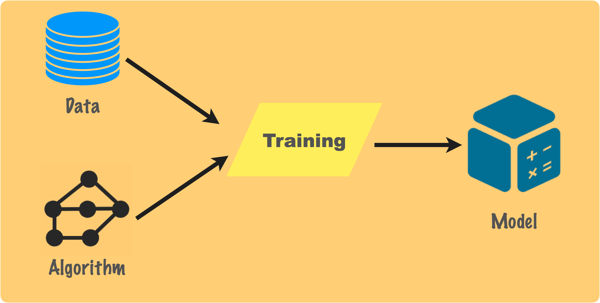
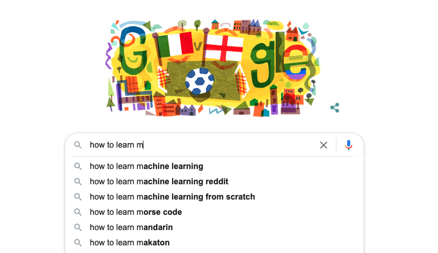
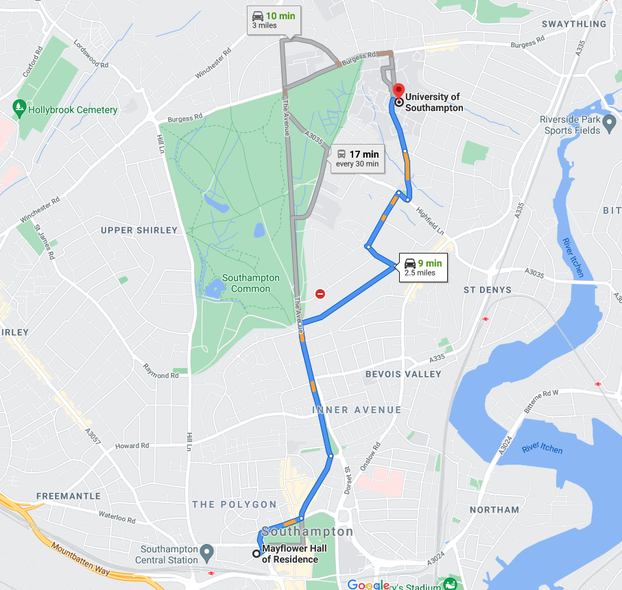
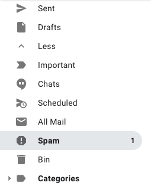

# 什么是机器学习 WHAT

汤姆·米切尔对机器学习的定义：

- Well-posed Learning Problem: A computer program is said to  learn from experience E with respect to some task T and some performance measure P, if its performance on T as measured by P, improves with experience E. - Tom Mitchell (1998). 
- 假设用 P 来评估计算机程序 在某任务类 T 上的性能， 若一个程序通过利用经验 E 在 T 中任务丰获得了性 能改善，则我们就说关于 T 和 P， 该程序对 E 进行 了学习

简单来说，机器学习是计算机基于已有的经验/数据，通过恰当的算法指导训练出有效的模型，然后利用此模型对新的情境做出预测的过程。

- 机器学习和人工智能有什么关系？
  
    如果把人工智能理解为一种学科，一个研究领域，那么机器学习就是人工智能的一个分支，机器学习是一门多领域交叉学科，涉及到多方面的知识。
    
    如果把人工智能理解为实体产物，现实中人们常会说语音助手Siri是人工智能，战胜围棋世界冠军的AlphaGO是人工智能，钢铁侠的虚拟管家Javis是人工智能，那么机器学习就是实现人工智能的途径，基于不同的输入数据，机器学习能够在不同的领域产出各种优秀的人工智能。
    

# 机器学习怎样学习 HOW

机器学习的过程与人类学习非常类似。

人是如何学习翻译的？

- 我们首先需要的是大量的双语内容的输入，从单词、词组搭配到段落和整篇文本
- 每个人学习的过程中都会用到不同的学习方法，它们所实现的学习效果或许是不同的，但目的都是一致的，那就是能够做到尽量准确地翻译文本。
- 对这些双语内容不断理解、学习和进行翻译实践。
- 经过长时间的学习后，我们已经能够比较准确地翻译见过的很多文本，这时再通过翻译一些新的文本（比如参加翻译资格考试）来评估我们的翻译水平如何。
- 在评估的过程中我们可能会发现以前的学习过程中有的地方存在不足，再通过经过改进后更有效的学习方法，我们的翻译水平也许能得到进一步的提升。
- 经历了大量的时间和脑力的投入，（也许）一个优秀的笔译工作者诞生了，在将来通过对新文本的翻译来检验我们的水平，并仍然可能继续学习和提高。

机器是如何学习翻译的？—— ***定义问题***

- 需要大量双语文本的输入，需要对数据进行预处理来让机器学习更方便 —— **收集和预处理数据**
- 选取适当的学习方法（机器学习算法） —— **算法选择**
- 根据提供的双语文本进行学习 —— **模型训练**
- 用一部分提供的双语文本对学习成果进行检验 —— **模型评估**
- 基于评估的分数试着改进学习方法 —— **参数调整**
- 用学习好的模型对新的文本进行翻译 —— **预测**

以上只是简化后的机器学习过程，在每一个步骤中，都有很多的细节和问题值得注意。

# 为什么使用机器学习 WHY

- 自动化。好的模型一经训练，就可以一直投入应用，避免了大量的人工重复劳动。比如机器翻译、图像识别、语音识别等
- 高效率。有的问题太过复杂以至于用传统的编程算法难以解决，但机器学习能够极大地提高解决的速度。比如AI玩游戏、自动驾驶汽车等
- 可塑性。一个机器学习算法可以解决很多不同的问题，而且能够通过新增的数据不断学习和进步，训练出更优秀的模型。

- 机器学习有什么缺点？
    - 数据需求。训练好的机器学习模型一般需要大量的数据输入，而且训练数据的质量很大程度地影响了模型的准确度，在‣ 中会有详细的说明。
    - 资源消耗。一个复杂的机器学习模型在训练过程中需要消耗大量的时间和算力，这也是为什么在1970年代出现了一次人工智能发展的低谷。
    - 不可解释性。尽管机器学习已经能够完成一些十分复杂的任务，比如AlphaGo战胜世界围棋冠军，能够非常准确地识别身份证图片上的信息，但有些算法（比如深度学习）实现的机器学习模型像一个黑盒，人类无法解释模型做出决策的依据，因此不能在像医疗、金融、自动驾驶汽车这样比较危险和敏感的领域完全信任模型。

# 机器学习应用 Applications

机器学习的发展十分迅速，其工业落地已经不只是传统的互联网公司，比如谷歌、Facebook、百度等，现如今各行各业都在应用AI解决和加速自己的实际业务。

1. 搜索引擎
   
    机器学习在搜索过程中应用到多个阶段，有一个例子是搜索文字的自动补全。用户打出同样的文字，搜索引擎补全的内容并不是完全一样，而是会基于用户所在的地域、使用的语言、历史搜索等来预测最有可能要搜索的内容。比如我经常在Google上搜索机器学习相关的文章，于是在搜索的时候才打出m，她已经预测补全我最有可能要搜索的内容是machine learning了。
    
    
    
2. 语音识别
   
    输入语音数据，机器需要理解人类所说的内容，或是将语音转化为文字，或是生成内容给予回应，中间都需要机器翻译参与实现。
    
    
    
    机器学习在地图导航中也应用到多个阶段，一个例子是预测交通情况。
    
    输入出发地和目的地以及出发时间，Google Maps会给出耗时最短的路线，并基于现在路上的车辆情况以及以往那个时间段人们通过各个路段的平均用时等信息，来预测到时候的拥堵情况，
    
    
    
4. 推荐系统
   
    
    
5. 垃圾邮件过滤
   
    