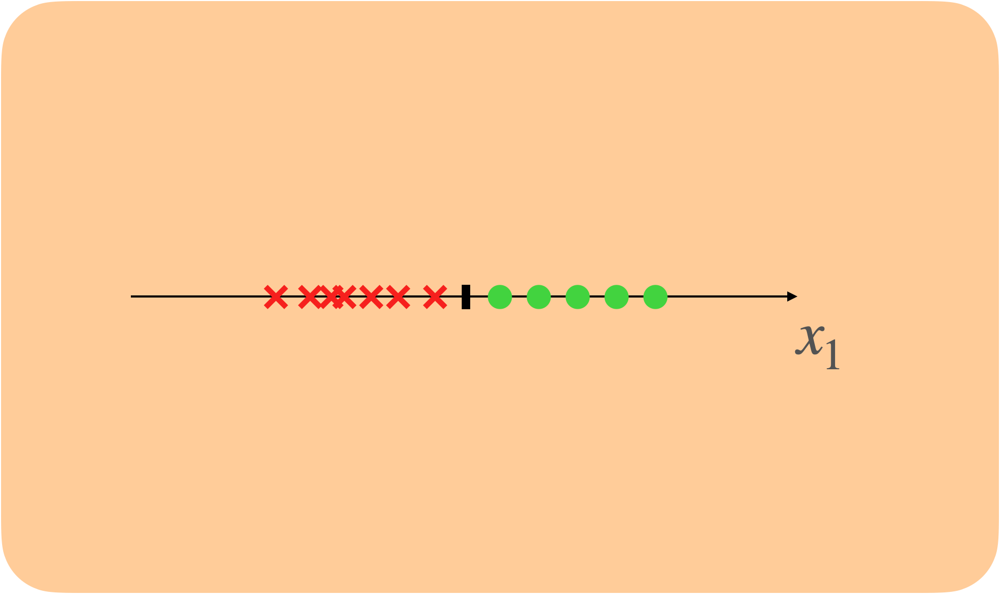
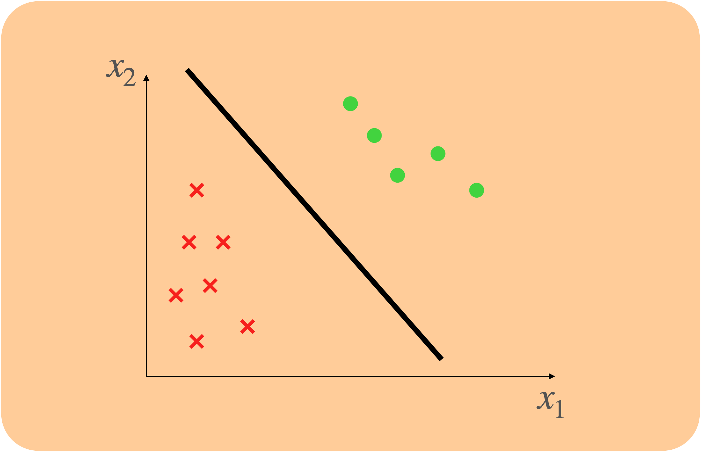
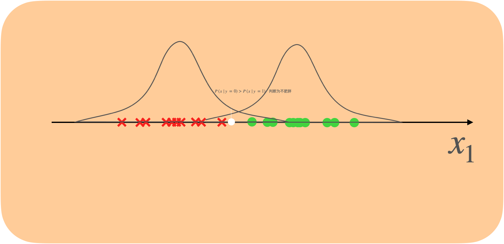
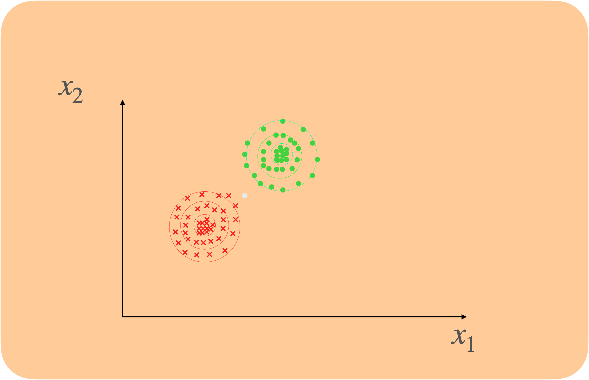
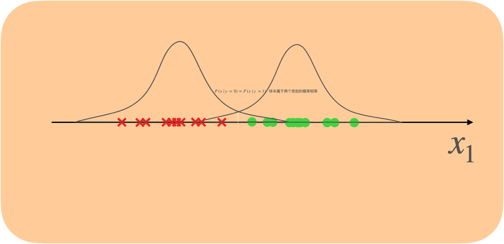
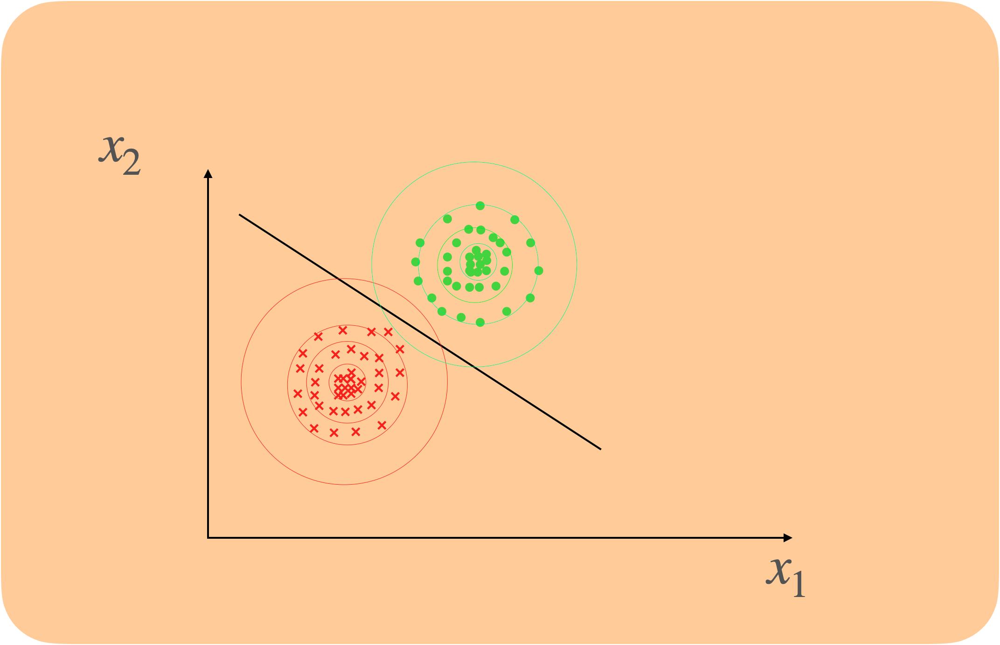

# 引入

解决二分类问题时，感知机和逻辑回归的方法是找到一个决定边界，当预测新样本时，通过判断新样本在决定边界的哪一侧来决定其分类。

比如通过一个人的身高判断他是否是肥胖（一维特征），感知机要找到一个分界点来进行判断。

通过一个人的身高和每周卡路里摄入来判断他是否肥胖（二维特征），感知机要找到一条分界线来进行判断。

而如果我们假设两个类别的***特征都满足高斯分布***，就可以通过将新样本分别属于两个类别的概率进行比较，来判断其属于哪一类。

通过一个人的身高判断他是否是肥胖（一维特征），我们找到想要最能模拟数据分布的两个高斯分布，然后通过概率密度公式$P(x|y)=\frac{1}{\sigma \sqrt{2 \pi}} e^{-\frac{1}{2}\left(\frac{x-\mu}{\sigma}\right)^{2}}$分别计算出新样本属于两个分布的概率，比较之后判断新样本属于哪一类。

通过一个人的身高和每日摄入卡路里判断他是否是肥胖（二维特征），我们找到想要最能模拟数据分布的两个多维高斯分布，然后通过概率密度公式$P(x|y)=\frac{\exp \left(-\frac{1}{2}(\mathbf{x}-\boldsymbol{\mu})^{\mathrm{T}} \mathbf{\Sigma}^{-1}(\mathbf{x}-\boldsymbol{\mu})\right)}{\sqrt{(2 \pi)^{k}|\mathbf{\Sigma}|}}$分别计算出新样本属于两个分布的概率，比较之后判断新样本属于哪一类。

所以现在的问题转化为已知两组数据，要分别求出最能拟合它们的高斯分布模型，我们可以用最大似然估计法来求这些参数。

# 参数推导

## 高斯分布的参数推导 —— 最大似然估计

给定一个训练集$X=\{x^{(1)},x^{(2)},...,x^{(m)}\}$，每个样本$x^{(i)}$有d个特征，分类标签$Y=\{0,1\}$

，则

$P(x|y=1)=\frac{\exp \left(-\frac{1}{2}(\mathbf{x}-\boldsymbol{\mu_1})^{\mathrm{T}} \mathbf{\Sigma_1}^{-1}(\mathbf{x}-\boldsymbol{\mu_1})\right)}{\sqrt{(2 \pi)^{k}|\mathbf{\Sigma_1}|}}$

$P(x|y=0)=\frac{\exp \left(-\frac{1}{2}(\mathbf{x}-\boldsymbol{\mu_0})^{\mathrm{T}} \mathbf{\Sigma_0}^{-1}(\mathbf{x}-\boldsymbol{\mu_0})\right)}{\sqrt{(2 \pi)^{k}|\mathbf{\Sigma_0}|}}$

根据$y=1$类别的样本，我们想要找到估计出最合适的参数$\mu_1,\Sigma$，则可以使用最大似然估计法

$L(\mu_1,\Sigma_1)=\prod_{i=1}^nP(x|y=1)=\prod_{i=1}^n\frac{\exp \left(-\frac{1}{2}(\mathbf{x^{(i)}}-\boldsymbol{\mu_1})^{\mathrm{T}} \mathbf{\Sigma_1}^{-1}(\mathbf{x^{(i)}}-\boldsymbol{\mu_1})\right)}{\sqrt{(2 \pi)^{d}|\mathbf{\Sigma_1}|}}$

取对数似然：

$\begin{aligned} l(\mu_1,\Sigma_1)=& \sum_{i=1}^{n} \log \left[\frac{1}{\sqrt{(2 \pi)^{d}|\Sigma_1|}} e x p\left(-\frac{1}{2}\left(x^{(i)}-\mu_{1}\right)^{\top} \Sigma_1^{-1}\left(x^{(i)}-\mu_{1}\right)\right]\right.\\=& \left.\sum_{i=1}^{n}\left[\log \sqrt{(2 \pi)^{d}\left|\Sigma_1\right|}-\frac{1}{2}\left(x^{(i)}-\mu_{1}\right)^{\top} \Sigma_1^{-1}\left(x^{(i)}-\mu_{1}\right)\right)\right] \end{aligned}$

令偏导$\frac{\partial}{\partial\mu_1}l(\mu_1,\Sigma_1)=0$，得到$\mu_1=\frac{\sum_{i=1}^nx^{(i)}}{n}$

令偏导$\frac{\partial}{\partial\Sigma_1}l(\mu_1,\Sigma_1)=0$，得到$\Sigma_1=\frac{\sum_{i=1}^n (x-\mu_1)^T(x-\mu_1)}{n}$

同理可以得到$\mu_0, \Sigma_0$

这样，我们就能通过比较新样本分别属于两个类别的概率来进行分类了

但是这样计算出的参数有一个问题，就是没有考虑样本类别不均匀的情况，当一个类别的样本远大于另一个类别时，需要考虑两类样本出现概率的影响，于是我们结合贝叶斯公式来进一步优化，得到最终的高斯判别分析模型。

## 高斯判别分析推导

我们假设两个类别特征满足的高斯分布拥有相同的协方差矩阵，并假设样本标签符合伯努利分布

则$P(y=1)=\phi$，$P(y=0)=1-\phi$

综合起来有$P(y)=\phi^{y}+(1-\phi)^{1-y}$

根据贝叶斯公式：

$P(y|x)=\frac{P(x|y)P(y)}{P(x)}$

我们想要最大化$P(y|x)$，但实际上只用最大化$P(x|y)P(y)$即可，根据最大似然估计

$\begin{aligned}
l&=logL(\phi,\mu_1,\mu_0,\Sigma)\\&=\sum_{i=1}^{m} \log \left(p\left(x^{(i)} \mid y^{(i)}=1 ; \mu_{1}, \Sigma\right)^{y^{(i)}} \cdot p\left(x^{(i)} \mid y^{(i)}=0 ; \mu_{0}, \Sigma\right)^{1-y^{(i)}}\right)+\sum_{i=1}^{m} \log p\left(y^{(i)} ; \phi\right) \\&=\sum_{i=1}^{m} y^{(i)} \log p\left(x^{(i)} \mid y^{(i)}=1 ; \mu_{1}, \Sigma\right)+\sum_{i=1}^{m}\left(1-y^{(i)}\right) \log p\left(x^{(i)} \mid y^{(i)}=0 ; \mu_{0}, \Sigma\right)+\sum_{i=1}^{m} \log p\left(y^{(i)};\phi\right)
\end{aligned}$代入

$p(x|y=1)=\frac{\exp \left(-\frac{1}{2}(\mathbf{x}-\boldsymbol{\mu_1})^{\mathrm{T}} \mathbf{\Sigma}^{-1}(\mathbf{x}-\boldsymbol{\mu_1})\right)}{\sqrt{(2 \pi)^{k}|\mathbf{\Sigma}|}}$

$p(x|y=0)=\frac{\exp \left(-\frac{1}{2}(\mathbf{x}-\boldsymbol{\mu_0})^{\mathrm{T}} \mathbf{\Sigma}^{-1}(\mathbf{x}-\boldsymbol{\mu_0})\right)}{\sqrt{(2 \pi)^{k}|\mathbf{\Sigma}|}}$

$p(y)=\phi^{y}+(1-\phi)^{1-y}$

并分别令四个参数的偏导数等于0，可以求出

$\begin{aligned}\phi &=\frac{1}{m} \sum_{i=1}^{m} 1\left\{y^{(i)}=1\right\} \\\mu_{0} &=\frac{\sum_{i=1}^{m} 1\left\{y^{(i)}=0\right\} x^{(i)}}{\sum_{i=1}^{m} 1\left\{y^{(i)}=0\right\}} \\\mu_{1} &=\frac{\sum_{i=1}^{m} 1\left\{y^{(i)}=1\right\} x^{(i)}}{\sum_{i=1}^{m} 1\left\{y^{(i)}=1\right\}} \\\Sigma &=\frac{1}{m} \sum_{i=1}^{m}\left(x^{(i)}-\mu_{y^{(i)}}\right)\left(x^{(i)}-\mu_{y^{(i)}}\right)^{T}\end{aligned}$

有了这些参数，预测时，只需用贝叶斯公式计算$P(y|x)$即可。

# 线性分界性质

观察一维特征的样本分类情况，我们发现存在一个点，使得数据在两个高斯分布中的概率相等

观察二维特征的样本分布情况（俯视图），我们也发现有的数据在两个高斯分布中的概率相等，而且那这些概率相等的点会不会都在同一条直线上呢？

推广到多维特征的的情况，概率相等的点会不会都在同一个线性超平面上呢？

答案是肯定的，证明如下：

$P(x|y=1)=\frac{\exp \left(-\frac{1}{2}(\mathbf{x}-\boldsymbol{\mu_1})^{\mathrm{T}} \mathbf{\Sigma}^{-1}(\mathbf{x}-\boldsymbol{\mu_1})\right)}{\sqrt{(2 \pi)^{k}|\mathbf{\Sigma}|}}$

$P(x|y=0)=\frac{\exp \left(-\frac{1}{2}(\mathbf{x}-\boldsymbol{\mu_0})^{\mathrm{T}} \mathbf{\Sigma}^{-1}(\mathbf{x}-\boldsymbol{\mu_0})\right)}{\sqrt{(2 \pi)^{k}|\mathbf{\Sigma}|}}$

数据在两个高斯分布中的概率相等，即

$P(x|y=1)P(y=1)=P(x|y=0)P(y=0)$

$\frac{\exp \left(-\frac{1}{2}(\mathbf{x}-\boldsymbol{\mu_1})^{\mathrm{T}} \mathbf{\Sigma}^{-1}(\mathbf{x}-\boldsymbol{\mu_1})\right)}{\sqrt{(2 \pi)^{k}|\mathbf{\Sigma}|}}\phi=\frac{\exp \left(-\frac{1}{2}(\mathbf{x}-\boldsymbol{\mu_0})^{\mathrm{T}} \mathbf{\Sigma}^{-1}(\mathbf{x}-\boldsymbol{\mu_0})\right)}{\sqrt{(2 \pi)^{k}|\mathbf{\Sigma}|}}(1-\phi)$

化简后得到

$-2\left(\mu_{0}^{\top}-\mu_{1}^{\top}\right) \Sigma^{-1} x=2 \log (1-\phi)-2 \log (\phi)+\mu_{1}^{\top} \Sigma^{-1} \mu_{1}-\mu_{1}^{\top} z^{-1} \mu_{0}$

其中$-2\left(\mu_{0}^{\top}-\mu_{1}^{\top}\right) \Sigma^{-1}$ 、$2 \log (1-\phi)-2 \log (\phi)+\mu_{1}^{\top} \Sigma^{-1} \mu_{1}-\mu_{1}^{\top} z^{-1} \mu_{0}$都为常数，

所以可以简化为$ax+b=0$的形式，即$x$在一个线性超平面上。

注：超平面是线性的前提是我们假设两个分类的特征满足的高斯分布拥有相同的方差

# 假设条件

总结一下，高斯判别分析中需要满足的假设有

1. 样本标签服从概率为$\phi$的伯努利分布
2. 两个类别的样本特征满足高斯分布，而且它们的协方差矩阵相同

# 高斯判别分析与逻辑回归

从计算的角度看：

与逻辑回归相比，高斯判别分析的计算更为快速，可以直接计算参数，而逻辑回归需要使用梯度下降训练出最佳的参数。

从假设的角度看：

逻辑回归中需要满足的假设有

1. 样本标签服从概率为$\phi$的伯努利分布 
2. $P(y=1|x)$满足sigmoid函数

实际上，通过高斯判别分析求得参数后，使用贝叶斯公式，我们同样可以得到：

$P(y=1|x)=\frac{1}{1+e^{-w^Tx}}$

不仅如此，如果假设样本特征分别满足柏松分布，我们也得到：

$P(y=1|x)=\frac{1}{1+e^{-w^Tx}}$

而通过$P(y=1|x)=\frac{1}{1+e^{-w^Tx}}$，无法反推样本特征属于什么分布。所以，高斯判别分析的假设条件比逻辑回归更严格，可以把高斯判别分析的假设看作逻辑回归的一种特殊情况。

从性能的角度看：

在数据特征满足高斯分布时高斯判别分析能够有更好的效果，但不满足这个条件时时逻辑回归会有更有更好的效果；

在数据量较小时高斯判别分析能够有更好的效果，但数据量较大逻辑回归会有更有更好的效果。