回归是一类有监督学习问题，给定的数据既有输入的特征又有输出的标签，且输出的标签是连续变量

线性回归是解决这一类问题最基本的方法。

# 引入

如果我们想要通过一个人的身高去预测他的体重，收集到了一批数据，身高为以$x$表示，体重以$y$表示：

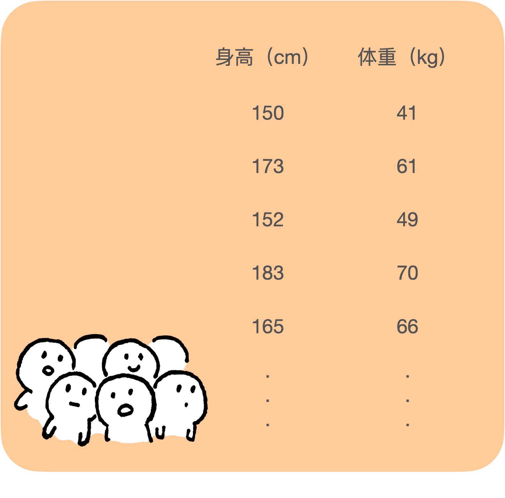

# 公式表达

为了更直观地观察这些数据，将它们画到图中：

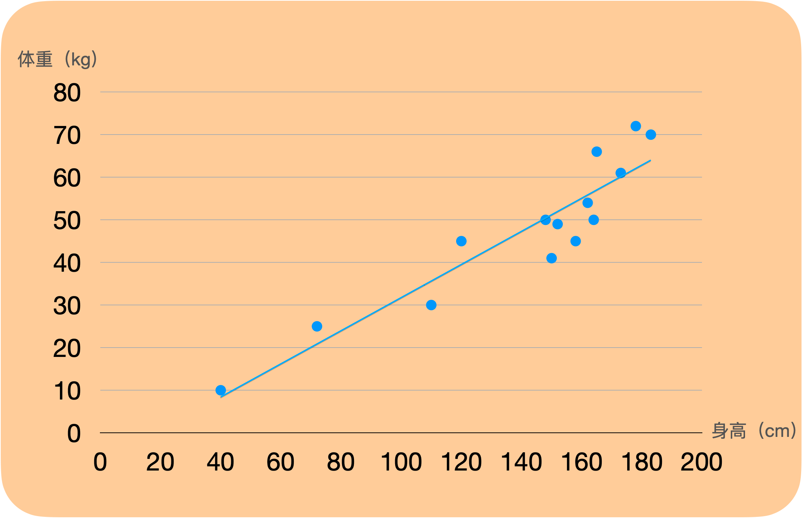

这是一个一元线性回归问题，直觉上，我们可以画一条直线（图中的蓝色直线）尽可能地拟合这些点，那么如果能够求出这条直线的函数$\hat{f}(x)=wx+b$中的参数$w$和$b$，我们就可以进行体重的预测。

如果是个多元线性回归问题（有多个特征），我们要求一个超平面$\hat{f}(x)=Wx+b$来拟合数据。

于是我们的目的转化为求出线性方程中的参数（权重）值$W$，接下来介绍估计这个最优参数的方法。

# 参数估计

## 1. 最小二乘法 **Least Squares Method**

- 什么是最小二乘法？

  在线性回归中，最小二乘法就是找到一条直线，使所有样本到直线上的欧氏距离之和最小

### 一元线性回归中的最小二乘法

我们希望这条直线上的点离我们数据集中的点越近越好，用欧氏距离$\hat{f}(x)-y$来表示估计值和实际观测值之间的差距，这个差叫做残差（residual）。

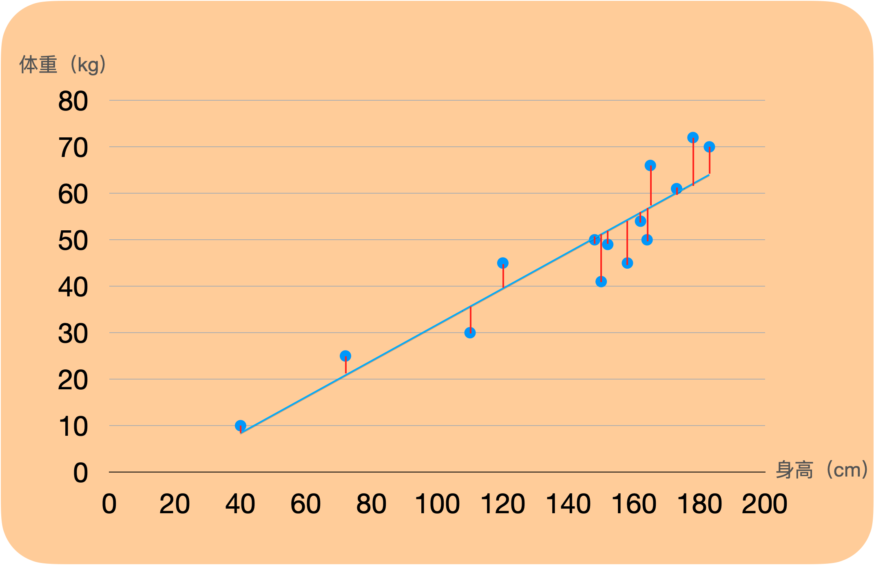

一般对于线性回归模型，我们用$(\hat{f}(x)-y)^2$来表示估计值和实际观测值的差距，并对在所有点求得的误差求平均数，这就是均方误差(Mean Squared Error)

$$ \begin{aligned} MSE&=\frac{1}{m} \sum_{i=1}^{m}\left(\hat{f}\left(x_{i}\right)-y_{i}\right)^{2} \\ &=\frac{1}{m} \sum_{i=1}^{m}\left(w x_{i}+b-y_{i}\right)^{2} \end{aligned} $$

于是我们的目的转化为求出使得均方误差最小时$w$的值

$\frac 1 m$为常数，不影响我们求最小值，可以去除，于是这时$w$可以表示为：

$$ \begin{aligned} w &=\argmin_w E_{(w,b)}\\ &=\argmin_w  \sum_{i=1}^{m}\left(w x_{i}+b-y_{i}\right)^{2}\\

\end{aligned} $$

可以用导数为0的方法进行参数的估计

将$E_{(w,b)}$对$w$进行求导，得到

$$ \begin{aligned} \frac {\partial E_{(w,b)}}{\partial w} &= \sum_{i=1}^{m}[2x_i(wx_i+b-y_i)]\\ &=\sum_{i=1}^{m}(2wx_i^2+bx_i-y_ix_i)\\ &=2w\sum_{i=1}^mx_i^2+b\sum_{i=1}^{m}x_i-y_i\sum_{i=1}^{m}x_i \end{aligned} $$

令导数为0，得到

$$ 2w\sum_{i=1}^mx_i^2+(b-y_i)\sum_{i=1}^mx_i=0\\ 2w\sum_{i=1}^mx_i^2=(y_i-b)\sum_{i=1}^mx_i $$

将$E_{(w,b)}$对$b$进行求导，得到

$$ \begin{aligned} \frac {\partial E_{(w,b)}}{\partial b} &= \sum_{i=1}^{m}[2(wx_i+b-y_i)]\\ &=2(\sum_{i=1}^{m}wx_i+\sum_{i=1}^{m}b-\sum_{i=1}^{m}y_i)\\ &=2(\sum_{i=1}^{m}wx_i+mb-\sum_{i=1}^{m}y_i) \end{aligned} $$

令导数为0，得到

$$ \begin{aligned} b&=\frac 1 m\sum_{i=1}^{m}y_i-\frac 1 mw\sum_{i=1}^{m}x_i\\ &=\bar{y}-w\bar{x} \end{aligned} $$

两个式子联合，代入b的值，可分别求出$w$和$b$的值：

$$ w=\frac{\sum_{i=1}^{m} y_{i}\left(x_{i}-\bar{x}\right)}{\sum_{i=1}^{m} x_{i}^{2}-\frac{1}{m}\left(\sum_{i=1}^{m} x_{i}\right)^{2}} $$

$$ b=\frac{1}{m} \sum_{i=1}^{m}\left(y_{i}-w x_{i}\right) $$

### 多元线性回归中的最小二乘法

上面是一元线性回归的情况，下面考虑多元线性回归，即数据有多个特征，将求解过程向量化

在身高预测体重的任务中，影响体重的因素很多，仅凭身高一项特征预测不够准确，还要考虑年龄、性别、日均摄入卡路里等特征，每个特征都以一定的参数（权重）$w$影响我们的预测函数，我们试图找到所有的理想权重

设数据中有$d$个特征，有m个样本，用$x^{(i)}$表示第$i$个样本，对于每个样本，$x=(x_0,x_1,x_2...,x_d)$表示它的$d$个特征，$w=(w_0,w_1,w_2,...,w_d)$表示每个特征的权重，$w_0$即为一元线性回归中的截距b，为了方便表示和计算，设$x_0$=1

这时我们的目标函数：

$$  \hat{f}(x)=w_0x_0+w_1x_1+w_2x_2+...+w_nx_n =\sum_{i=1}^dw_dx_d $$

为了方便在计算机上进行计算，我们将数据向量化表示

样本的输入

$$ X=\begin{bmatrix} 1 & x_{1}^{(1)} & x_{2}^{(1)} & x_{3}^{(1)} & \dots  & x_{d}^{(1)} \\ 1 & x_{1}^{(2)} & x_{2}^{(2)} & x_{3}^{(2)} & \dots  & x_{d}^{(2)} \\ \vdots & \vdots & \vdots & \ddots & \vdots \\ 1 & x_{1}^{(m)} & x_{2}^{(m)} & x_{3}^{(m)} & \dots  & x_{d}^{(m)} \end{bmatrix} $$

样本的输出

$$ Y=\begin{bmatrix} y_1 \\ y_2 \\ y_3\\ \vdots \\y_m \end{bmatrix} $$

权重

$$ W=\begin{bmatrix} w_1 \\ w_2 \\ w_3 \\ \vdots \\w_d \end{bmatrix} $$

要预测的模型函数可表示为

$$ \hat{f}(x)=W^Tx $$

此时

$E_{W} = \sum_{i=1}^{m}(\hat{f}(x_i)-y_i)^2 = (XW-Y)^T(XW-Y)$

现在需要求当$E_w$最小时，$W$的值为多少

同样地，对$E_w$进行求导

$$ \begin{aligned} \frac {\partial {E_W}} {\partial W} &= \frac \partial {\partial W} (W^{T}X^{T}-Y^{T})(XW-Y)\\ &=\frac \partial {\partial W} (W^TX^TXW-W^TX^TY-Y^TXW+Y^TY)\\ &= (X^TX+X^TX)W-X^TY-X^TY+0\\ &=2(X^TXW-X^TY) \end{aligned} $$

令导数为0，得到$W=(X^TX)^{-1}X^TY$

则

$$ \hat{f}\left(\boldsymbol{x}*{i}\right)={\boldsymbol{x}}^{{i}^{\mathrm{T}}}\left(\mathbf{X}^{T} \mathbf{X}\right)^{-1} \mathbf{X}^{\mathrm{T}} \boldsymbol{y} $$

### 最小二乘法有什么优点？

1. 简单，公式易于解释和理解
2. 计算方便，二次方的缘故
3. 有概率理论支撑：极大似然估计

### 最小二乘法有什么缺点？

1. 对数据敏感，特别是异常值 outlier
2. 要求输入的特征相互独立
3. 容易造成过拟合

## 2. 极大似然估计 Maximum Likelihood Estimation ——从概率角度理解最小二乘法

***问题***

在最小二乘法中，为什么我们用最小平方损失函数来估计权重，而不用绝对值、三次方、平方根等方法来估计？

假设我们所要求的真实函数为$f(x)$，其输出变量$y$和输入变量$x$有以下的关系：

$$ y^{i}=W^Tx^{(i)}+ \epsilon^{(i)} $$

其中$\epsilon^{(i)}$是误差项，表示噪声的影响以及回归模型中没有考虑到的特征的影响等，**假设$\epsilon^{(i)}$满足独立同分布（IID），而且基于均值为0方差为$\sigma^2$的高斯分布**，即$\epsilon^{(i)} \sim N(0, \sigma^2)$

于是$\epsilon^{(i)}$的概率密度可以表示为$p\left(\epsilon^{(i)}\right)=\frac{1}{\sqrt{2 \pi} \sigma} \exp \left(-\frac{\left(\epsilon^{(i)}\right)^{2}}{2 \sigma^{2}}\right)$

我们可以认为$y^i$满足$N(W^Tx^{(i)}, \sigma^2)$的分布

即$p\left(y^{(i)} \mid x^{(i)} ; W\right)=\frac{1}{\sqrt{2 \pi} \sigma} \exp \left(-\frac{\left(y^{(i)}-W^{T} x^{(i)}\right)^{2}}{2 \sigma^{2}}\right)$

给定所有的样本数据$X$和权重$W$，出现$Y$的概率是$p(Y|X;W)$，这就是似然函数，它衡量了在模型和参数都已知的情况下，出现特定数据结果的概率。

考虑到给定$X$下的$Y$满足独立同分布，似然函数有

$$ \begin{aligned}L(W) &=\prod_{i=1}^{m} p\left(y^{(i)} \mid x^{(i)} ; W\right) \\&=\prod_{i=1}^{m} \frac{1}{\sqrt{2 \pi} \sigma} \exp \left(-\frac{\left(y^{(i)}-W^{T} x^{(i)}\right)^{2}}{2 \sigma^{2}}\right)\end{aligned} $$

我们的目标是估计一个合适的参数（权重）$W$，最大似然估计认为如果似然函数的取值最大，那么这时的参数就是最合适的选择

$$ \begin{aligned} W_{MLE} &=\argmax_W L(W)\\ &=\argmax_W\prod_{i=1}^{m} \frac{1}{\sqrt{2 \pi} \sigma} \exp \left(-\frac{\left(y^{(i)}-W^{T} x^{(i)}\right)^{2}}{2 \sigma^{2}}\right)\\ &=\argmax_W  \sum_{i=1}^m \log \frac{1}{\sqrt{2 \pi} \sigma} \exp \left(-\frac{\left(y^{(i)}-W^{T} x^{(i)}\right)^{2}}{2 \sigma^{2}}\right)\\ &= \argmax_W  \sum_{i=1}^m [\log(2\pi)^{-\frac {1} {2}}+\log \sigma^{-1}-\frac{\left(y^{(i)}-W^{T} x^{(i)}\right)^{2}}{2 \sigma^{2}}]\\

\end{aligned} $$

可以观察到，要使$L(W)$最大，就要使$\sum_{i=1}^m (y^{(i)}-W^Tx^{(i)})^2$最小，即和最小二乘法中有着同样的目标，这也是为什么我们会选择最小化平方误差来做最小二乘法的原因

接下来同样地，我们令$\sum_{i=1}^m (y^{(i)}-W^Tx^{(i)})^2$的导数为0，也就求出了$W_{MLE}$的值。

## 3. 梯度下降法 Gradient Descent

对于预测函数$\hat {f}(x)=W^Tx$，其最小平方（Least Squares)损失函数为

$$ L(W)=\frac 1 2\sum_{i=1}^m(W^Tx^{(i)}-y^{i})^2 $$

我们的目的是最小化$L(W)$，其沿着各个变量的导数的反方向下降最快，可以对其权重进行迭代更新

$w_i=\alpha \frac {\partial L(W)}{\partial w_i}=\alpha \frac{\partial}{\partial {w_i}}\frac 1 2\sum_{i=1}^m(W^Tx^{(i)}-y^i)^2$

经过一定迭代次数后$L(W)$会达到一个局部最小值或全局最小值，这个时候的$W$就是我们的目标因为在这个例子中我们的损失函数是个凸函数（convex function)，只有一个最小值，所以一定会优化到全局最小。

其中的$\alpha$叫做学习率（learning rate），就像是每一次更新所走的步长，其一般根据经验进行赋值，如0.01, 0.001等

- 学习率$\alpha$怎么选择？

  学习率的取值取决于样本，可以取不同的值多运行几次，看看迭代效果。学习率太大，迭代就会太快，损失函数最后可能会停在一个较大的值，错过最优解；学习率太小，迭代太慢，可能需要很多次迭代才能到达最优解

- 权重的初始值怎么选择？

  如果损失函数不是凸函数，就会有落到局部最优解的风险，一般需要用不同的初始值运行算法，选择使得损失函数最小的那一组

- 迭代还是太慢会是什么原因？

  可能是样本的特征取值范围相差太大，大致迭代很慢。可以对特征数据进行归一化（normalisation)，一种普遍的方法是求出其期望$\bar x$和标准差$std(x)$然后转化为$\frac {x-\bar x}{std(x)}$，这样得到的值满足期望为0，方差为1的分布，可以使得迭代加快。

### 批量梯度下降 Batch Gradient Descent

像上面那样，每一次更新权重我们都将所有的训练集数据拿来进行梯度下降的方法，叫批次梯度下降，每一次更新，我们离局部/全局最小值都会更近，损失都会减小。

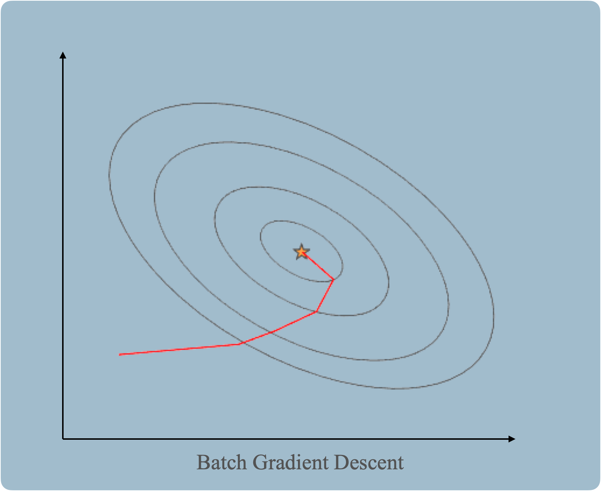

- 批量梯度下降有什么缺点？

  当数据集非常大时，权重更新的过程会非常缓慢，因为每次都要用全部的样本数据进行计算

### 随机梯度下降 Stochastic Gradient Descent

随机梯度下降和批量梯度下降类似，区别是每次更新权重只使用一个样本

即$w_i=\alpha \frac {\partial L(W)}{\partial w_i}=\alpha \frac{\partial}{\partial {w_i}}\frac 1 2(W^Tx^{(i)}-y^i)^2$

因为每次只采用一个样本进行权重更新，SGD的训练速度很快

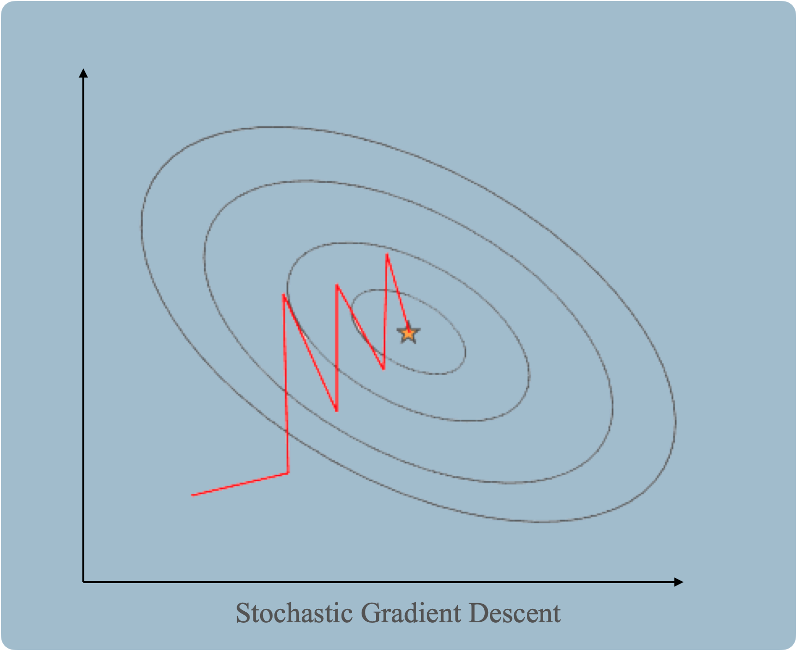

- 随机梯度下降有什么缺点？

  虽然训练速度很快，但是因为每次只用一个样本决定方向，所以更新过程中可能不会朝着最小值的方向，导致解可能不是最优解。

BGD和SGD是两个极端的方法，有没有在两者之间的缓和方法？

### 小批量梯度下降 Mini-batch Gradient Descent

顾名思义，小批量梯度下降就是采用训练集中的一小批$k$来进行每次的权重更新，比如$k=10$

则$w_i=\alpha \frac{\partial}{\partial {w_i}}\frac 1 2\sum_{i=t}^{t+x-1}(W^Tx^{(i)}-y^i)^2$

## 4. 牛顿法/拟牛顿法

我们的目的是找到$J(w)$取极小值的时候，权重$w$的值，极小值存在于 $J^\prime(w)=0$的时候，而牛顿法就是一个求$f(x)=0$时$x$的近似值的方法。

### 过程图示

以一维自变量的情况为例：

我们的目的是求出$f(x)=0$时，$x$的值，即找到红点的位置

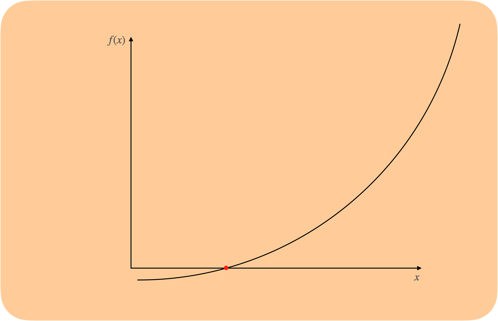

随机初始化一个点（蓝点），然后找到其切线为0（与$x$轴相交）的点$x_1$

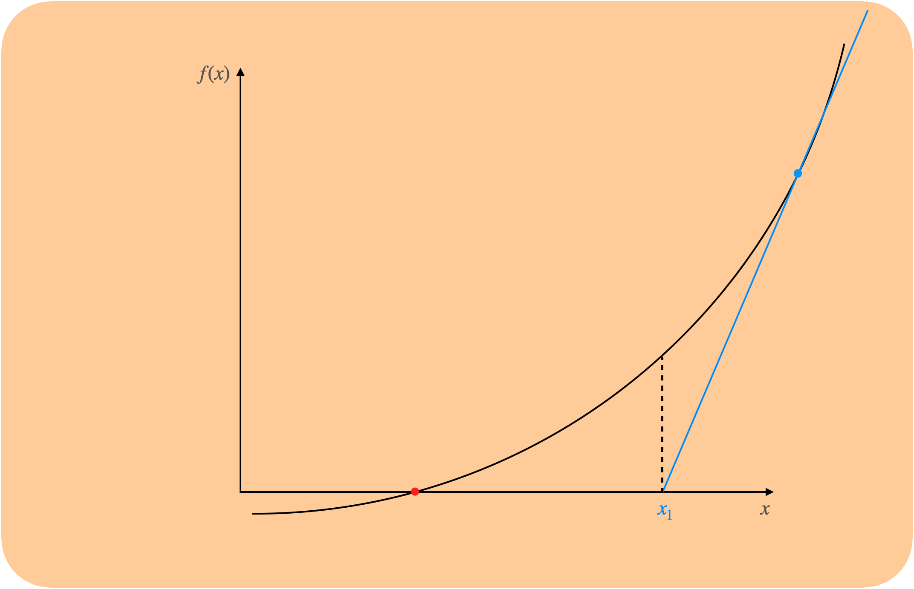

继续找$f(x_1)$的切线为0（与$x$轴相交）的点$x_2$

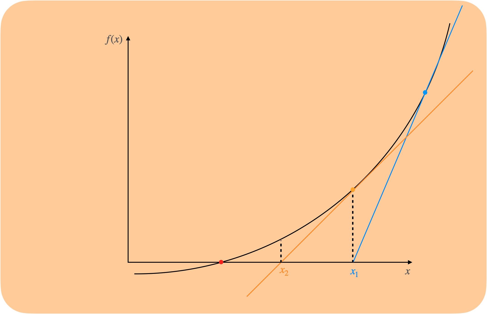

继续找$f(x_3)$的切线为0（与$x$轴相交）的点$x_3$

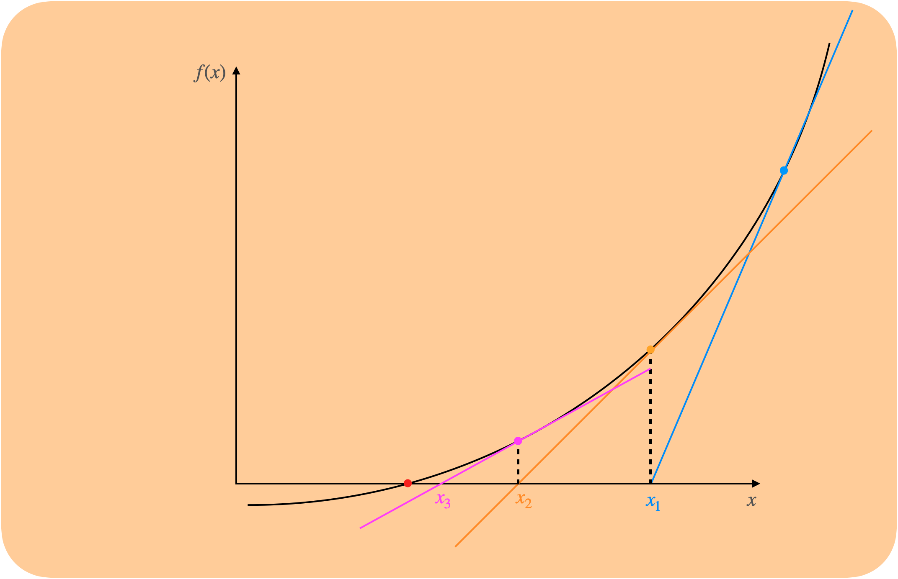

不断重复以上步骤，$x$会不断地逼近我们的目标，最后达到差距非常小的程度。

### 更新公式

我们想要找到每次更新的步长，即$\Delta x$

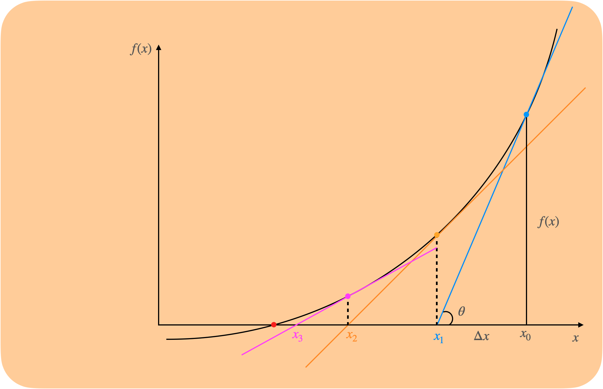

以第一次更新为例，三角形中容易发现关系：

$\tan \theta=f^\prime(x)=\frac{f(x)}{\Delta x}$

则$\Delta x=\frac {f(x)}{f^\prime(x)}$

于是更新公式为 $x_{t+1} = x_t-\Delta x=x_t-\frac {f(x_t)}{f^\prime(x_t)}$

### 最优化应用

将牛顿法应用到求我们代价函数$J(w)$的极小值中，我们想找到$J^\prime(w)=0$的点，令$J^\prime(w)$为上面的$f(x)$

则$\Delta w=\frac{J^\prime(w)}{J^{\prime\prime}(w)}$

更新公式：$w_{t+1} = w_t-\frac{J^\prime(w_t)}{J^{\prime\prime}(w_t)}$

**向量化表示：**

$\begin{aligned}\underline{x} & \triangleq{\boldsymbol{x}} \\f^{\prime}(x) & \triangleq {\nabla f(\boldsymbol{x})} \\f^{\prime \prime}(x) & \triangleq \boldsymbol{H}(\boldsymbol{x})\end{aligned}$

其中$H$是Hsssian矩阵，$H_{ij}=\frac{\partial^2J(w)}{\partial w_i\partial w_j}$

$w_{t+1} = w_t-HJ(w)^{-1}\Delta_wJ(w)$

## 5. 方法比较

1. 梯度下降法需要选择学习率，其他方法不需要
2. 梯度下降法和牛顿法/拟牛顿法是迭代求解，其中梯度下降是梯度求解，牛顿法/拟牛顿法是用海森矩阵的逆矩阵/伪逆矩阵求解，最小二乘法计算解析解。
3. 如果样本量不算很大，且存在解析解，最小二乘法比起梯度下降法要有优势，计算速度很快。
4. 但是如果样本量很大，用最小二乘法很难求解析解，使用迭代的梯度下降法比较有优势。
5. 梯度下降法总体上比牛顿法/拟牛顿法收敛慢，但是每次迭代的时间更快。

# 假设条件

1. Linearity 特征与标记之间存在线性关系
2. Independence 标记的误差项是相互独立的
3. Normality 误差项服从高斯分布
4. Equal-variance 误差项的方差为常数（同方差性）

# 局部加权线性回归 Locally Weighted Linear Regression

普通的线性回归模型有什么问题？

当输入的特征x和输出变量y之间存在的是非线性关系的时候，线性模型不能做到很好的拟合，这种特征就会降低线性回归模型的整体性能，如下图

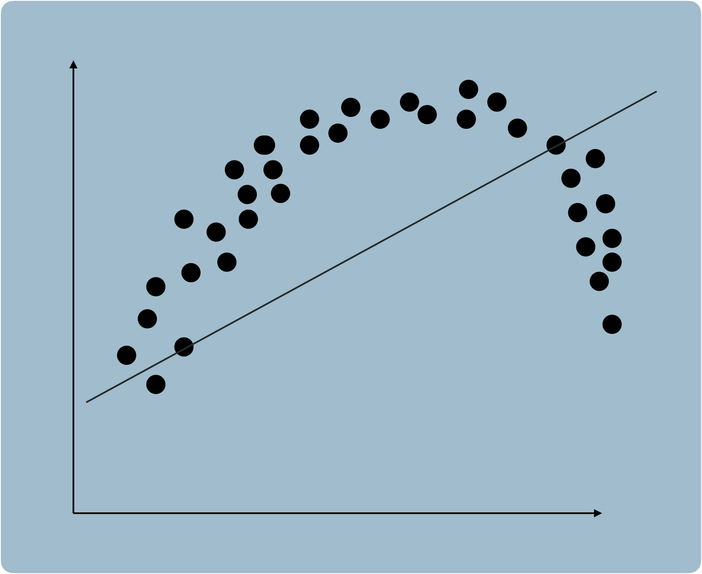

局部加权回归在一定程度上就能解决这个问题。

在局部加权线性回归中，参数是根据每一个预测点来计算点，会赋予距离预测点近的数据点更高的权重。

损失函数为：

$L(W)=\sum_{i=1}^m w^{(i)}(\theta^Tx^{(i)}-y^{(1)})^2$

注意，这里用$\theta$替代上面的权重表示$W$，$w^{(i)}$为针对每一个数据点$x^i$的权重，是非负值。

$x^{(i)}$离预测点$x$越近，$w^{(i)}$就越大，反之就越小。

一般来说，$w^{(i)}$的计算公式为$w^{(i)}=\exp (-\frac {(x^{(i)}-x)^2}{2\tau^2})^2$

其中，$\tau$叫带宽参数，控制$w^{(i)}$的大小

如果$(x^{(i)}-x)^2$小，$w^{(i)}$会接近1，如果$(x^{(i)}-x)^2$大，$w^{(i)}$会接近0

因此在进行权重更新的时候，离预测点更近的数据点会有更大的影响。

直观上理解，以下图为例

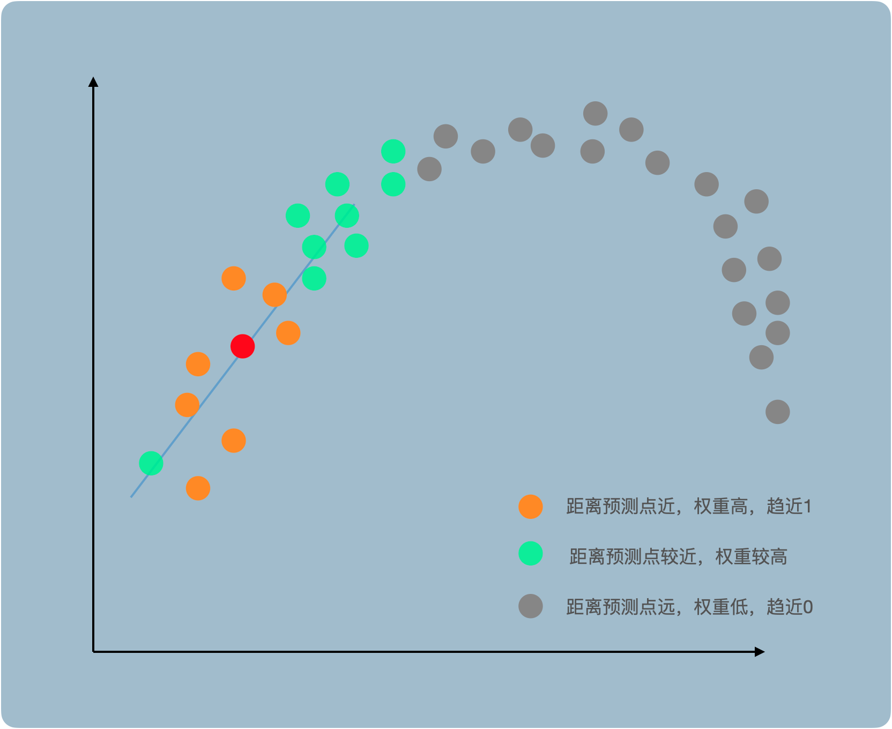

如果要预测的点为红点，我们认为越靠近它的点就越重要，权重w趋近为1，越靠近它的点越不重要，权重$w$趋近于0，于是迭代更新权重后得到一根局部的直线，能更好地对红点进行预测。

参数化的和非参数化的机器学习算法

- 参数化算法 Parametric Learning Algorithms: 参数（权重）是固定的，不随数据的改变而改变
- 非参数化算法 Non-Parametric Learning Algorithms：参数（权重）不是固定的，随着数据改变，参数也会改变，局部加权线性回归是其中一种

优点：

1. 当数据量足够的时候，特征的选择不会影响模型的性能
2. 灵活多变，即使要预测的模型很复杂，也能够较为准确地预测

缺点：

1. 需要大量数据，模型才能准确
2. 数据越多，需要保存的参数就越多（线性增大）
3. 计算量大，因为每个点都需要计算出一个模型
4. 对于异常值的处理也不好
5. 当特征较多的时候表现不好

总结：适合数据量大，特征少（2-3个）的时候使用