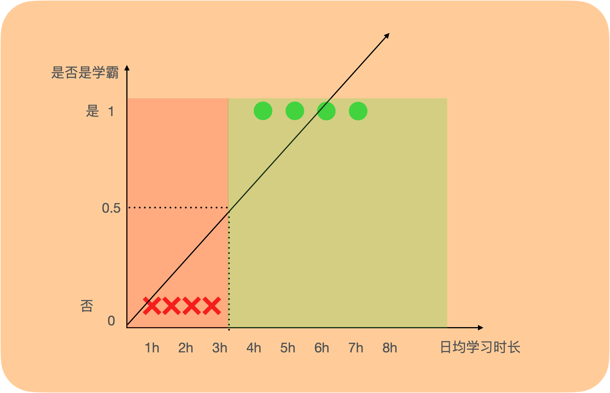
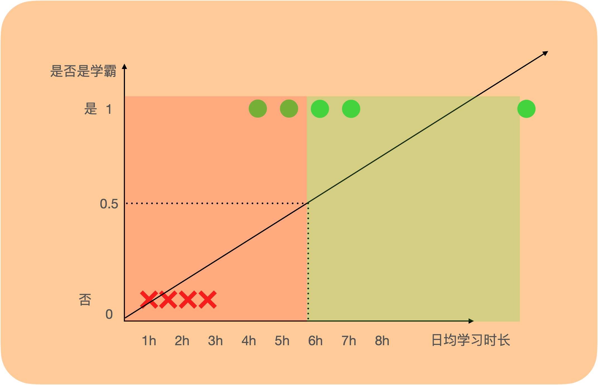
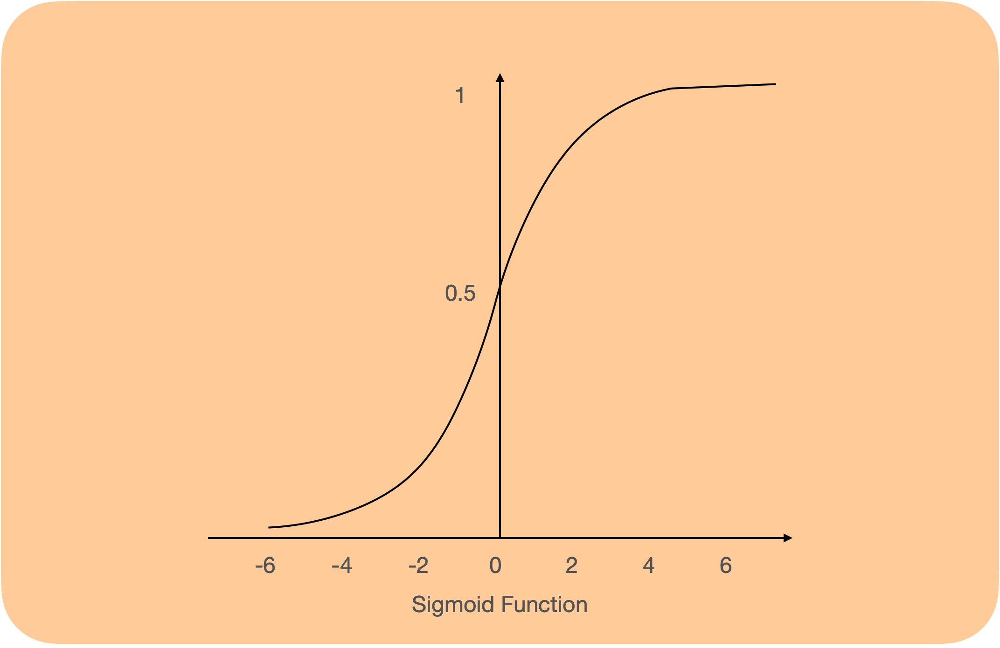

# 引入

线性回归可以解决输出值为连续变量的回归问题，但解决当输出值为离散变量时的分类问题时，效果并不好。

如下图，我们想通过日均学习时长判断一个学生是否是学霸（均分超过90），给定几个数据，我们拟合了一条直线并设定0.5为分类阈值，输出超过0.5判断为学霸，小于0.5判断不是学霸，目前看来能够对所有数据做一个准确的判断。

但拟合的直线对于数据很敏感，比如当出现一个样本，是一个每天学习长达12小时的学霸，这个合理样本的出现会使得拟合的直线发现较大的偏移（如下图），在选定阈值为0.5的情况下对样本误分类的情况会比较严重。

因此，对于分类问题，线性回归并不是一个好的机器学习方法，而逻辑回归是一个基础的解决二分类问题的方法。

要解决分类问题，一个直观的想法是将输出控制在$(0,1)$的范围，表示这个样本判断为正例的概率是多大，比如输出0.9，表示这个学生有90%的概率是个学霸，我们就将其分类为学霸。

那么如何输出映射到$(0,1)$的范围呢？——逻辑回归中使用Sigmoid函数$\sigma(z)=\frac{1}{1+e^{-z}}$

# 公式表达

设数据中有$d$个特征，有m个样本，用$x^{(i)}$表示第$i$个样本，对于每个样本，$x=(x_0,x_1,x_2...,x_d)$$x^{(i)}=(x_0,x_1,x_2...,x_d)$表示它的$d$个特征，$w=(w_0,w_1,w_2,...,w_d)$表示每个特征的权重，输出$\hat{y}=\{0,1\}$

则$\hat{f}(x)=\sigma(w^Tx)=\frac{1}{1+e^{-w^Tx}}$

- 如何根据输出值分类？
  - 输出值在0到1之间，我们规定一个阈值（比如0.5），当输出超过这个阈值时，判断样本为正类，当输出小于这个阈值时，判断样本为负类
- **为什么要选择Sigmoid函数？**

# 参数估计

我们想要找到最好的权重$w$，和线性回归一样，需要一个代价函数$J(w)$

在线性回归中，我们假设模型的残差服从均值为0，方差为$\sigma^2$的高斯分布（Gaussian Distribution），并通过最大似然估计推导出使用最小平方误差/均方误差作为代价函数；

在逻辑回归中，因为输出值为0或1，所以我们假设样本标签服从伯努利分布（Bernoulli Distribution），

样本判断为正例的概率为$\hat{f}(x)$，则判断为负例的概率为$1-\hat{f}(x)$，则

$P({y}=1|x;w)=\hat{f}(x)$, $P(\hat{y}=0|x;w)=1-\hat{f}(x)$

综合起来有$P({y}|x;w)={\hat{f}(x)}^y+(1-\hat{f}(x))^{1-y}$

根据最大似然估计

$\begin{aligned}L(w) &=\prod_{i=1}^{m} p\left(y^{(i)} \mid x^{(i)} ; w\right) \\&=\prod_{i=1}^{m}[{\hat{f}(x^{(i)})}^{y^{(i)}}+(1-\hat{f}(x^{(i)}))^{1-{y^{(i)}}} ]\end{aligned}$

$\log L(w)=\sum_{i=1}^m[{y^{(i)}}\log{\hat{f}(x^{(i)})}+（1-{y^{(i)}}）\log(1-\hat{f}(x^{(i)})) ]$

我们想要取合适的$w$，以最大化$\log L(w)$，即想要最小化$-\log L(w)$

因此代价函数

$J(w)=-\log L(w)=-\sum_{i=1}^m[{y^{(i)}}\log{\hat{f}(x^{(i)})}+（1-{y^{(i)}}）\log(1-\hat{f}(x^{(i)})) ]$

可以使用梯度下降来求解

$w=w-\alpha\frac {\partial J(w)}{\partial w}=w-\alpha \sum_{i=1}^m (y^{(i)}-\hat{f}(x))x^{(i)}$

- 这里使用极大似然估计推导出了代价函数，可以直接用均方误差作为代价函数吗？

# 优点

- 形式简单，可解释性好
- 训练速度较快，计算量只与特征的数量有关
- 内存占用小，只用存储特征值
- 方便输出结果调整，只需调整阈值

# 缺点

- 很难拟合数据的真实分布，准确率不是很高
- 对不平衡数据的处理不好
- 只能处理线性可分的二分类问题
- 本身无法对特征进行筛选