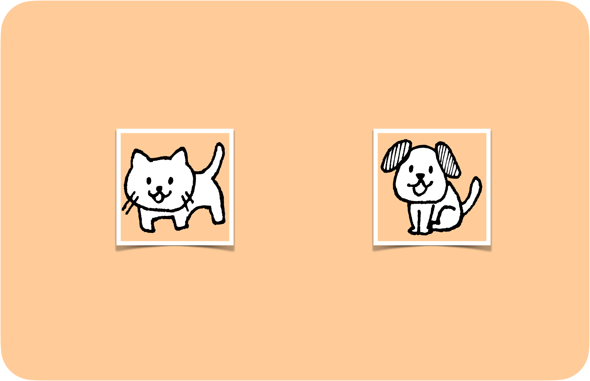
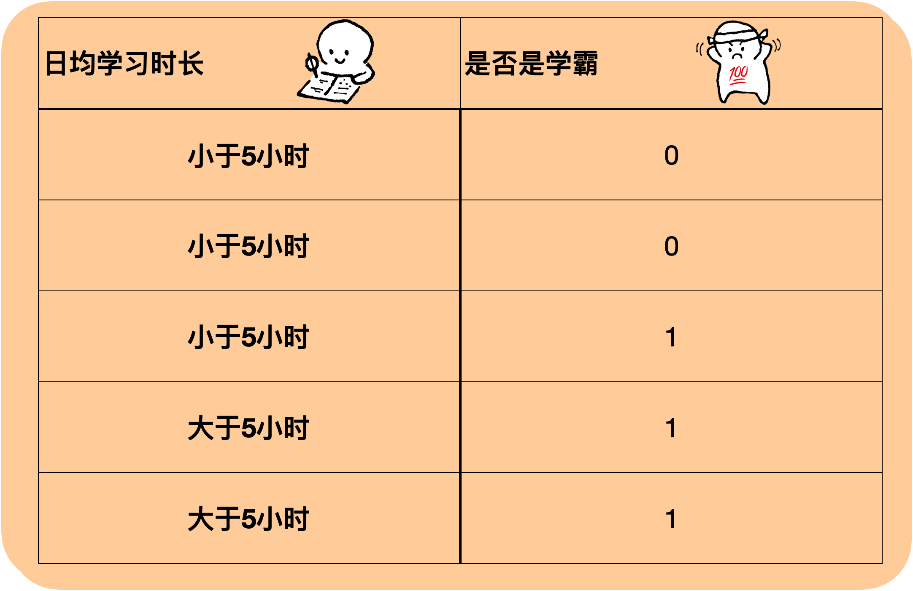
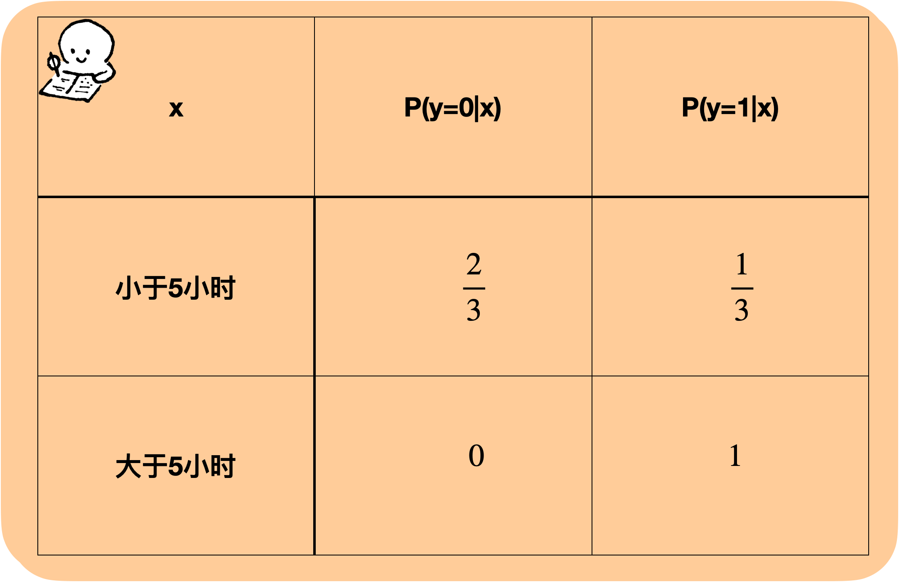
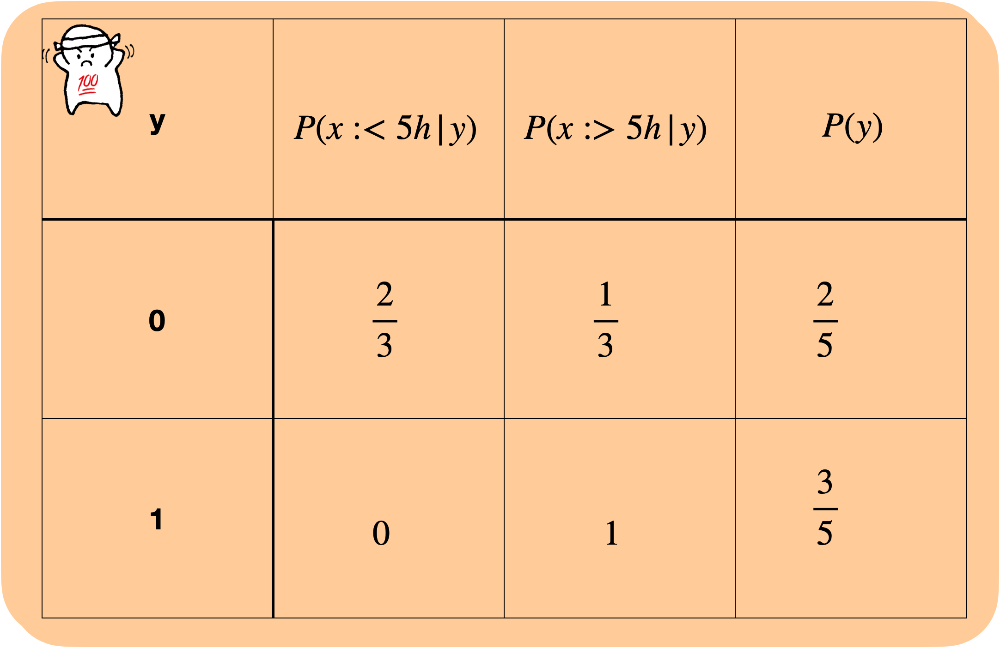
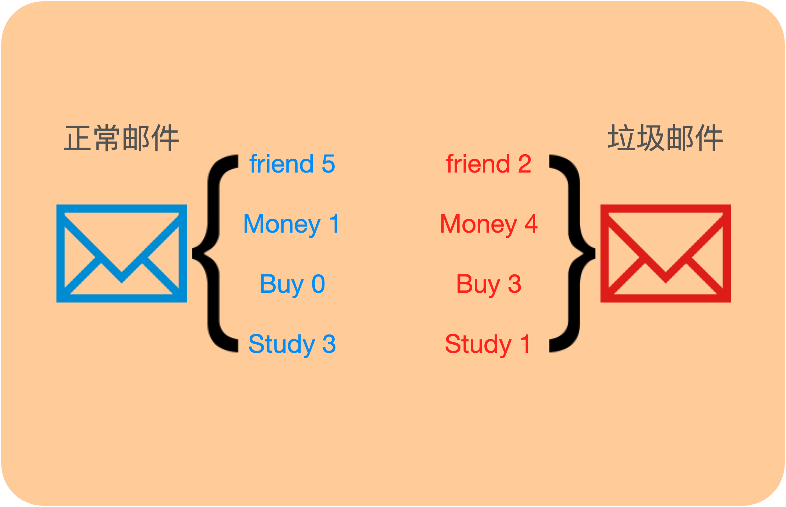

# 引入

## 生成模型和判别模型

### 解释

在前一个模型[高斯判别分析 Gaussian Discriminant Analysis](chapter4/gda/README.md) 中，我们并没有像[逻辑回归 Logistic Regression](chapter4/logisticregression/README.md) 和[感知机 Perceptron](chapter4/perceptron/README.md) 那样，通过对特征与标记之间的关系进行建模，确定一个分界，进而直接估计$P(y|x)$，而是先对每个类别的特征进行建模，先估计$P(x|y)$以及$P(y)$，然后通过贝叶斯公式$P(y|x)=\frac{P(x|y)P(y)}{P(x)}$计算得到预测值。

判别模型（Discriminative Model）：像逻辑回归和感知机这样，直接对$P(y|x)$进行估计的模型。

生成模型（Generative Generative）：像高斯判别分析这样，对$P(x|y)$以及$P(y)$进行估计，然后通过贝叶斯公式计算概率的模型。

### 实际例子

假如给定数据集，我们要判断一张新图片上的动物是猫还是狗。

判别模型会通过特征之间的差别来判断分类，比如鼻子大的大概率是狗，耳朵长的大概率是狗······

生成模型会分别对猫和狗的特征进行学习，然后将学习到的两个模型分别和新图片比较，新图片更像哪个，就分到哪类。

### 数据化例子

给定五个同学的日均学习时长和是否是学霸（0表示非学霸，1表示学霸）的数据，现在有一个新同学的日均学习时长小于5小时，判断他是否是学霸。

判别模型直接对$P(y|x)$进行估计：

日均学习时长小于5小时的一共3人，2人为非学霸，1人为学霸，则

$P(y = 0|x=小于5小时)=\frac 2 3$

$P(y = 1|x=小于5小时)=\frac 1 3$

日均学习时长大于5小时的一共2人，0人为非学霸，2人为学霸，则

$P(y = 0|x=大于5小时)=0$

$P(y = 1|x=大于5小时)=1$

对于新同学：

如果他日均学习小于5小时，有$\frac{2}{3}>\frac {1}{3}$，判断他是非学霸；

如果他日均学习大于5小时，有$0<1$，判断他是学霸

生成模型对$P(x|y)$以及$P(y)$进行估计：

在所有同学中，非学霸有2人，学霸有3人，则

$P(y = 0)=\frac 2 5$

$P(y = 1)=\frac 3 5$

在非学霸中，学习时长小于5小时的有2人，大于5小时的有1人，则

$P(x=小于5小时|y=0)=\frac 2 3$

$P(x=大于5小时|y=0)=\frac 1 3$

在学霸中，学习时长小于5小时的有0人，大于5小时的有2人，则

$P(x=小于5小时|y=1)=0$

$P(x=大于5小时|y=1)=1$

对于新同学

如果他学习时长小于5小时，有

$P(x=小于5小时|y=0)P(y=0)=\frac {2}{3} *\frac 2 5=\frac{4}{15}$

$P(x=小于5小时|y=1)P(y=1)=0 *\frac 3 5=0$

$\frac{4}{15}>0$，所以判断他是非学霸

如果他学习时长大于5小时，有

$P(x=大于5小时|y=0)P(y=0)=\frac 1 3 *\frac 2 5=\frac {2}{15}$

$P(x=大于5小时|y=1)P(y=0)=1 *\frac 3 5=\frac {3}{5}$

$\frac {2}{15}<\frac{3}{5}$，所以判断他是学霸

殊途同归！

### 比较

1. 生成模型一般会有比较强的假设，比如GAD中我们假设每个类别的特征服从高斯分布，且数据的标记服从伯努利分布。当这些假设和数据吻合时，生成模型效果较好，反之不然。
2. 生成模型更容易计算，模型更容易拟合，高斯判别分析中可以直接计算参数，逻辑回归需要使用梯度下降训练
3. 出现新的类别时，生成模型不需要重新训练，而判别式模型需要全部重新训练。

朴素贝叶斯，就属于生成模型的一种，是解决分类问题的一种模型。

# 公式表达

给定一个d个特征、m个样本的数据集$X=\{x^{(1)},x^{(2)},...,x^{(m)}\}$，其中$x=\{x_1,x_2,...,x_d\}$

标记$y=\{0,1\}$

贝叶斯公式

$P(y|x)=\frac{P(x|y)P(y)}{P(x)}$

对于单个样本

$\begin{aligned}P(x|y)=&P(x_1,x_2,...,x_d|y)\\=&P(x_1|y)P(x_2|x_1,y)P(x_3|x_1,x_2,y)···P(x_d|x_1,x_2,...,x_{d-1})\end{aligned}$

**我们假设在每个类别中，数据中的每个特征满足条件独立，则：**

$\begin{aligned}
P(x|y)
=&
P(x_1,x_2,...,x_d|y)\\
=&P(x_1|y)P(x_2|x_1,y)P(x_3|x_1,x_2,y)···P(x_d|x_1,x_2,...,x_{d-1})\\
=&P(x_1|y)P(x_2|y)···P(x_d|y)\\
=&\prod_{i=1}^{d}P(x_i|y)
\end{aligned}$

对于整个数据集，我们想要最大化$P(Y|X)$，则只需最大化$P(X|Y)P(Y)$。

设$\phi_{j|y=0}=P(x_{j}|y=0),\phi_{j|y=1}=P(x_{j}|y=1),\phi_y=P(y)$

则：

$L(\phi_{j|y=0},\phi_{j|y=1},\phi_y)=\prod_{j=1}^{d}(\prod_{i=1}^n\phi_{j|y^{(i)}=0}\prod_{i=n+1}^m\phi_{j|y^{(i)}=1})\prod_{i=1}^m {\phi_{y^{(i)}}}^{y^{(i)}}{(1-\phi_{y^{(i)}})}^{1-y^{(i)}}$

根据最大似然估计，可以求得

$\begin{gathered}\phi_{j \mid y=1}=\frac{\sum_{i=1}^{m} 1\left\{x_{j}^{(i)}=1 \wedge y^{(i)}=1\right\}}{\sum_{i=1}^{m} 1\left\{y^{(i)}=1\right\}} \\\phi_{j \mid y=0}=\frac{\sum_{i=1}^{m} 1\left\{x_{j}^{(i)}=1 \wedge y^{(i)}=0\right\}}{\sum_{i=1}^{m} 1\left\{y^{(i)}=0\right\}} \\\phi_{y}=\frac{\sum_{i=1}^{m} 1\left\{y^{(i)}=1\right\}}{m}\end{gathered}$

可以看出，第$j$个特征在$0$类别中出现的概率就是第$j$个特征在0类别中的样本总数除以$0$类别的样本总数，第$j$个特征在$1$类别中出现的概率就是第$j$个特征在$1$类别中的样本总数除以$1$类别的样本总数，先验即为$0/1$类别在所有样本中出现的总数除以样本总数。

在对新样本进行预测的时候，只需求

$\begin{aligned}p(y=1 \mid x) &=\frac{p(x \mid y=1) p(y=1)}{p(x)} \\&=\frac{\left(\prod_{i=1}^{d} p\left(x_{i} \mid y=1\right)\right) p(y=1)}{\left(\prod_{i=1}^{d} p\left(x_{i} \mid y=1\right)\right) p(y=1)+\left(\prod_{i=1}^{d} p\left(x_{i} \mid y=0\right)\right) p(y=0)}\end{aligned}$

即可知道新样本属于$1$类别的概率。

朴素贝叶斯的过程主要在于计数，其实在上文中，我们举的生成模型判断同学是否是学霸的例子就是一个简单的朴素贝叶斯过程，只不过数据只有一个特征，所以我们的假设“两个类别中的特征是条件独立的”没有用上。

# 文本分类例子

一个垃圾邮件分类的简单实例，我们在一堆正常邮件和垃圾邮件中抽取出3个关键词：

friend, money, buy, study

把每一个关键词看作一个特征，分别对四个关键词在正常邮件和垃圾邮件中出现的次数进行统计，得到下图

每个特征分别在两个类别里的概率（$y=1$表示正常邮件，$y=0$表示垃圾邮件）：

$P(x_j=friend|y=1)=\frac{5}{9}$

$P(x_j=money|y=1)=\frac{1}{9}$

$P(x_j=buy|y=1)=0$

$P(x_j=study|y=1)=\frac{1}{3}$

$P(x_j=friend|y=0)=\frac{1}{5}$

$P(x_j=money|y=0)=\frac{2}{5}$

$P(x_j=buy|y=0)=\frac{3}{10}$

$P(x_j=study|y=0)=\frac{1}{10}$

两个类别出现的概率：

$P(y=1)=\frac{9}{19}$

$P(y=0)=\frac{10}{19}$

这样需要的参数都已经求出来了，可以对新样本进行判断

如果新邮件中出现了3次friend和1次money，则

$\begin{aligned}p(y=1 \mid x) &=\frac{p(x \mid y=1) p(y=1)}{p(x)} \\
&=\frac{\left(\prod_{i=1}^{d} p\left(x_{i} \mid y=1\right)\right) p(y=1)}{\left(\prod_{i=1}^{d} p\left(x_{i} \mid y=1\right)\right) p(y=1)+\left(\prod_{i=1}^{d} p\left(x_{i} \mid y=0\right)\right) p(y=0)}\\
&=\frac{\frac{5}{9}^3*\frac1 9*\frac1 2}{\frac{5}{9}^3*\frac1 9*\frac1 2+ \frac{1}{5}^3*\frac{2}{5}*\frac12}\\
&\approx0.86
\end{aligned}$

所以，新样本有更高的概率为正常邮件，分类到正常一类。

如果新邮件中出现了2次friend、1次buy和1次study，则

$\begin{aligned}p(y=1 \mid x) &=\frac{p(x \mid y=1) p(y=1)}{p(x)} \\
&=\frac{\left(\prod_{i=1}^{d} p\left(x_{i} \mid y=1\right)\right) p(y=1)}{\left(\prod_{i=1}^{d} p\left(x_{i} \mid y=1\right)\right) p(y=1)+\left(\prod_{i=1}^{d} p\left(x_{i} \mid y=0\right)\right) p(y=0)}\\
&=\frac{\frac{5}{9}^2*0*\frac{1}{3}*\frac1 2}{\frac{5}{9}^2*0*\frac{1}{3}*\frac1 2+ \frac{1}{5}^2*\frac{3}{10}*\frac{1}{10}*\frac{1}{2}}\\
&=0
\end{aligned}$

可以看到，$P(x_j=buy|y=1)=0$，所以只要邮件中出现buy这个词，它为正常邮件的概率就会变成0，这显然是不合理的，即当某个特征在一个类别中没有出现过时，会造成分类器判断太过绝对而增加误差。针对这一现象，我们可以使用拉普拉斯平滑来解决。

# 拉普拉斯平滑  Laplace Smooth

给每个类别中的每个特征的计数都加1，使得特征出现的概率大于0，这样就不会出现在计算概率时乘积为0的情况了，即：

$\begin{gathered}\phi_{j \mid y=1}=\frac{\sum_{i=1}^{m} 1\left\{x_{j}^{(i)}=1 \wedge y^{(i)}=1\right\}+1}{\sum_{i=1}^{m} 1\left\{y^{(i)}=1\right\}+n} \\\phi_{j \mid y=0}=\frac{\sum_{i=1}^{m} 1\left\{x_{j}^{(i)}=1 \wedge y^{(i)}=0\right\}+1}{\sum_{i=1}^{m} 1\left\{y^{(i)}=0\right\}+(m-n)} \end{gathered}$

其中$n$为样本中为正例的个数。

在上面邮件分类的例子中，我们用拉普拉斯平滑进行处理后：

$P(x_j=friend|y=1)=\frac{5+1}{9+9}$

$P(x_j=money|y=1)=\frac{1+1}{9+9}$

$P(x_j=buy|y=1)=\frac{0+1}{9+9}$

$P(x_j=study|y=1)=\frac{3+1}{9+9}$

$P(x_j=friend|y=0)=\frac{2+1}{10+10}$

$P(x_j=money|y=0)=\frac{4+1}{10+10}$

$P(x_j=buy|y=0)=\frac{3+1}{10+10}$

$P(x_j=study|y=0)=\frac{1+1}{10+10}$

当新邮件中出现了2次friend、1次buy和1次study时

$p(y=1 \mid x) =\frac{\frac{6}{18}^2*\frac{1}{18}*\frac{4}{18}*\frac1 2}{\frac{6}{18}^2*\frac{1}{18}*\frac{4}{18}*\frac{1}{2}+\frac{3}{20}^3*\frac{4}{20}*\frac{2}{20}*\frac{1}{2}}\approx0.95$

因此我们判断新邮件是正常邮件。

 

- 如果分类不止两类怎么办？
  
    和二分类一样，分别计算每个类别中每个特征出现的概率以及每个类别的占比$P(y)$，算$P(y|x)$时，分母把所有的$P(x|y)P(y)$相加即可
    

# 优点和缺点

## 优点

1. 能处理多分类任务 
2. 计算简单快速
3. 对小规模数据表现好，可以实时对新增样本进行训练
4. 对缺失数据不敏感
5. 可解释性好

## 缺点

1. 假设性太强，现实中特征之间往往不是相互独立的，当特征相关性较强时分类效果不好