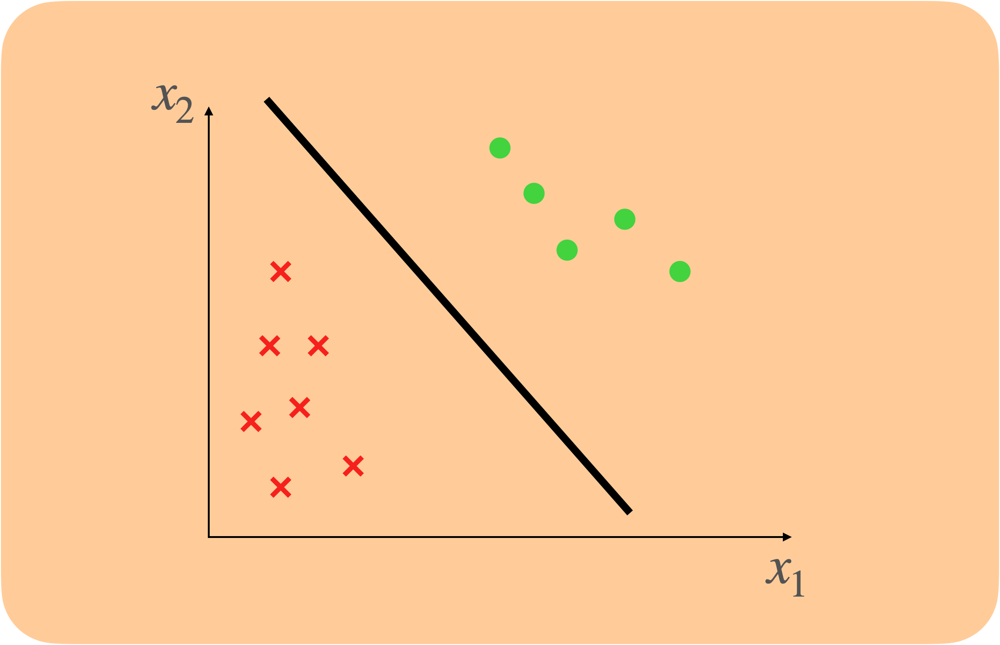
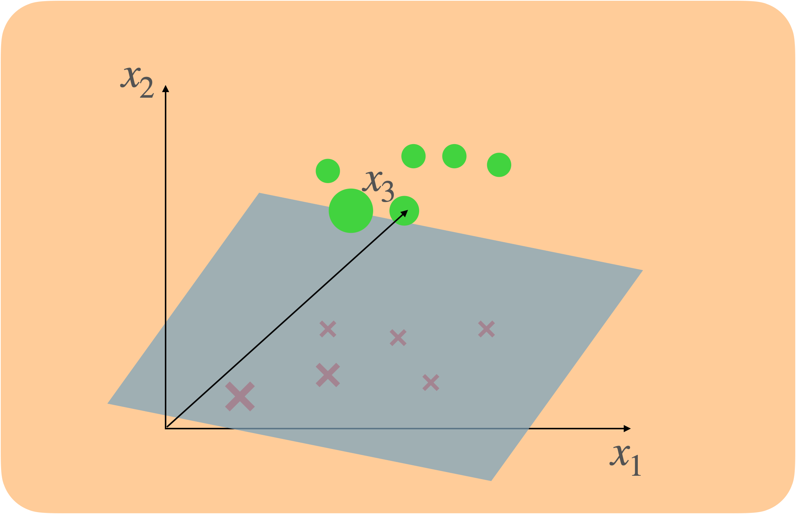
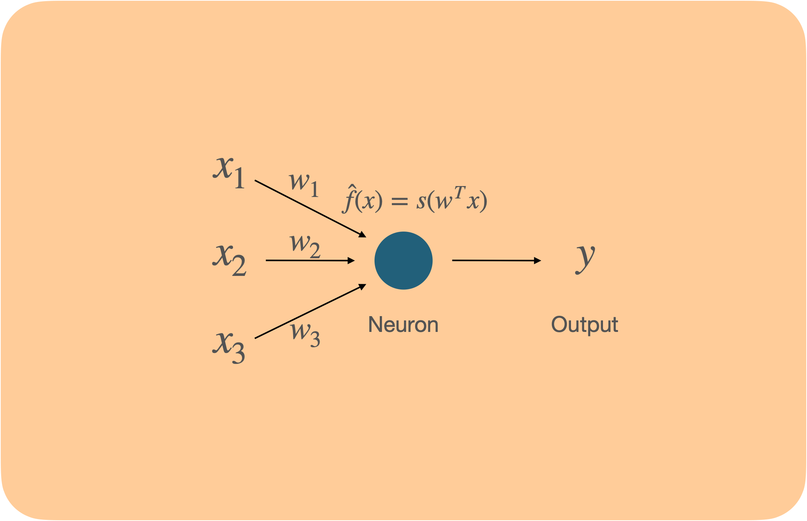
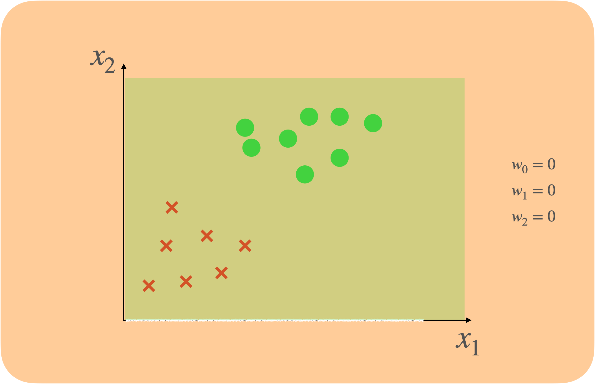
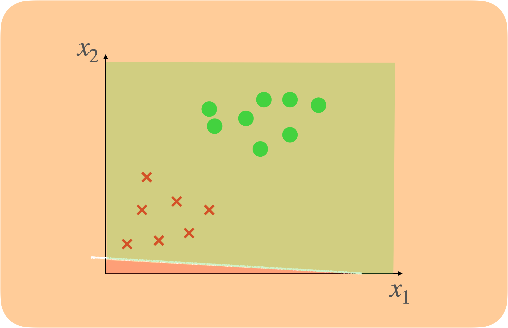
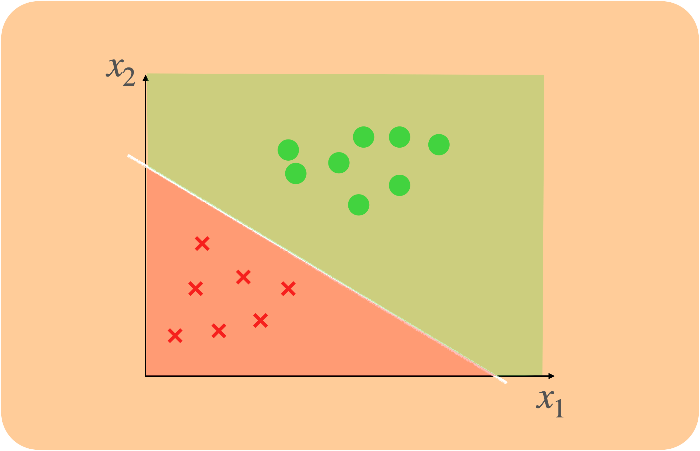
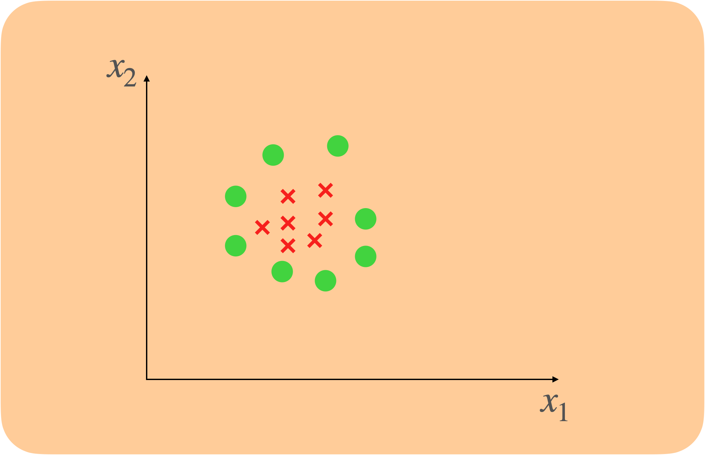

# 引入

感知机受到了生物神经元的启发，是用来解决***二分类问题***的一种线性模型，其目标是找到一个超平面，使其能够将全部的数据点进行**完美**的分类。

当数据只有一个特征时（一维），目标是找到一个**点**将所有的正例和负例区分。

当数据有两个特征时（二维），目标是找到一条**直线**将所有的正例和负例区分。

当数据有三个特征时（三维），目标是找到一个**平面**将所有的正例和负例区分。

······

当数据有多个特征时，目标是找到一个**超平面**将所有的正例和负例区分。

# 公式表达

给定一个有m个样本、d个特征的数据集$X=\{x^{(1)},x^{(2)},...,x^{(m)}\}$，$x^{(i)}=\{x_0^{(i)},x_1^{(i)},x_2^{(i)},...,x_d^{(i)}\}$，每一个特征都对应一个权重$w_0,w_1,...,w_d$，输出$y=\{0,1\}$

这个超平面应该如何表达呢？

我们用$0=w^Tx$表示这个区分正例和负例的超平面的函数，对于每个特征，其权重越大表示其对我们要预测的结果影响越大

在逻辑回归中，我们使用Sigmoid函数来让函数的值连续地落在(0,1)中以进行二分类，输出的结果是概率值

感知机像是一个逻辑回归的硬分类版本，我们用符号函数（Sign Function）（有的使用单位阶越函数）来判断其分类，直接输出分类结果

$s(x)=\left\{\begin{array}{l}
-1 \text { if } x<0 \\
1 \text { if } x \geq 0
\end{array}\right.$

当$w^Tx$小于0当时候，判断结果为负，当$w^Tx$大于或等于0时，判断结果为正

这里的使用的函数叫做激活函数，就像大脑里判断神经元是否被激活起作用一样，激活函数需要是非线性的

# 参数估计

有了模型，接下来需要根据给定的数据找出最优的权重$w$，使得超平面完美地将正类和负类分隔开，和线性回归、逻辑回归一样，我们需要通过最小化一个损失函数来寻找理想的权重，怎么去定义这个损失函数呢？

1. 直觉上可以选择误分类点的个数，因为误分类点越多，误差就越大，我们希望误分类点的数量越少越好。但是这样的函数既不是凸函数，不能直接令其一阶导数为0求最值的方法求参数；而且其对于$w$也不可导，不能通过梯度下降的方法求参数，所以不可行。
2. 将误分类点个数这个离散的量转化为一个连续变化的量，可以用误分类点到超平面的总距离作为衡量标准，这样来得到损失函数$J(w)$

***怎么判断是否是误分类点？***

对于误分类的点，有两种情况：

本来是正例，模型判断为负例（False Negative）：当$y=1$时，$w^Tx<0$

本来是负例，模型判断为正例（False Positive）：当$y=-1$时，$w^Tx>=0$

综合起来则有$y(w^Tx)<0$，当满足这个条件时为误分类点。

***怎么计算误分类点到超平面的距离？***

对于任意点来说，它到超平面$w^Tx=0$的距离$d=\frac{\left|w * x_{0}+b\right|}{\|w\|}$

其中$\|w\|=\sqrt{w_{1}^{2}+w_{2}^{2}+\ldots+w_{n}^{2}}$$（L_2范数）$

则单个误分类的点到平面的距离$d=\frac {-y(w^Tx)}{\|w\|}$

所有误分类的点到平面的距离，即$J(w)=\frac 1 {\|w\|} \sum_{i=1}^m-y^{(i)}(w^Tx^{(i)})$

考虑梯度下降法，权重的更新规则为$w_k=w_k-\alpha \frac {\partial J(w)}{\partial w_k}$

为了方便计算梯度，我们**不考虑**$\frac 1 {\|w\|}$来进行求导

$\frac {\partial J(w_)}{\partial w_k}=\sum_{i=1}^m -y_k^{(i)}x_k^{(i)}$

采用随机梯度下降，每次只用一个样本来进行权重更新

$w_k=w_k+\alpha y_k^{(i)}x_k^{(i)}$

更新权重，直到所有的点都被正确分类

***问题***

- 为什么可以不考虑$\frac {1} {\|w\|}$来求梯度？
  
    我们关注的是减小损失函数，直到其为0（没有误分类点），$\frac {1} {\|w\|}$并不改变收敛的方向，所以只要存在误分类点，损失函数一定会朝着0的方向减小，直到最终误分类点的个数为，所以去除这一项求导不影响最终的结果。
    
- 随机梯度下降中，权重更新多少次，怎么确定什么时候更新？
  
    遍历数据，如果$y(w^Tx)<0$，就对$w$进行更新，遍历完后如果还有误分类点再重新遍历，一共出现多少次误分类点，就更新多少次权重
    

更新过程，以二维数据为例，初始化权重，$w_0=w_1=w_2=0$，此时全部预测为正例

遍历所有的数据，遇到有第一个负例没有被正确分类，更新权重，调整w的值使分离超平面向该误分类点的一侧移动一点

继续遍历数据，遇到没正确分类的点就更新函数，直到遍历完所有点

这时如果还没有得到完美分类的超平面（直线），就再次遍历所有数据，重复更新步骤，直到完美分类为止

满足条件的超平面不一定只有一个，比如上图中就可以有多条直线可以将正例和负例完美分类，难以直接找到最完美的分类超平面 。

注：当我们提到“感知机”当时候，一般是指上面的这种“单层感知机”（Single-layer Perceptron），实际上是一个单神经元的使用Sign函数作为激活函数的神经网络，数据经过加权求和以及激活函数直接得到输出。

# 缺点

感知机在现实实际场景中应用比较少，它只有一个神经元，不能表达复杂的模型，**不能解决线性不可分的问题（比如下图，无法找到一个超平面（直线）能完全将两个类完全分离。**

如何去改进感知机，使其能够解决线性不可分的问题？

1. 使用核方法。
2. 使用多个神经元，转化为多层感知机（Multi-layer Perceptron），即前馈神经网络。