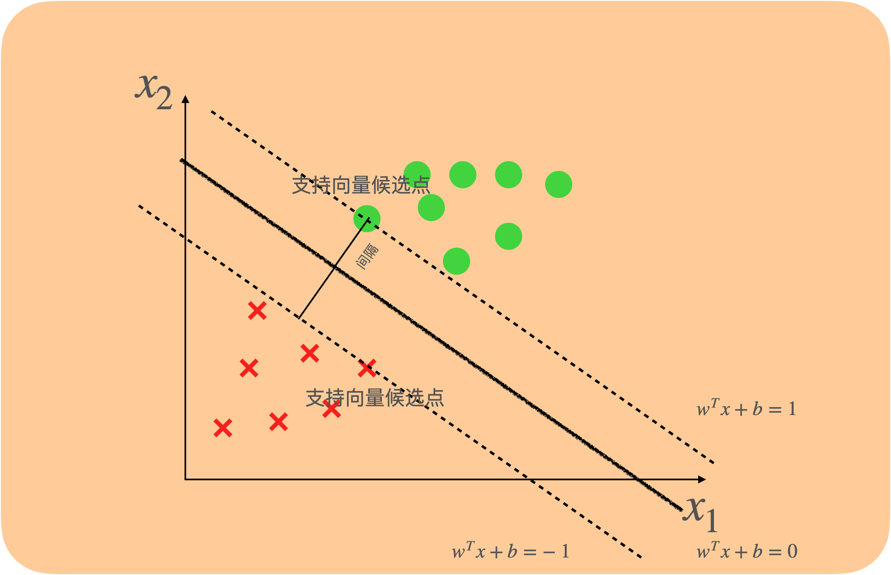

# 引入

在[感知机 Perceptron](https://www.notion.so/Perceptron-f2b0efeb5ebe4afcb70d96ef56aa82b6) 中，针对一个线性可分的二分类问题，我们希望找到一个线性超平面来将两个类别的数据完全分离，通过逐渐地调整参数使得所有误分类点到超平面的距离之和为0来得到最终的超平面，不过因为迭代次数的不同，最终可能会找到不同的超平面，都能够将两个类别完全分类。

比如在下图有两个特征的二分类问题中，所有直线能够将二维特征的数据点完全分离

不过，这些直线是有优劣之分的，其中有的直线相比之下会更适合选取为预测模型。

想象如果在待预测的点中，出现了$a$和$b$两个点，$a$是负例，$b$是正例，根据数据分布来看，这是很可能出现的情况。

直线1会将$a$分类错误，直线3会将$b$分类错误，只有直线2将两个点都分类正确了。可以看出，同样是能将原来的数据点完美分类的直线，直线1和直线3对于新出现的点的容忍度不高，只要数据点太靠近直线，就可能会将其分类错误，而直线2因为距离两个类别的点的距离（间隔）比其他直线远，所以对于那些靠近它的点也能进行合理地分类。

如果我们能找到一条直线，使得它离两个类别的点的间隔最大，那么它对于新数据点的容忍度就会比较好，就是我们要找到的最佳分类直线，支持向量机就是以这样的理论为基础的一种线性分类方法。

如果是要解决上面这样完全线性可分的分类问题，我们使用“硬间隔”的支持向量机，也叫最大间隔分类器。

# 硬间隔 - 最大间隔分类器 Optimal Margin Classifier

## 理论描述

对于上面这样一个线性可分的二分类问题，我们希望找到一条直线（超平面），使得它距离两个类别的点足够远，进而我们想找到距离直线最近的数据点，并调整直线的参数，使得直线到这个最近点的间隔最大，这时候的直线就是分类效果最好的理想模型。

## 公式推导

设数据中有$d$个特征，有m个样本，用$x^{(i)}$表示第$i$个样本，对于每个样本，$x=(x_1,x_2...,x_d)$$x^{(i)}=(x_0,x_1,x_2...,x_d)^T$，$w=(w_1,w_2,...,w_d)$表示每个特征的权重，输出$\hat{y}=\{-1,1\}$

- 为什么这里采用{-1,1}作为标签，而不是{0,1}？
  
    为了方便数学上表示后面对于点到超平面距离，可以用一个统一的公式表示
    

### 定义目标

对于一条能够完美分类数据点的直线，有$\left\{\begin{array}{l}w^{\top} x^{(i)}+b \ge 0, y^{(i)}=1 \\w^{\top} x^{(i)}+b<0, y^{(i)}=-1\end{array}\right.$

即是$y^{(i)}(w^{\top} x^{(i)}+b)>=0$

我们想要在所有数据点中，找到距离直线$w^Tx+b=0$最近的点，即最小化数据点到直线（超平面）的距离：

$\begin{aligned}\min_{x^{(i)}}\frac{|w^Tx+b|}{||w||}=\min_{x^{(i)}}\frac{y^{(i)}(w^Tx^{(i)}+b)}{||w||}
\end{aligned}$, $i=1,2,...,m$

然后我们调整直线的参数，最大化这个间隔：$\begin{aligned}\max_{w,b}\min_{x^{(i)}}\frac{y^{(i)}(w^Tx^{(i)}+b)}{||w||}\end{aligned}$, $i=1,2,...,m$

$||w||$与$i$的值无关，因此目标转化为：$\begin{aligned}\max_{w,b}\frac{1}{||w||}\min_{x^{(i)}}y^{(i)}(w^Tx^{(i)}+b)\end{aligned}$, $i=1,2,...,m$, $s.t.\ y^{(i)}w^{\top} x^{(i)}+b >=0$

### 参数缩放

对于直线$w^Tx+b=0$来说，$w$和$b$的值是可以等比例进行缩放的，比如$2x_1+3x_2+1=0$与$20x_1+30x_2+10=0$是一条直线，因此我们一定可以对$w,b$进行缩放，使得对于距离直线最近的那个点，有：$y^{(i)}(w^Tx^{(i)}+b)=1$，也就是两条支持边界

举例：假设最终我们最终的的理想直线是$2x_1+3x_3+5=0$，离它最近的数据点是$(2,1)$且是个正例，那么我们可以通过缩放（两边同时乘以$\frac{1}{12}$）将方程调整为$\frac {1}{6}x_1+\frac {1}{4}x_2+\frac{5}{12}=0$，这时候$y^{(i)}(w^Tx^{(i)}+b)=$$\frac {1}{6}*2+\frac {1}{4}*1+\frac{5}{12}=1$

做了这样的假设后，我们的目标就能转化为：$\begin{aligned}\max_{w}\frac{1}{||w||}\end{aligned}$, $\begin{aligned}s.t. \ \min_{x^{(i)}}y^{(i)}(w^Tx^{(i)}+b)=1
\end{aligned}$

即$\begin{aligned}\max_{w,b}\frac{1}{||w||}\end{aligned}$, $\begin{aligned}s.t. \ y^{(i)}(w^Tx^{(i)}+b)\ge1
\end{aligned}$, $i=1,2...,m$

现在的目标函数里就只有$w$一个参数了，但是多了一个限制条件。

### 目标变形

$\begin{aligned}\max_{w,b}\frac{1}{||w||}=\min_{w}||w||=\min_{w}\frac{1}{2}||w||^2=\min_{w}\frac{1}{2}w^Tw\end{aligned}$

到此，目标函数是一个凸函数，我们成功将问题转换为一个二次规划问题：

$\begin{aligned}\min_{w,b}\frac{1}{2}w^Tw\end{aligned}$, $\begin{aligned}s.t. \ y^{(i)}(w^Tx^{(i)}+b)\ge1
\end{aligned}$, $i=1,2,...m$

这时通过一般的QP Solver就能顺利解出$w$，不过还可以进一步地将目标进行转换，使用拉格朗日乘子法来求解。

### 拉格朗日乘子法

我们的目标函数可以进一步转化为：

$\begin{aligned}\min_{w,b}\frac{1}{2}w^Tw\end{aligned}$, $\begin{aligned}s.t. \ 1-y^{(i)}(w^Tx^{(i)}+b)\le0
\end{aligned}$, $i=1,2,...m$

根据拉格朗日函数，转化为：

$\begin{aligned}\min_{w,b}\max_\alpha L=\min_{w,b}\max_\alpha \frac{1}{2}w^Tw+\sum_{i=1}^m \alpha_i(1-y^{(i)}(w^Tx^{(i)}+b))
\end{aligned}$, $s.t.\ \alpha_i \ge0$

因为目标函数是一个凸函数，所以具有强对偶性，转化为：

$\begin{aligned}\max_\alpha \min_{w,b}L=\max_\alpha\min_{w,b} \frac{1}{2}w^Tw+\sum_{i=1}^m \alpha_i(1-y^{(i)}(w^Tx^{(i)}+b))
\end{aligned}$, $s.t.\ \alpha_i \ge0$

对于$\begin{aligned}\min_{w,b}L=\min_{w,b} \frac{1}{2}w^Tw+\sum_{i=1}^m \alpha_i(1-y^{(i)}(w^Tx^{(i)}+b))\end{aligned}$，我们令拉格朗日函数关于$b$的偏导为0，以求得这个最小值

即$\begin{aligned}\frac{\partial L}{\partial b}=\sum_{i=1}^m-\alpha_i y^{(i)}=0
\end{aligned}$, $\begin{aligned}\frac{\partial L}{\partial w}=w+\sum_{i=1}^m-\alpha_i y^{(i)}x^{(i)}=0
\end{aligned}$

得到$\begin{aligned}\sum_{i=1}^m\alpha_i y^{(i)}=0
\end{aligned}$, $\begin{aligned}w=\sum_{i=1}^m\alpha_i y^{(i)}x^{(i)}
\end{aligned}$

代入得到$\begin{aligned}\min_{w,b} L=&\min_{w,b} \frac{1}{2}w^Tw+\sum_{i=1}^m \alpha_i(1-y^{(i)}(w^Tx^{(i)}+b))\\=&\frac{1}{2}\sum_{i=1}^m(\alpha_i y^{(i)}x^{(i)})^T\sum_{i=1}^m\alpha_i y^{(i)}x^{(i)}+\sum_{i=1}^m \alpha_i -\sum_{i=1}^m y^{(i)}((\sum_{i=1}^m\alpha_i y^{(i)}x^{(i)})^Tx^{(i)})\\
=&\frac{1}{2}\sum_{i=1}^m \sum_{j=1}^m \alpha_i\alpha_j y^{(i)}y^{(j)}{x^{(i)}}^Tx^{(j)}+\sum_{i=1}^m\alpha_i-\sum_{i=1}^m \sum_{j=1}^m \alpha_i\alpha_j y^{(i)}y^{(j)}{x^{(i)}}^Tx^{(j)}\\
=&-\frac{1}{2}\sum_{i=1}^m \sum_{j=1}^m \alpha_i\alpha_j y^{(i)}y^{(j)}{x^{(i)}}^Tx^{(j)}+\sum_{i=1}^m\alpha_i
\end{aligned}$

则

$\begin{aligned}\max_\alpha \min_{w,b}L=\max_\alpha&-\frac{1}{2}\sum_{i=1}^m \sum_{j=1}^m \alpha_i\alpha_j y^{(i)}y^{(j)}{x^{(i)}}^Tx^{(j)}+\sum_{i=1}^m\alpha_i
\end{aligned}$, $s.t.\ \alpha_i \ge0$

最大化变最小化：

$\begin{aligned}\min_\alpha\frac{1}{2}\sum_{i=1}^m \sum_{j=1}^m \alpha_i\alpha_j y^{(i)}y^{(j)}{x^{(i)}}^Tx^{(j)}-\sum_{i=1}^m\alpha_i
\end{aligned}$, $s.t.\ \alpha_i \ge0, \sum_{i=1}^m\alpha_i y^{(i)}=0$

问题转为关于$\alpha$的二次规划问题，这时候目标函数中不含任何特征相关的参数$w$和$b$，此时用QP Solver就可以求解出$\alpha_i$

然后用上面得到的$\begin{aligned}w=\sum_{i=1}^m\alpha_i y^{(i)}x^{(i)}
\end{aligned}$求出$w$，如何求得$b$呢？

### KKT条件

我们把在支持边界上的点叫做支持向量候选点（Support Vector Candidate），这些点满足

$y^{(k)}(w^Tx^{(k)}+b)=1$

任何满足强对偶性的优化问题，只要其目标函数与约束函数可微，那么它的原始问题与对偶问题的解都是满足 KKT 条件的，则对于当前的问题，满足的KKT条件为：

$\left\{\begin{array}{l}\alpha_i \ge 0 \\ \frac{\partial L }{\partial w}=0, \frac{\partial L }{\partial b}=0 ,\frac{\partial L }{\partial \alpha}=0 \\
1-y^{(i)}(w^Tx^{(i)}+b)\le 0 \\
\alpha_i(1-y^{(i)}(w^Tx^{(i)}+b))=0\end{array}\right.$

观察这个式子可以得到，当$\alpha_i>0$时，$1-y^{(i)}(w^Tx^{(i)}+b)=0$，即$y^{(i)}(w^Tx^{(i)}+b)=1$，这时的数据点在决策边界上，我们称这些在决策边界上且$\alpha_i>0$的点叫做支持向量（Support Vector），这些支持向量满足$y^{(k)}(w^Tx^{(k)}+b)=1$

代入$\begin{aligned}w=\sum_{i=1}^m\alpha_i y^{(i)}x^{(i)}
\end{aligned}$有：

$y^{(k)}(\sum_{i=1}^m\alpha_i y^{(i)}{x^{(i)}}^Tx^{(k)}+b)=1$

所以$b=\frac{1}{y^{(k)}}-\sum_{i=1}^m\alpha_i y^{(i)}{x^{(i)}}^Tx^{(k)}=y^{(k)}-\sum_{i=1}^m\alpha_i y^{(i)}{x^{(i)}}^Tx^{(k)}$

至此，我们就通过对$\alpha$进行最优化的过程求解最优的$w$和$b$

回顾一下这种优化方法

我们通过解决下面的二次规划问题得到$\alpha_i$

$\begin{aligned}\min_\alpha\frac{1}{2}\sum_{i=1}^m \sum_{j=1}^m \alpha_i\alpha_j y^{(i)}y^{(j)}{x^{(i)}}^Tx^{(j)}-\sum_{i=1}^m\alpha_i
\end{aligned}$, $s.t.\ \alpha_i \ge0$

然后通过$\begin{aligned}w=\sum_{i=1}^m\alpha_i y^{(i)}x^{(i)}
\end{aligned}$，$b=y^{(k)}-\sum_{i=1}^m\alpha_i y^{(i)}{x^{(i)}}^Tx^{(k)}$得到$w$和$b$

虽然这种方法避免了对$w$直接进行优化，但是其中的$x^{(i)}y^{(i)}$也和特征数量有关，如果特征数量很多的时候，会是很大的计算量，对于这个问题，我们可以运用核方法来巧妙地简化运算，不仅如此，核方法还能够增加特征的数量（维度），把线性不可分问题转化为线性可分问题。

# 核方法 Kernel Method

## 从升维角度看核方法

最大间隔分类器能够解决线性可分的问题，即总有一个超平面能够完全将两个类别分开，但如果遇到的是下面这样线性不可分问题该怎么办？

目前的数据是在二维空间中，我们不能找到条直线来分离两个类别，我们想如果能把这些点表示在更高的维度中，也许就能找到一个平面来对两类数据点进行分离。

于是我们可以根据已有的特征，人为地修改或者添加一个新的特征，比如对于每个样本$x^{(i)}$，不改变第一和第二个特征，令第三个特征的值$x_3^{(i)}=x_1^{(i)}x_2^{(i)}$，这样生成的新特征也许会带来一些新的信息，原本不可分的数据点也可能变得可分。这时候，我们不管是使用支持向量机、逻辑回归还是感知机，都可以找到一个超平面来对两类数据进行分类。

# 补充

## 点到平面的距离公式