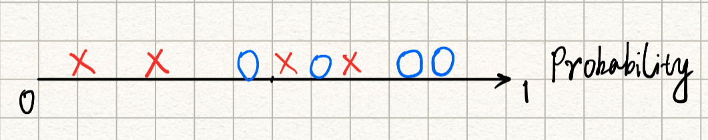

- 机器学习在哪些方面会遇到困难？
    - 问题的特征太多，需要选取有意义的特征进行训练
    - 问题的特征太少，带来的信息不足，训练效果不好
- 什么样的机器学习模型是好的?
  
    - 拥有小的泛化误差(Generalisation Error)，模型的表现不仅在训练集和测试集上优秀，在没有遇见过的其他数据集上的表现也同样优秀
    
    - 比如判断一张图片上是否有猫，根据一个数据集训练模型，模型在训练集/测试集上的准确率达到90%，但有可能是因为这个数据集里的猫都是黄色的，所以模型检测到黄色就判断为猫，而使用其他含不同颜色的猫的数据集时，模型的表现会很差，泛化误差就会很高

#

# 分类问题

## 混淆矩阵(Confusion Matrix)

- 什么是混淆矩阵?
  
    混淆矩阵是机器学习中描述**分类模型的表现好坏**的一个表，其中行表示模型预测的结果，列表示实际数据的情况，行列反过来也可以。
    
- 混淆矩阵的目的是什么？
  
    评估分类模型的表现
    

## 度量方法（查准率、查全率、F-度量等）

- 真正例（True Positive）
  
    预测结果为正，实际情况也为正的数据
    
- 真反例（True Negative
  
    预测结果为反， 实际情况也为反的数据
    
- 假正例（False Positive）
  
    预测结果为正，实际情况为反的数据，也叫Type I Classification Error
    
- 假反例（False Negative）
  
    预测结果为反，实际情况为正的数据，也叫Type II Classification Error
    

**“正反”为预测的结果，“真假”决定了预测是正确的还是错误的**

- 精度（Accuracy）
  
    - 预测成功的例子的占比
    
    - 当数据集不平衡的时候精度变得不具有代表性。比如在一个95个正例5个反例的数据集里，模型只要全部预测为正即可取得95%的精度，但显然这不是一个好的模型。
    
      
    
- 查准率（Precision）/正类预测值（PPV, Positive Predictive Value)

    - 在所有预测为正的数据中，预测正确的个数的占比查准率值越大，表示预测为正预测得越准

    - 比如广告投放，在判断用户对某一类产品有需求时，需要这个判断越准确越好，否则会浪费广告投入。

        

        

- 查全率/召回率（Recall）/灵敏度（Sensitivity）/真正类率（TPR, True Positive Rate）

    - 所有的实际正例中，模型预测成功的例子

    - 查全率越高，表示模型预测正类的能力越强，找出的正例越全

    - 比如找出人群中的新冠患者，遗漏的患者越少越好，所以需要高查全率

      

      

- 特异度（Specificity）/选择度（Selectivity）/真反类率（TNR, True Negative Rate）

    - 所有的实际反例中，模型预测成功的例子

    - 特异度越高，表示模型预测反类的能力越强，找出的反例越全

      

- 假反类率（False Positive Rate）

    - 1-特异度，表示所有真实反例中，预测错误的例子的比例

- P-R曲线（Precision-Recall Curve）

    - 以查准率为纵轴、查全率为横轴作图，得到查准率-查全率曲线

    - 当一条曲线完全包住另一条曲线时，前者模型的性能好于后者

- 平衡点（Break-Even Point）

    - 查准率等于查全率时的取值，值越大，模型性能越好

- F1度量（F-score/F-measure）
  

     - 综合查准率和查全率考虑的评估标准                                                     
     
          
     
- F-Beta度量

    - F1度量的更一般情况，由查准率和查全率的加权调和平均数得来

    - 当Beta大于1时，查全率有更大影响；当Beta小于1时，查准率有更大影响

    

## ROC与AUC

### **受试者工作特征曲线（Receiver Operating Characteristic Curve）**

ROC曲线是一个**表现模型在不同分类阈值时的性能的图象**，纵轴使用真正类率（TPR）/查全率/召回率，横轴使用假正类率（FPR）

- TPR表示在所有真实正例中，预测正确的比例

- FPR表示在所有真实反例中，预测错误的比例，也等于1-Specificity（特异度）

举例:

有四个正样本和四个负样本，一个模型对它们的预测概率如下：

负样本：0.12, 0.28, 0.34, 0.49

正样本：0.54, 0.62, 0.78, 0.98

如果选取1作为区分正负样本的阈值

可以画出混淆矩阵：

TPR = TP / (TP + FN) = 0 / 4 = 0

FPR = FP / (FP + TN) = 0 / 4 = 0

此时模型准确地预测对了所有的负类，但对正类的预测完全错误

如果选取0.9作为区分正负样本的阈值

可以画出混淆矩阵：

TPR = TP / (TP + FN) = 1 / 4

FPR = FP / (FP + TN) = 0 / 4 = 0

如果选取0.8作为区分正负样本的阈值

TPR = TP / (TP + FN) = 1 / 4

FPR = FP / (FP + TN) = 0 / 4 = 0

如果选取0.7作为区分正负样本的阈值

TPR = TP / (TP + FN) = 2 / 4 = 1 / 2

FPR = FP / (FP + TN) = 0 / 4 = 0

如果选取0.6作为区分正负样本的阈值

TPR = TP / (TP + FN) = 3 / 4

FPR = FP / (FP + TN) = 0 / 4 = 0

如果选取0.5作为区分正负样本的阈值

可以画出混淆矩阵：

TPR = TP / (TP + FN) = 4 / 4 = 1

FPR = FP / (FP + TN) = 0 / 4 = 0

此时对于样本的预测全部正确，模型的效果最好

如果选取0.4作为区分正负样本的阈值

TPR = TP / (TP + FN) = 4 / 4 = 1

FPR = FP / (FP + TN) = 1 / 4

如果选取0.3作为区分正负样本的阈值

TPR = TP / (TP + FN) = 4 / 4 = 1

FPR = FP / (FP + TN) = 2 / 4 =  1 / 2

如果选取0.2作为区分正负样本的阈值

TPR = TP / (TP + FN) = 4 / 4 = 1

FPR = FP / (FP + TN) = 3 / 4

如果选取0.1作为区分正负样本的阈值

TPR = TP / (TP + FN) = 4 / 4 = 1

FPR = FP / (FP + TN) = 4 / 4 =  1

如果选取0作为区分正负样本的阈值

TPR = TP / (TP + FN) = 4 / 4 = 1

FPR = FP / (FP + TN) = 4/4 = 1

以FPR为横轴，TPR为纵轴建立坐标系，画出以上所有的坐标点并连接：

连接生成的绿线则为ROC曲线，此处为理想模型

对于同样的四个正样本和四个负样本，另一个模型对它们的预测概率如下：

负样本：0.12, 0.35, 0.55, 0.64

正样本：0.48, 0.62, 0.78, 0.98

同上述过程，通过取从1-0的不同阈值，计算出多个TPR和FPR，画在坐标轴上：

我们想要TPR越高越好，想要FPR越低越好，所以图中越靠近左上角(0, 1)的点，此处阈值的效果就越好

曲线与坐标轴围起来的区域越大，表示该模型的性能越好

还有一种模型叫随机分类器(Random Classifier)

对于4个正样本和4个负样本的数据，如果一个模型将所有的样本都预测为正类

此时4个正样本中4个被预测为正类，4个负样本中4个被预测为正类

TP = 4, FN =  0, FP = 0

TPR = 4/4 = 1, FPR = 4/4 = 1

如果这个模型将所有的样本都预测为负类

此时4个正样本中0个被预测为正类，4个负样本中0个被预测为正类

TP = 0, FN = 4, FP = 0

TPR = 0/4 = 0, FPR = 0/4 = 0

以上是两个极端例子，更通常来说

如果这个模型有p[0,1]的概率将所有的样本都预测为正类

此时4个正样本中有4*p个被预测为正类，4个负样本中有4*p个被预测为正类

TP = 4*p, FP = 4*p, FN = 4(1-p), TN=4*(1-p)

TPR = 4*p/4 = p, FPR = 4*p/4 = p

可以看出，通过改变模型随机预测样本为正类的概率，TPR和FPR同步变化，而且都等于变化的概率，这就是随机分类器

### ROC 曲线下的面积（Area Under ROC Curve）

AUC 通过对 ROC 曲线下各部分的面积求和而得，AUC越大，表示模型的性能越好。

AUC本质上可以理解为：随机给定一个正样本和一个负样本，模型对正样本的预测结果比对负样的预测结果大的概率，反应模型对样本的分离/排序能力。

**AUC的直观公式**

计算AUC的核心就是要知道正样本的预测概率比负样本的预测概率大的个数

- 初级算法

比如有4个正样本和4个负样本，用模型他们进行预测并获取每个样本为正例的概率

比较每个正样本和每个负样本的预测概率，一共需要比较4*4=16次，看看一共有多少次正样本的预测概率是大于负样本的预测概率。

如果模型性能非常好，预测出的结果如下：

正样本：0.98, 0.91, 0.84, 0.76

负样本：0.48, 0.35, 0.21, 0.11

此时在16次比较中，每一个正样本的预测概率都大于所有负样本的预测概率，所以AUC = 16/16 = 1，表示模型的预测能力很强，对正负样本的分类完全正确。

如果模型性能稍差，预测出的结果如下：

正样本：0.98, 0.91, 0.64, 0.52

负样本：0.72, 0.58, 0.42, 0.12

此时在16次比较中，正样本的预测概率大于负样本的预测概率的情况一共有4+4+3+2=13次，所以AUC = 13/16。

这种算法需要将所有的正负样本都一一比较一遍，如果有M个正样本，N个负样本，时间复杂度是O(MxN)

- 进阶算法

因为两两比较太消耗时间和性能，所以我们先对所有的预测概率进行从小到大排序，时间复杂度为O(nlogn)

以性能较好的模型为例，按预测概率从小到大排列：

第一个正样本的排位为5，前面有5-1 = 4个负样本，1代表之前的所有正样本（包括自身）

第二个正样本的排位为6，前面有6-2 = 4个负样本，2代表之前的所有正样本（包括自身）

第三个正样本的排位为7，前面有7-3 = 4个负样本，3代表之前的所有正样本（包括自身）

第四个正样本的排位为8，前面有8-4 = 4个负样本，4代表之前的所有正样本（包括自身）

所以共计有(5-1)+(6-2)+(7-3)+(8-4) = (5+6+7+8) - (1+2+3+4) = 16次正样本的预测概率大于负样本的预测概率，AUC = 16/16 = 1

以性能较差的模型为例，按预测概率从小到大排列：

第一个正样本的排位为3，前面有3-1 = 2个负样本，1代表之前的所有正样本（包括自身）

第二个正样本的排位为5，前面有5-2 = 3个负样本，2代表之前的所有正样本（包括自身）

第三个正样本的排位为7，前面有7-3 = 4个负样本，3代表之前的所有正样本（包括自身）

第四个正样本的排位为8，前面有8-4 = 4个负样本，4代表之前的所有正样本（包括自身）

所以共计有(3-1)+(5-2)+(7-3)+(8-4) = (3+5+7+8) - (1+2+3+4) = 16次正样本的预测概率大于负样本的预测概率，AUC = 13/16

发现规律：

设样本集里一共有n个正样本，设ri为第i个正样本的在排序结果中的位置，则

第一个正样本的前面有r1-1个负样本

第二个正样本前面有r2-2个负样本

第三个正样本前面有r3-3个负样本

...

第n个正样本前面有rn-n个负样本

总计为(r1-1)+(r2-2)+(r3-3)+...+(rn-n) = (r1+r2+r3+...+r3) - (1+2+3+...+n)

 = (r1+r2+r3+...+rn)- n(n+1)/2，即为正样本的预测概率比负样本的预测概率大的个数

# 回归问题

# 偏差方差权衡(Bias Variance Trade-off)

### 泛化

很多时候数据集并不是唾手可得的，比如通过一个人的体重预测他的身高，数据集可能只有一千名中国人的身高体重信息，这样训练出的模型可能在该数据集的训练集和测试集（局部数据）上表现很好，但应用于其他未知的数据（unseen data）表现就不如人意，比如欧洲人、非洲人、拉美人等，而我们训练的最终目的就是要找到一个能够适用于所有可能样本（全局数据）的好的模型，这样的模型泛化能力（generalisation）比较强。

### 训练误差 (Training Error)

**以回归问题为例，**假设$f(x)$是要学习的真实函数，$X$是所有可能的样本集合，$D$是从$X$中抽取的训练集，$y$是数据的真实标签，考虑噪声的影响，$y_d$是训练集中观察到的数据，经过训练后得到了模型的预测函数$\hat{f}(x|D)$。

模型**预测的值和训练集里观察到的的值的差距，也叫做经验误差/经验风险（Empirical Error/Risk）这里使用最小平方误差（Least Square Error)来体现**

$$
E_T(D)=\sum_{x\in D} (\hat{f}(x|D)-y_d)^2
$$

训练误差只是基于一个数据集$D$训练后的结果，还有很多的样本没有考虑到，在现实中，有的样本出现的频率会很高，有的样本出现频率会很低，如果选取到数据大多是出现频率低的训练样本，训练出的模型泛化能力就比较差。

### 泛化误差 (Generalisation Error)

泛化误差表现了模型在没有出现过的数据集上的性能，需要考虑到全局数据。

如果要表示泛化误差，一种思路是通过将抽取的训练集$D$从所有可能样本的集合$X$中去除，用剩余的所有数据来计算模型的泛化误差：

$$
E_G(D)=\sum_{x\in X-D}(\hat{f}(x|X-D)-y_d)^2
$$

另一种思路是考虑从所有样本中选取到每个样本的情况，我们假设$D$是以 $p(x)$的概率分布从$X$中抽取的训练集，也就是说从$X$中抽取出第$i$个样本的概率是$p(x_i)$，那么就可以使用期望来计算模型的泛化误差

$$
E_G(D)= \sum_{x\in X}p(x)(\hat{f}(x|D)-y_d)^2
$$

我们的理想是最小化泛化误差，但所做的实际工作是最小化训练误差或者是测试误差，因为现实情况中，一般不能收集到所有可能样本的数据，也无法得知收集到数据在样本中的概率情况，比如根据体重预测身高的任务，不可能获取全球几十亿人的身高体重信息。下面介绍的方差-偏差分解，西瓜书和很多文章中都是使用训练误差$E_T(D)$来进行分解的，但实际上使用原本的泛化误差$E_G(D)$得出的结论是一样的。

### 近似误差(Approximation Error)和估计误差(Estimation Error)

真实函数$f(x)$坐落在黄色的Target Space中，训练出的模型函数 $\hat{f}(x)$坐落在橙色的Hypothesis Space中，选取不同的数据集训练出的函数，就落在其中的不同位置。

选取我们一个当前使用的数据集$D_1$ ，训练得到的模型它与我们需要的真实模型$f(x)$的差为泛化误差

其中有一个效果最好的数据集，用同一个算法训练得到的最好的模型$\hat{f}_{best}(x)$离真实模型最近，它们之间的差为近似误差（Approximation Error）

最好的模型函数和选取到的数据集训练出的函数的差为估计误差（Estimation Error）

### 方差误差分解

- 什么是偏差(Bias)？
  
    模型预测的结果和数据集中实际结果的差别，度量了模型的平均预测结果与真实函数目标的接近程度
    
- 什么是方差(Variance)？
  
    使用不同的相同规模数据集时，模型性能发生的变化
    

从所有可能的样本中选取大小为$m$的数据集，使用这些数据集训练出多个模型$\hat{f}(x)$，为了衡量它们的平均表现，计算它们的期望函数：

$$
\bar{f}(x)=E_D[\hat{f}(x|D)]
$$

设期望函数的输出值为$\bar{y}$

偏差为：

$$
B=(\hat{f}_m(x)-y)^2
$$

方差为：

$$
V=E_d(\hat{f}(x|D)-\bar{f}(x))^2
$$

噪声为：

$$
N=y-y_d
$$

泛化误差可以进行分解：

当增加模型的复杂度时（如多项式的次数），偏差会越来越小，方差会越来越大。

- 当偏差较大时，说明模型欠拟合，考虑增加模型的复杂度，比如使用更复杂的算法，增加神经网络的层数和神经元等
- 当方差较大时，说明模型过拟合，考虑增加更多数据进行训练，或者使用正则化方法等。
