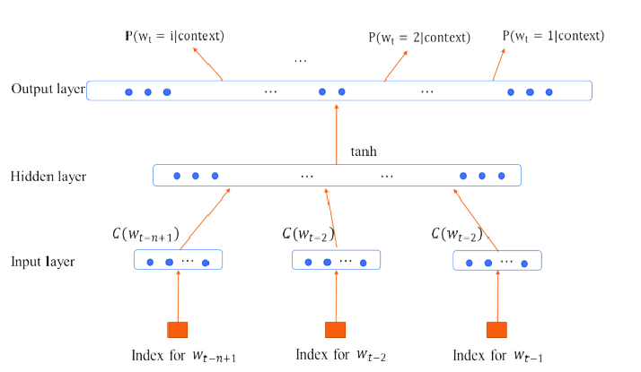
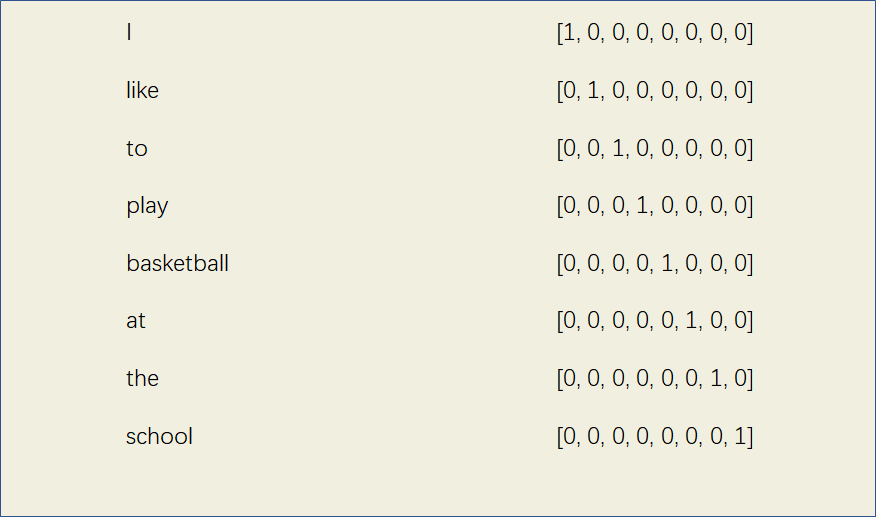
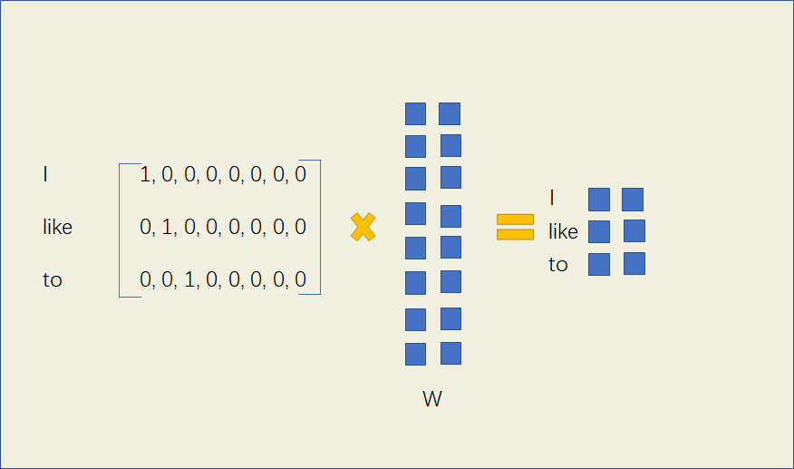
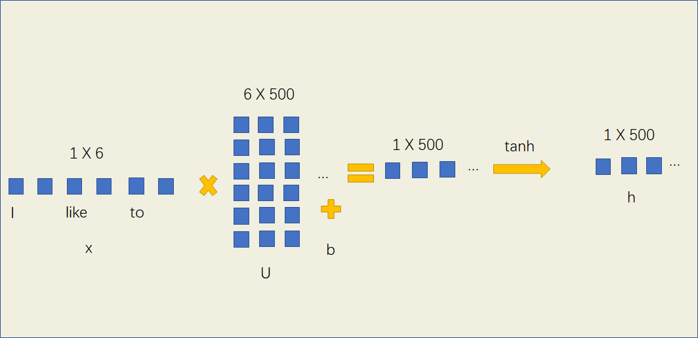
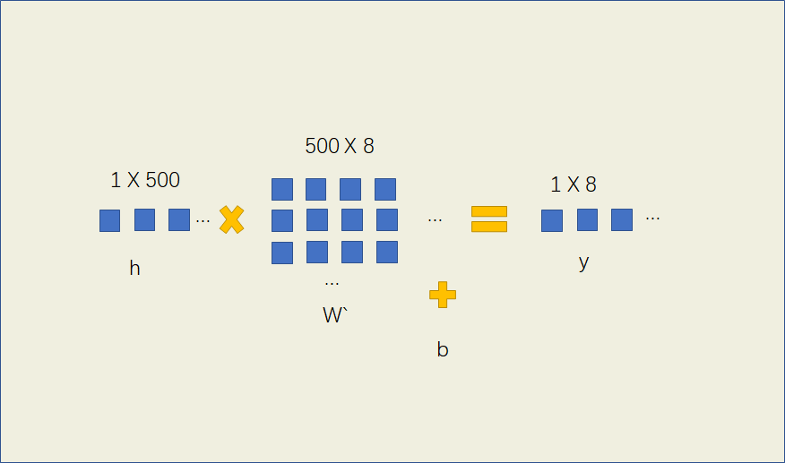

# 
# NNLM(Neural Network Language Model)
2003年，Bengio发表的《A Neural Probabilistic Language Model》成为使用神经网络训练语言模型的首创，主要使用的是最简单的前馈神经网络（Feed Forward Neural Net Language Model），这种模型被简称为NNLM。

NNLM不仅训练出了一个语言模型，并且在过程中获得了每个词的词向量，这种向量可以在一定程度上反映出词语之间的相似性。

给定一个语料库V，输入前n-1个单词，输出第n个单词出现的概率，通过前馈神经网络结构，用梯度下降法训练出中间的权重参数，使得输出单词是正确的概率最大。

我们想在训练神经网络的过程中得到每个词的词向量，因此需要先将它们初始化给定一个向量，One-hot就是一种很好的初始化方式。例如一个语料中有一句话：I like to play basketball at the school. 可以给这8个词用One-hot方法进行初始化词向量。

现在我们想通过I like to play这四个词，输出下一个词是basketball的概率，并使得这个概率尽量大，可以通过前馈神经网络来实现。

输入为一个3 X 8的矩阵，如果设定我们要产生的词向量的为二维特征，则可以构建一个参数矩阵W，W的形状为8 X 2，这样相乘后我们就能得到一个3 X 2的词向量矩阵$x$

W是待训练的参数矩阵，刚开始可以进行任意的初始化，当神经网络训练好，即使得输出下一个词为basketball的概率尽量大的时候，此时的W就是理想的参数矩阵，也能获取每个词的词向量。

我们要将中间的词向量矩阵转化为概率的形式作为输出，先把获得的三个词向量连接成一个1 X 6的向量。引入一个隐藏层，使用tanh作为激活函数进行非线性映射，并给定权重矩阵U和偏置$b^{1}$，U的大小为6 X 一个参数u（一般设为500）

$h=\tanh \left(U * x+b^{1}\right)$

这样得到隐藏层的输出h，然后再传入输出层，$W^{\prime}$的大小为500 X 8（词表大小），这样最终输出词表大小的结果。

$y=W^{\prime} * h+b^{2}$

最后引入softmax函数进行归一化，使得所有输出词的概率之和为1。

$p=\frac{\exp y}{\sum_{i=1}^{n} \exp y_{i}}$

输出词表大小的一个向量，每个向量代表输出结果为每个词的概率，概率最大的词即为预测的结果。

# RNN Language Model

222

# Word2Vec
33